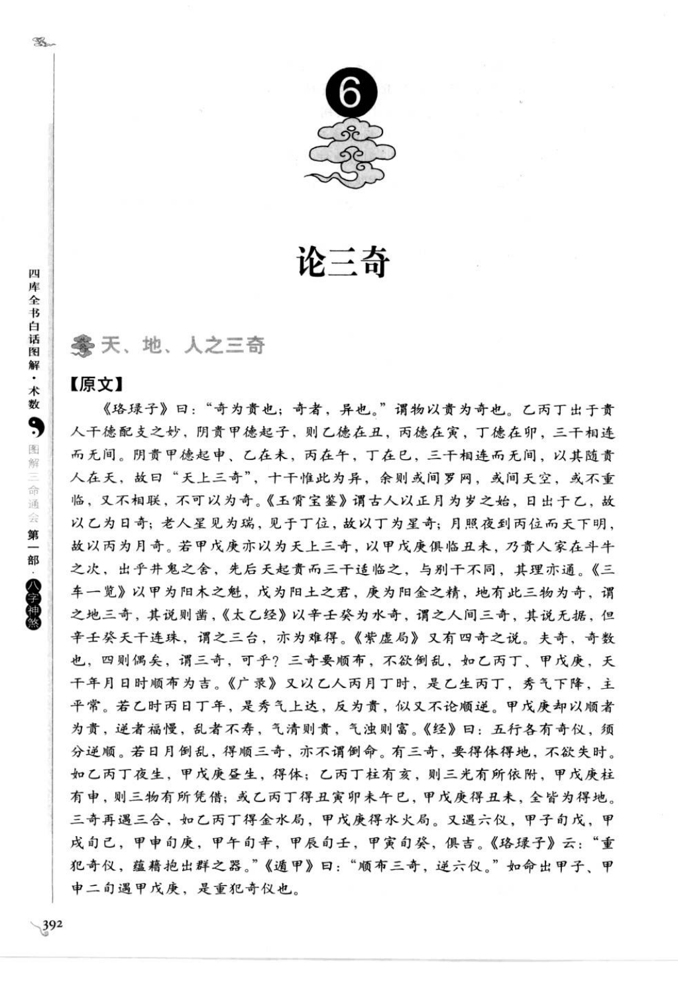
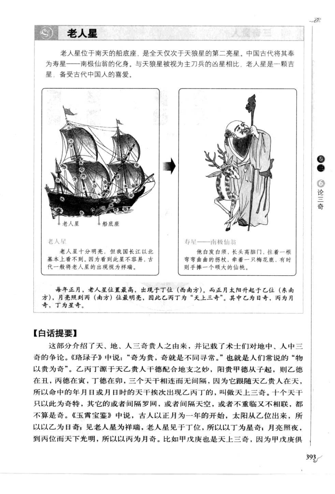
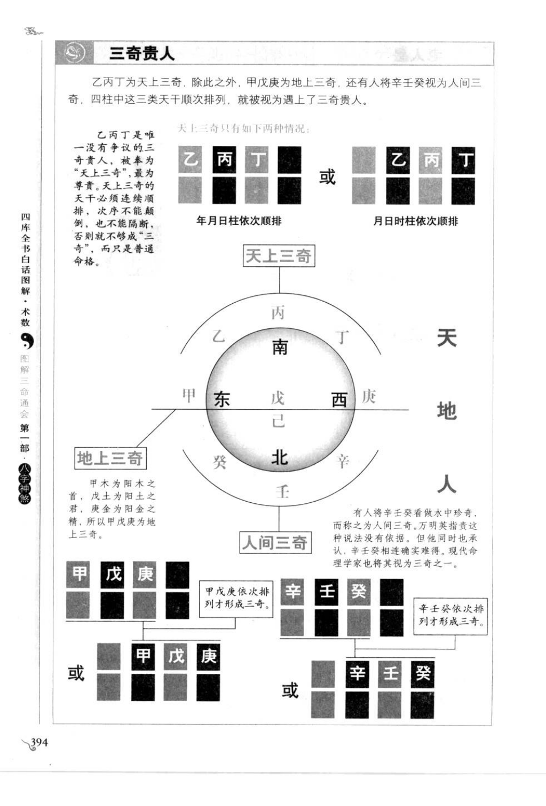
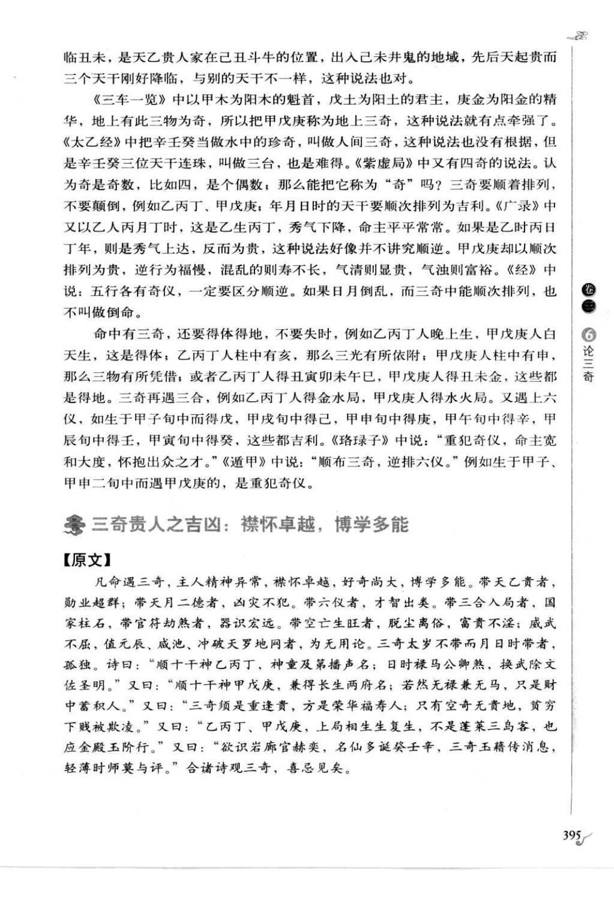
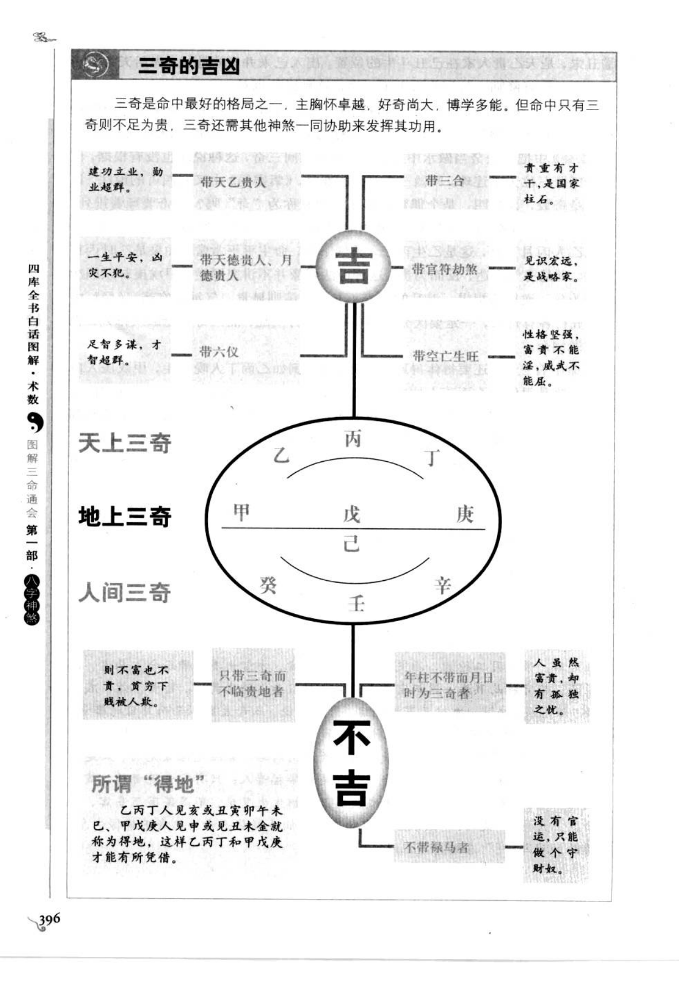
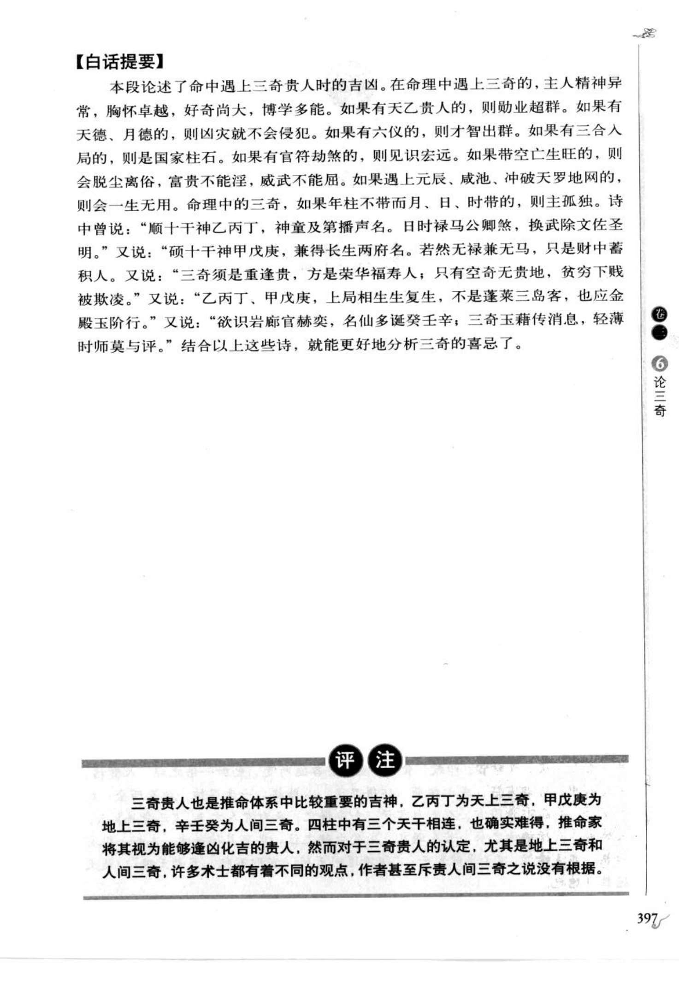

# 三奇贵人（第 6 号）

> 来源：《图解三命通会（第1部）：八字神煞》（万民英），书内印刷页 392-397，PDF 页 396-401。
> 原图截图：`docs/bazi/img/san_ming_tong_hui/page-396.png` 至 `page-401.png`。

## 天、地、人之三奇

### 【原文】

《珞琭子》曰：“奇为贵也；奇者，异也。”谓物以贵为奇也。乙丙丁出于贵人干德配支之妙，阳贵甲德起子，则乙德在丑，丙德在寅，丁德在卯，三干相连而无间；阴贵甲德起申，乙在未，丙在午，丁在巳，三干相连而无间。以其随贵人在天，故曰“天上三奇”。十干惟此为异，余则或间罗网，或间天空，或不重临，又不相联，不可以为奇。

《玉霄宝鉴》谓古人以正月为岁之始，日出于乙，故以乙为日奇；老人星见为瑞，见于丁位，故以丁为星奇；月照夜到丙位而天下明，故以丙为月奇。若甲戊庚亦以为天上三奇，以甲戊庚俱临丑未，乃贵人家在斗牛之次，出乎井鬼之舍，先后天起贵而三干适临之，与别干不同，其理亦通。

《三车一览》以甲为阳木之魁，戊为阳土之君，庚为阳金之精，地有此三物为奇，谓之地三奇，其说则凿。《太乙经》以辛壬癸为水奇，谓之人间三奇，其说无据，但辛壬癸天干连珠，谓之三台，亦为难得。《紫虚局》又有四奇之说。夫奇，奇数也，四则偶矣，谓三奇可乎？

三奇要顺布，不欲倒乱，如乙丙丁、甲戊庚，天干年月日时顺布为吉。《广录》又以乙人丙月丁时，是乙生丙丁，秀气下降，主平常；若乙时丙日丁年，是秀气上达，反为贵，似又不论顺逆。甲戊庚却以顺者为贵，逆者福慢，乱者不寿，气清则贵，气浊则富。《经》曰：五行各有奇仪，须分逆顺。若日月倒乱，得顺三奇，亦不谓倒命。

有三奇，要得体得地，不欲失时。如乙丙丁夜生，甲戊庚昼生，得体；乙丙丁柱有亥，则三光有所依附；甲戊庚柱有申，则三物有所凭借；或乙丙丁得丑寅卯未午巳，甲戊庚得丑未金，皆为得地。三奇再遇三合，如乙丙丁得金水局，甲戊庚得水火局。又遇六仪，甲子旬戊、甲戌旬己、甲申旬庚、甲午旬辛、甲辰旬壬、甲寅旬癸，俱吉。《珞琭子》云：“重犯奇仪，蕴藉抱出群之器。”《遁甲》曰：“顺布三奇，逆六仪。”如命出甲子、甲申二旬遇甲戊庚，是重犯奇仪也。

### 【白话提要】

乙丙丁源于天乙贵人干德配合地支之妙，三干依次连续出现，称为天上三奇；甲戊庚称为地上三奇；辛壬癸有人称为人间三奇，但原书认为依据不足。三奇宜顺次排列，不宜颠倒或间断，并要结合昼夜、得体、得地、三合和六仪判断。

## 三奇贵人之吉凶

### 【原文】

凡命遇三奇，主人精神异常，襟怀卓越，好奇尚大，博学多能。带天乙贵者，勋业超群；带天月二德者，凶灾不犯；带六仪者，才智出类；带三合入局者，国家柱石；带官符劫煞者，器识宏远。带空亡生旺者，脱尘离俗，富贵不淫；威武不屈。值元辰、咸池、冲破、天罗地网者，为无用论。

三奇太岁不带而月日时带者，孤独。诗曰：“顺十干神乙丙丁，神童及第播声名；日时禄马公卿煞，换武除文佐圣明。”又曰：“顺十干神甲戊庚，兼得长生两府名；若然无禄兼无马，只是财中蓄积人。”又曰：“三奇须是重逢贵，方是荣华福寿人；只有空奇无贵地，贫穷下贱被欺凌。”又曰：“乙丙丁、甲戊庚，上局相生生复生，不是蓬莱三岛客，也应金殿玉阶行。”又曰：“欲识岩廊官赫奕，名仙多诞发壬辛，三奇玉藉传消息，轻薄时师莫与评。”合诸诗观三奇，喜忌见矣。

### 【白话提要】

命中遇三奇，主人精神异常、襟怀卓越、好奇尚大、博学多能。带天乙贵人则勋业超群，带天月二德则少受凶灾，带六仪则才智出众，带三合入局则可成国家栋梁，带官符劫煞则器识宏远。三奇虽贵，仍需有贵地、禄马、生旺和顺排；若逢空亡、元辰、咸池、冲破、天罗地网等，则不能只凭三奇论吉。

## 图示转录

- **天上三奇**：乙丙丁依次顺排，可见于年月日柱或月日时柱；必须连续，不可颠倒、隔断。
- **地上三奇**：甲戊庚依次顺排。
- **人间三奇**：辛壬癸依次排列；原书注明此说无据，现代命理有时仍列为三奇之一。
- 图中另示三奇与天乙、天德月德、六合、六仪、空亡生旺等组合，以及“得体”“得地”“失时”的区别。

## 校勘备注

- 本章编号按书页右侧章节标记为第 6 号“论三奇”。
- “人间三奇”在原书中明确存在争议，不能与乙丙丁、甲戊庚等量齐观。
- 三奇的顺逆、昼夜、得体得地和组合条件属于原书多种并列论法，暂不合并为单一工程规则。
