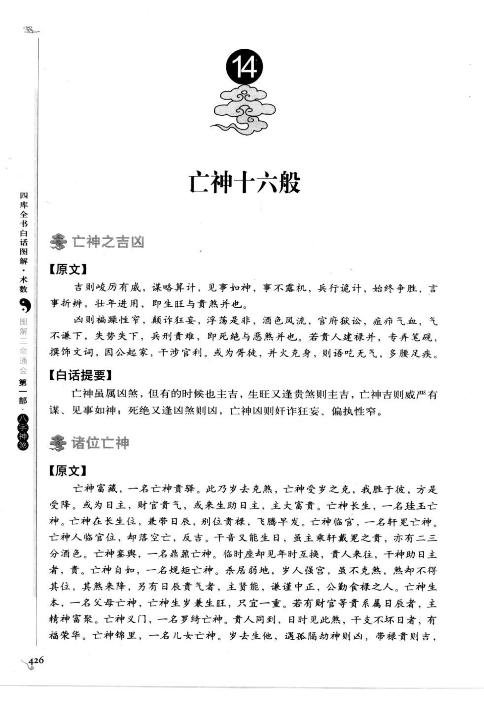
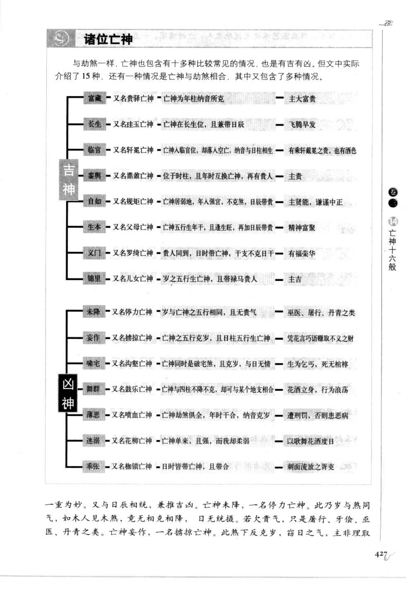
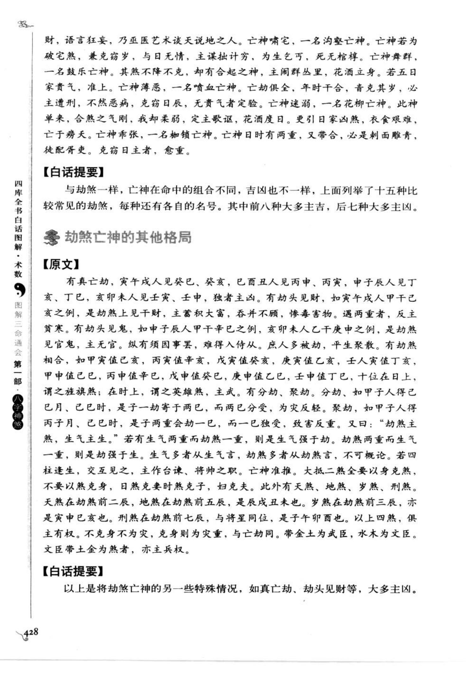
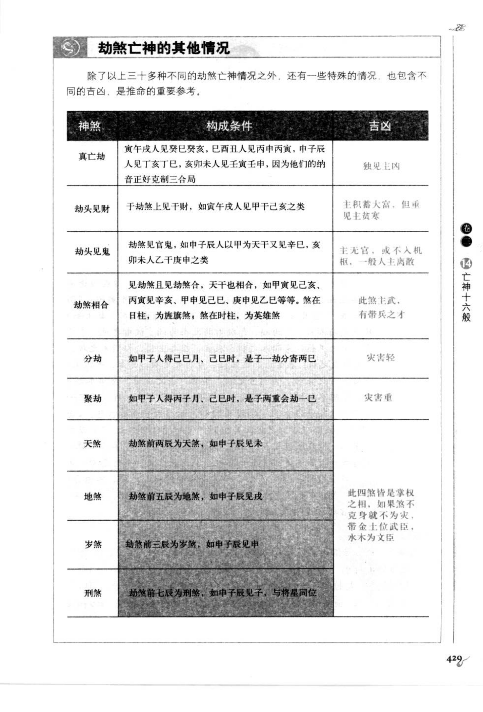

# 亡神十六般（古籍摘录）

> 资料状态：OCR 转录初稿，来源为《图解三命通会（第1部）：八字神煞》书内页 426-429（PDF 页 430-433）。原页截图保存在 `docs/bazi/img/san_ming_tong_hui/page-430.png` 至 `page-433.png`。

## 亡神之吉凶

### 【原文】

吉则俊敏有威，谋略算计，见事如神，事不露机，兵行诡计，始终争胜，言事折辨，壮年进用，即生旺与贵煞并也。凶则谗诬性窄，颠诈狂妄，浮荡是非，酒色风流，官府狱讼，疽病气血，气不谦下，失势失下，兵刑责难，即死绝与恶煞并也。若贵人建禄并，专弄笔砚，撰饰文词，因公起家，干涉官利；或为胥徒，并火克身，则语吃无气，多腰足疾。

### 【白话提要】

亡神虽属凶煞，但生旺又逢贵煞时可主聪慧、谋略、权力和名望；死绝又逢凶煞时则主奸诈、酒色、官非、疾病和失势。具体吉凶必须结合四柱干支、刑冲和其他神煞。

## 亡神十六般

原图说明，亡神在命中的组合不同，吉凶也不同，列举十五种常见情况，并另论亡神与劫煞相合：

| 类别 | 别名及构成 | 吉凶取象 |
| --- | --- | --- |
| 富藏 | 又名贵驿亡神，亡神为年柱纳音所克 | 主大富贵 |
| 长生 | 又名珪玉亡神，亡神在长生位且兼带日辰 | 飞腾早发 |
| 临官 | 又名轩冕亡神，亡神入临官位而落空亡，纳音与日柱相生 | 有乘轩戴冕之贵，也有酒色 |
| 奎舆 | 又名鼎舆亡神，位于时柱且年时互换亡神，再有贵人 | 主贵 |
| 自如 | 又名规矩亡神，亡神居弱地而年人强宫，虽不克煞、日辰带贵 | 主贤能、谦谨中正 |
| 生本 | 又名父母亡神，亡神五行生年干且逢生旺、再加日辰带贵 | 精神富聚 |
| 义门 | 又名罗绮亡神，贵人同到，日时带亡神，干支不克日干 | 有福荣华 |
| 锦里 | 又名儿女亡神，岁与五行生亡神且带禄马贵人 | 主吉 |
| 未降 | 又名停力亡神，岁与亡神五行同而无贵气 | 巫医、屠行、丹青之类 |
| 妄作 | 又名掠掠亡神，亡神五行克岁且日柱五行生亡神 | 凭花言巧语赚取不义之财 |
| 啰宅 | 又名沟壑亡神，亡神同时为破宅煞且克岁、日无情 | 生为乞丐，死无棺椁 |
| 舞群 | 又名鼓乐亡神，亡神与四柱不降不克却与其他地支相合 | 花酒立身，行为浪荡 |
| 薄恶 | 又名喷血亡神，亡神劫煞俱全、年时干合、纳音克岁 | 遭刑罚，否则患恶病 |
| 迷溺 | 又名花柳亡神，亡神单来而强、我却柔弱 | 以歌舞花酒度日 |
| 乖张 | 又名柳锁亡神，日时皆带亡神且相合 | 刺面流放之胥吏 |

## 亡神与劫煞的其他情况

| 神煞组合 | 构成条件 | 古籍取象 |
| --- | --- | --- |
| 真亡劫 | 寅午戌人见癸巳、癸亥；巳酉丑人见丙申丙寅；申子辰人见丁亥；亥卯未人见壬寅等，纳音正好克制三合局 | 独见主凶 |
| 劫头见财 | 干劫煞上见干财，如寅午戌人甲干己亥之类 | 主积大富，但重见主贫寒 |
| 劫头见鬼 | 劫煞见官鬼，主无官或离散 |
| 劫煞相合 | 劫煞见劫煞合，天干也相合；在日柱为旌旗劫，在时柱为英雄劫 | 主武职、有带兵之才 |
| 分劫 | 一柱劫分寄两干，灾害较轻 |
| 聚劫 | 两重会劫，灾害较重 |
| 天煞 | 劫煞前两辰，如申子辰见未 | 主有权 |
| 地煞 | 劫煞前五辰，如申子辰见戌 | 主有权 |
| 岁煞 | 劫煞前三辰，如申子辰见申 | 主有权 |
| 刑煞 | 劫煞前七辰，与将星同位，如申子辰见子 | 主有权 |

四煞多取掌权之相；不克身则为灾轻，克身则灾重。带金土为武臣，水木为文臣，文臣带土金也主兵权。

## 取用边界

- 本文保存亡神十六般及亡神、劫煞组合的古籍分类，不把别名或吉凶断语直接作为程序规则。
- 亡神十六般的别名部分字形紧密，已保留页图作为校勘依据。
- “真亡劫”等组合涉及年柱纳音和三合局，正式实现前应明确流派口径。

