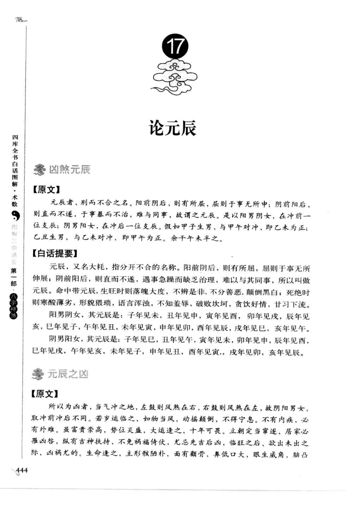
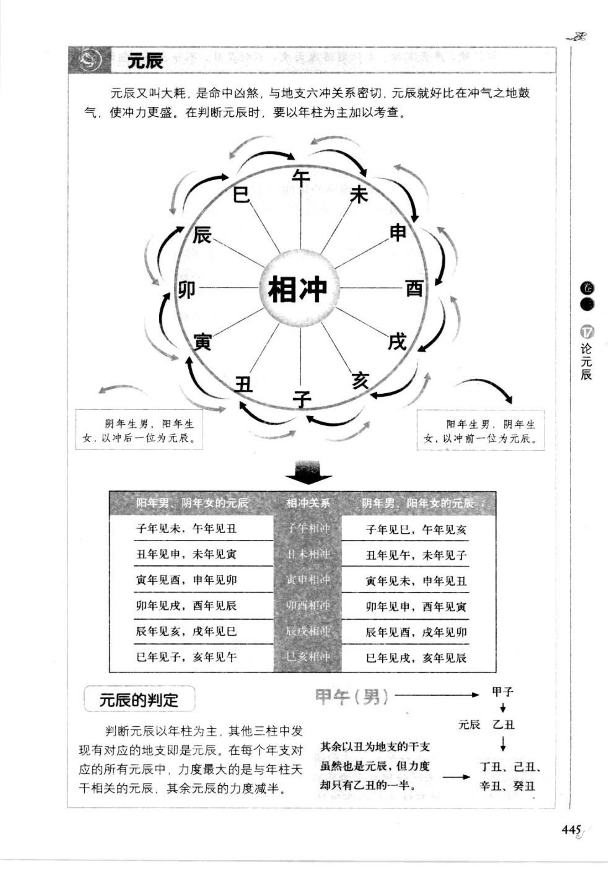
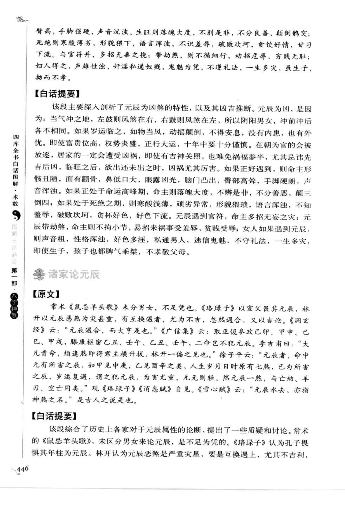
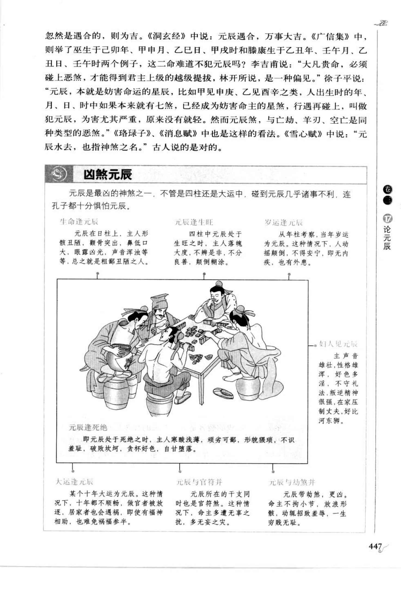

# 元辰（古籍摘录）

> 资料状态：OCR/人工转录初稿，来源为《图解三命通会（第1部）：八字神煞》书内页 444-447（PDF 页 448-451）。原页截图已保存到项目本地。

## 论元辰

### 【原文】

元辰者，别而不合之名。阳前阴后，则有所屈，屈则于事无所伸；阴前阳后，则直而不遂，于事暴而不治，难与同事，故谓之元辰。是以阳男阴女，在冲前一位支辰；阴男阳女，在冲后一位支辰。假如甲子生男，与甲午对冲，即乙未为正；乙丑生男，与己未对冲，即甲午为正。余干支准此。

### 【白话提要】

元辰又名大耗，是分开不合的名称。阳前阴后，则有所屈，屈则于事无所伸展；阴前阳后，则直而不遂，遇事急躁而缺乏治理，难以与人共事，所以叫做元辰。命中带元辰，生旺时落魄大度，不辨是非，不分善恶，颠倒黑白；死绝时寒酸薄劣，形貌猥琐，语言浑浊，不知羞辱，破败坎坷，贪饮好色，甘习下流。

## 元辰的定位

阳男阴女，其元辰是：子年见未，丑年见申，寅年见酉，卯年见戌，辰年见亥，巳年见子，午年见丑，未年见寅，申年见卯，酉年见辰，戌年见巳，亥年见午。

阴男阳女，其元辰是：子年见巳，丑年见午，寅年见未，卯年见申，辰年见酉，巳年见戌，午年见亥，未年见子，申年见丑，酉年见寅，戌年见卯，亥年见辰。

| 性别阴阳 | 取法 | 示例 |
| --- | --- | --- |
| 阳男、阴女 | 年支对冲前一位 | 甲子年见乙未 |
| 阴男、阳女 | 年支对冲后一位 | 乙丑年见甲午 |

原图判定说明：以年柱为主考察，日、时地支见到对应元辰也可参考。每个年支对应的所有元辰中，与年柱天干相关者力量最大，其余元辰力量减半。

## 元辰之凶

### 【原文】

所以为凶者，当气冲之地，左鼓则风煞在右，右鼓则风煞在左，故阴阳男女取冲前冲后不同。若岁运临之，如物当风，动摇颠倒，不得宁息。不有内疾，必有外难。虽富贵崇高，势位炎盛，大运逢之，十年可畏。立朝定当宰逐，居家必罹凶咎，纵有吉神扶持，不免祸福倚伏，尤忌先吉后凶，临旺之后，欲出未出之际，凶祸尤甚。生命逢之，主形骸陋朴，面有颧骨，鼻低口大，眼生威角，脑凸臀高，手脚强硬，声音沉浊。

生旺则落魄大度，不辨是非，不分良善，颠倒黑白；死绝则寒酸薄劣，形貌猥琐，语言浑浊，不知羞辱，破败坎坷，贪饮好色，甘习下流。与官符并，多招无辜之扰；带劫煞，则不拘细行，动招危辱，劳贱无耻。妇人得之，声雄性浊，奸淫私通奴婢，鬼魅为凭，不遵礼法，一生多灾；虽生子，拗而不孝。

### 【白话提要】

元辰属于凶煞，原因在于它处于冲气之地，像物体遭风吹动，容易动摇颠倒、不得安宁。岁运遇元辰，可能有内疾或外难；即使富贵显达，大运逢之也要谨慎，做官者可能被放逐，居家者可能遭受灾祸。元辰处生旺、死绝，或与官符、劫煞相并，取象各有轻重；遇吉神扶持也多是祸福相杂。

## 诸家论元辰

### 【原文】

常术《鼠忌羊头歌》未分男女，未免倥也。《珞琭子》以壬戌其元辰，林开以元辰恶煞为灾甚重，有互换遇者，尤为不吉，忽然遇合，又以吉论。《洞玄经》云：“元辰遇合，而大亨是也。”《广信集》云：取巫假参政己卯、甲申、己巳、甲戌、滕康枢密乙丑、壬午、乙丑、壬午，二命皆不犯元辰。李吉甫前曰：“大凡贵命，须逢煞即得君主横升拔，林开一偏之见也。”徐子平云：“元辰者，命中元有所害之辰，如甲见申庚，乙见西辛之类，人生岁月日时原有七煞，已为所害之辰，岁运复遇，谓之犯元辰，为害尤重，元无则轻。然而元辰煞，与亡劫、羊刃、空亡同类。”观《珞琭子》《消息赋》自见。《雪心赋》云：“元辰水去，亦指神煞之名。”古人说的是对的。

### 【白话提要】

诸家对元辰的取法和轻重有分歧：有的传本未区分男女，有的认为元辰是严重灾煞，互换相遇尤其不吉；也有“元辰遇合而大亨”的说法。徐子平认为元辰是命中原有的受害之辰，岁运再遇则为犯元辰，原局没有则较轻，并把它与亡神、劫煞、羊刃、空亡视为同类煞。不同传本应保留各自口径。

## 图示条目转录

| 图示情形 | 原图取象 |
| --- | --- |
| 生命逢元辰 | 元辰在日柱上，主人形骸丑陋，颧骨突出，鼻低口大，眼露凶光，声音浑浊等，总之为粗鄙丑陋之人。 |
| 元辰逢生旺 | 四柱中元辰处于生旺之时，主人落魄大度，不辨是非，不分良善，颠倒黑白。 |
| 岁运逢元辰 | 从年柱考察，当年岁运为元辰，人动摇颠倒，不得安宁；即无内疾，也有外患。 |
| 元辰逢死绝 | 元辰处于死绝之时，主人寒酸浅劣，顽劣可鄙，形貌猥琐，语言浑浊，不知羞辱，破败坎坷，贪杯好色，自甘堕落。 |
| 妇人见元辰 | 主声音雄壮，性格雄浑，好色多淫，不守礼法，叛逆情形较重，在家压制丈夫。 |
| 大运逢元辰 | 某个十年大运为元辰，十年都不顺畅；做官者被放逐，居家者遭祸，即使有福神相助，也难免祸福参半。 |
| 元辰与官符并 | 元辰所在干支同时为官符煞，多遭无辜之扰，多有无妄之灾。 |
| 元辰与劫煞并 | 元辰带劫煞，更为凶险；命主不拘小节，放浪形骸，动辄招致羞辱，一生劳碌。 |

## 取用边界

- 元辰以年柱为主要定位，性别阴阳决定取冲前或冲后一位；日、时及岁运属于叠加判断。
- “元辰又名大耗”、互换元辰、元辰遇合及诸家定义存在传本差异，正式实现前应保留来源口径并回看底图。
- 古籍吉凶断语仅作知识资料保存，不等同于现代命理结论。
