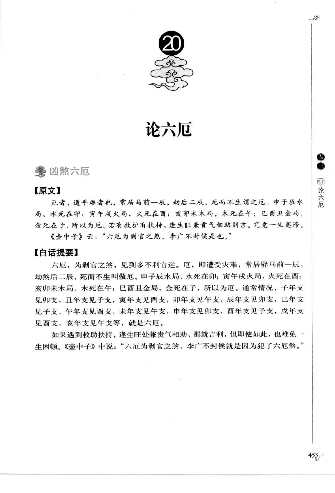
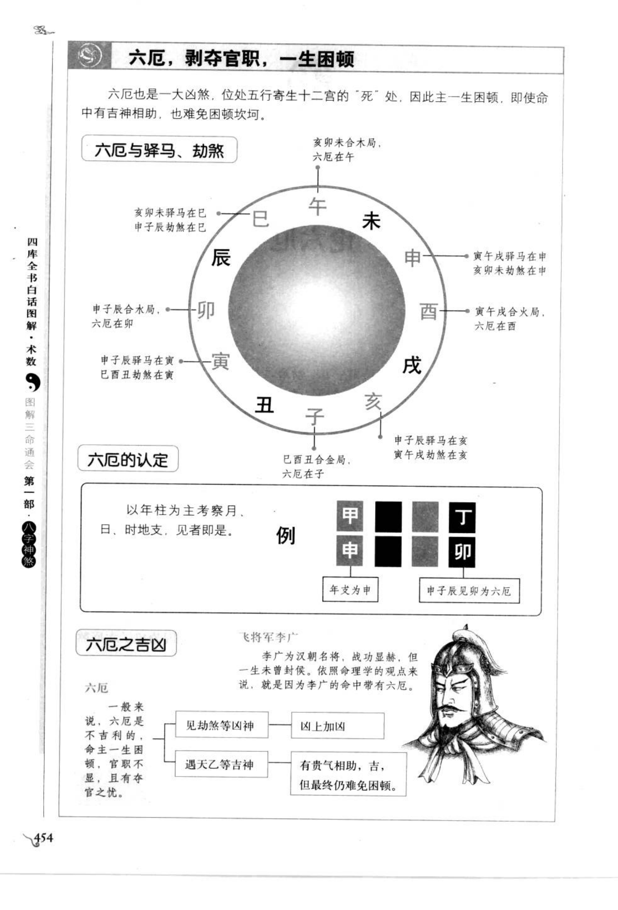

# 六厄（古籍摘录）

> 资料状态：OCR/人工转录初稿，来源为《图解三命通会（第1部）：八字神煞》书内页 453-454（PDF 页 457-458）。原页截图已保存到项目本地。

## 凶煞六厄

### 【原文】

厄者，遭乎难者也，常居马前一辰，劫煞后一辰，死而不生谓之厄。申子辰水局，水死在卯；寅午戌火局，火死在酉；亥卯未木局，木死在午；巳酉丑金局，金死在子，所以为厄。若有救护有扶持，逢生旺兼贵气相助则吉。究竟一生寒滞。《壶中子》云：“六厄为剥官之煞，李广不封侯是也。”

### 【白话提要】

六厄是剥官之煞，遇到它多有不利官运之事。厄就是遭受灾难，常在驿马前一辰、劫煞后一辰，死而不生，所以称为厄。申子辰水局，水死在卯；寅午戌火局，火死在酉；亥卯未木局，木死在午；巳酉丑金局，金死在子，这些就是六厄。

通常来说，六厄主一生困顿、官职不显、仕途受阻；若有救助扶持，遇生旺之地并有贵气相助，则凶性可缓，但仍难免一生寒滞。《壶中子》以李广终身不得封侯为六厄的例子。

## 六厄定位

| 三合局 | 五行死地 | 六厄 |
| --- | --- | --- |
| 申子辰（水局） | 卯 | 卯 |
| 寅午戌（火局） | 酉 | 酉 |
| 亥卯未（木局） | 午 | 午 |
| 巳酉丑（金局） | 子 | 子 |

按年支所属三合局取六厄，其他三柱地支见对应支也可参考。原图示例为年支申、日支子、六厄支卯：申子辰合水局，水死在卯，因此见卯即为六厄。

## 年支对应速查

| 年支 | 六厄 | 年支 | 六厄 |
| --- | --- | --- | --- |
| 子 | 卯 | 午 | 酉 |
| 丑 | 子 | 未 | 午 |
| 寅 | 酉 | 申 | 卯 |
| 卯 | 午 | 酉 | 子 |
| 辰 | 卯 | 戌 | 酉 |
| 巳 | 子 | 亥 | 午 |

## 六厄的吉凶图示转录

- 六厄一般不利，命主一生困顿，官职不显，并有本官之忧。
- 遇劫煞等凶神，凶上加凶；遇天乙等吉神，有贵气相助，虽吉但最终仍难免困顿。
- 六厄处于五行寄生十二宫的“死”处，故主剥官、困顿和难以施展。
- 图中以年柱为主考察月份、日柱和时柱，三柱中出现对应六厄地支即为参考条件。

## 取用边界

- 六厄以年支三合局的五行死地取法为主，日、月、时柱属于叠加信息。
- 救护、扶持、生旺、贵气及劫煞组合会改变轻重，本文不固化为单一吉凶结论。
- 古籍吉凶断语仅作知识资料保存，不等同于现代命理结论。
