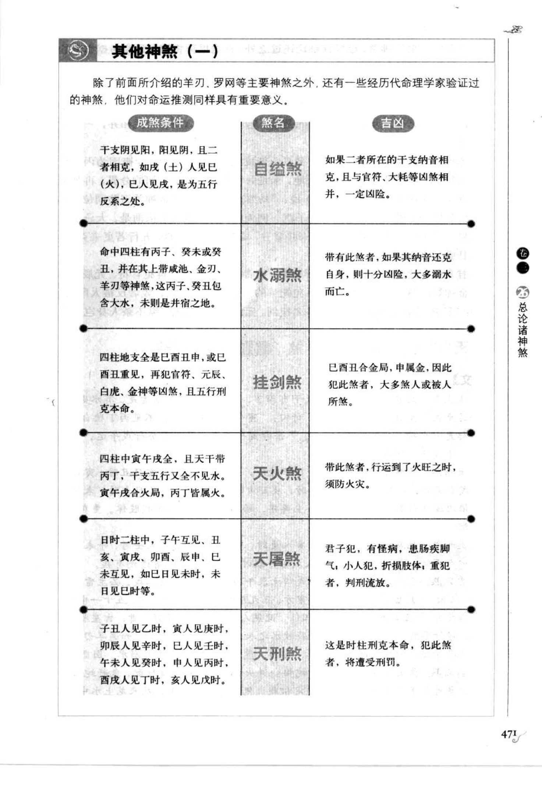
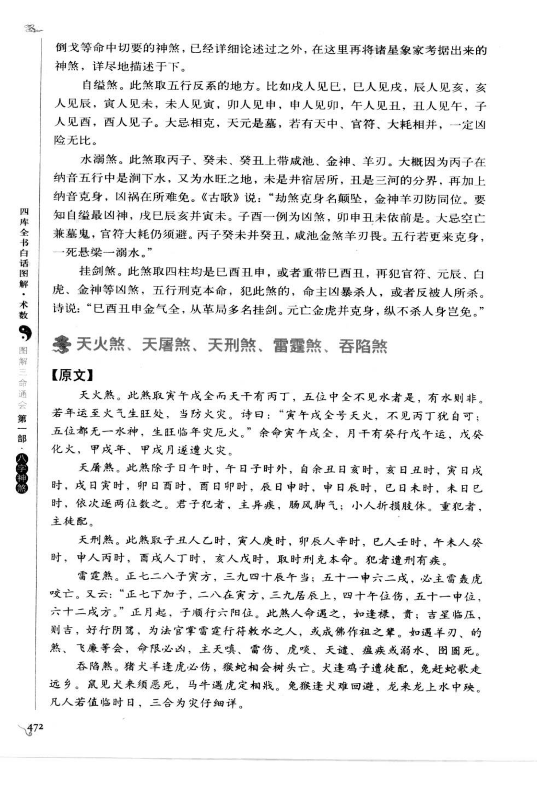

# 其他神煞（一）（古籍摘录）

> 资料状态：OCR/人工转录初稿，来源为《图解三命通会（第1部）：八字神煞》书内页 471-472（PDF 页 475-476）。原页截图已保存到项目本地。本条按书中“其他神煞（一）”分组保存八类煞，不将模糊字形强行定本。

## 自缢煞、水溺煞、挂剑煞

### 【原文摘录】

自缢煞。此煞取五行反系的地方。比如戊人见己，己人见戊，辰人见亥，亥人见辰，寅人见未，未人见寅，卯人见申，申人见卯，午人见丑，丑人见午，子人见酉，酉人见子。大忌相克，天元是墓，若有天冲、官符、大耗相并，一定凶险无比。

水溺煞。此煞取丙子、癸未、癸丑上带咸池、金神、羊刃。盖丙子纳音水，又子为水旺之地，未是井宿之居，丑为三河之分，更纳音克身，凶祸在所难免。古歌云：“劫煞克身名顿坠，金神羊刃防同位。要知自缢最凶神，戊己辰亥并寅未。”

挂剑煞。此煞取巳酉丑申中四柱纯全者，或重带巳酉丑，更犯官符、元辰、白虎、金神等凶煞，五行刑克本命，主凶杀人，或反为人所杀。诗曰：“巳酉丑申金气全，从革局多名挂剑。元亡金虎并克身，纵不杀人身当鬼。”

### 【白话提要】

自缢煞取五行反系的位置，例如天干戊己相见、地支辰亥、寅未、卯申、午丑、子酉相见。若再相克、天元为墓，并遇天冲、官符、大耗，凶险加重。

水溺煞以丙子、癸未、癸丑等日柱，兼带咸池、金神、羊刃为主要条件，因纳音和地支水势等关系，主溺水、灾厄之象。

挂剑煞取巳酉丑申四柱纯全，或重复出现巳酉丑并带官符、元辰、白虎、金神等凶煞，五行又刑克本命，主刀兵、凶杀或被害；有时也会反取为武勇之象，须看全局。

## 天火煞、天屠煞、天刑煞、雷霆煞、吞陷煞

### 【原文摘录】

天火煞。此煞取寅午戌全而天干有丙丁，五位中全不见水者是；有水则非。若年运至火气生旺处，当防火灾。诗曰：“寅午戌全号天火，不见丙丁犹自可；五位都无一水神，生旺临年灾厄火。”

天屠煞。此煞除子日午时、午日子时外，自余丑日亥时、亥日丑时、寅日戌时、戌日寅时、卯日酉时、酉日卯时、辰日申时、申日辰时、巳日未时、未日巳时，依次逢两位数之。君子犯者主疾病、肠风脚气；小人折损肢体，重犯者主徒配。

天刑煞。此煞取子丑人乙时，寅人庚时，卯辰人辛时，巳人壬时，午未人癸时，申人丙时，酉戌人丁时，亥人戊时，取时刑克本命，犯者遭刑有疾。

雷霆煞。正七二八子寅方，三九四十卯巳方，五十一午申方，六十二酉亥方，取生时之方，命主雷霆煞虎咬亡。又云：“七煞打破命宫，三九居辰上，四十临巳乡。”命中遇之，如逢禄贵、天德等吉神，仍须看制化。

吞陷煞。猪犬羊逢虎必伤，猴蛇相会树头亡，兔见犬来须恶死，马逢牛鼠走他乡。鼠见犬羊为吞陷，凡人若值临时日，多主夭折、伤亡或流离。

### 【白话提要】

天火煞以寅午戌三支齐全且天干有丙丁、全局不见水为主要条件，火运火年更要防火灾。天屠煞按日时相对的两位地支取法，主疾病、脚气、肢体损伤和徒配。

天刑煞按年支所属和时干相配，再由时柱刑克本命，主刑罚、疾病。雷霆煞按出生时方位和月份组合推取，古籍多主雷击、凶伤；有禄贵、天德等吉神时仍要看制化。吞陷煞以猪犬羊、虎、猴蛇、兔犬、马牛鼠等冲害组合取象，多主夭折、伤亡和漂泊。

## 其他神煞速查

| 名称 | 主要条件 | 古籍取象 |
| --- | --- | --- |
| 自缢煞 | 五行反系，兼相克、墓、天冲、官符、大耗 | 凶险、灾伤 |
| 水溺煞 | 丙子、癸未、癸丑等兼咸池、金神、羊刃 | 溺水、灾厄 |
| 挂剑煞 | 巳酉丑申纯全或重见，兼官符元辰白虎金神 | 刀兵、凶杀 |
| 天火煞 | 寅午戌全，丙丁透出，五位无水 | 火灾 |
| 天屠煞 | 特定日时相对组合 | 疾病、徒配 |
| 天刑煞 | 年支与时干相配并刑克本命 | 刑罚、疾病 |
| 雷霆煞 | 月份与出生时方位组合 | 雷击、凶伤 |
| 吞陷煞 | 猪犬羊、虎、猴蛇、兔犬、马牛鼠等组合 | 夭折、伤亡、流离 |

## 取用边界

- 本条是书中“其他神煞（一）”分组，不代表八类煞共享同一判定算法。
- 原图中的部分日时组合和口诀字形较小，已按可辨内容转录，正式实现前应逐条回看底图校勘。
- 古籍吉凶断语仅作知识资料保存，不等同于现代命理结论。
