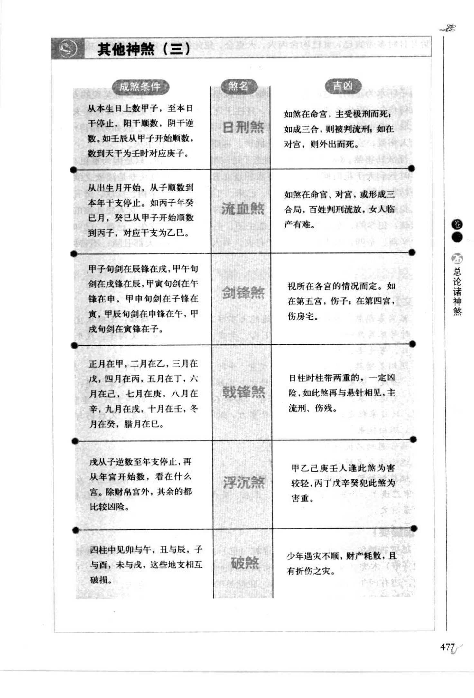
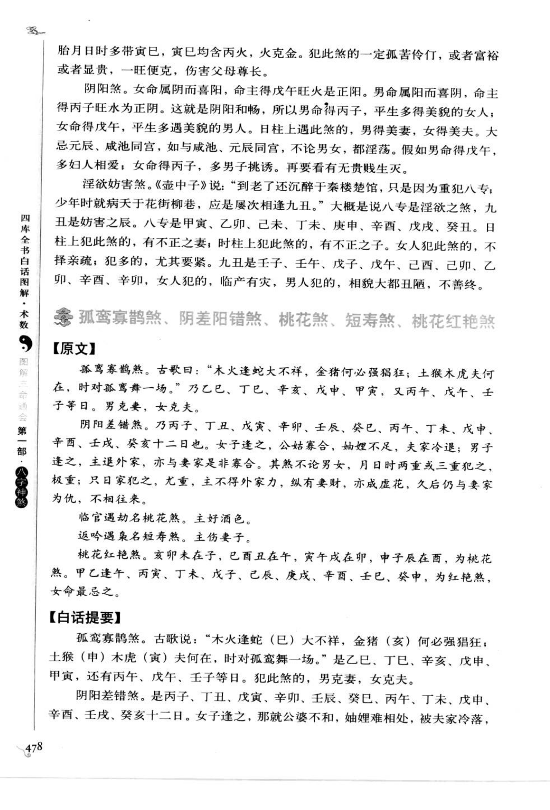

# 其他神煞（三）（古籍摘录）

> 资料状态：OCR/人工转录初稿，来源为《图解三命通会（第1部）：八字神煞》书内页 477-478（PDF 页 481-482）。原页截图已保存到项目本地；个别日时口诀和字形以 `[待校]` 标记。

## 日刑煞、流血煞、剑锋煞、戟锋煞、浮沉煞、破煞

### 【成煞条件与吉凶】

| 煞名 | 成煞条件（原图转录） | 吉凶（原图转录） |
| --- | --- | --- |
| 日刑煞 | 从本生日上数甲至本日干，阳干顺数，阴干逆数；如壬辰从甲子开始顺数，数到天干为壬时，对应庚子。 | 如煞在命宫，主受极刑而死；如成三合，则被判流刑；如在对宫，则外出而死。 |
| 流血煞 | 从出生月开始，从子顺数到本年干支停止。如丙子年癸巳月，癸巳从甲子开始顺数到丙子，对应干支为乙巳。 | 如煞在命宫、对宫，或形成三合局，百姓判刑流放，女人临产有难。 |
| 剑锋煞 | 甲子旬剑在辰、锋在戌；甲午旬剑在戌、锋在辰；甲寅旬剑在午、锋在子；甲申旬剑在子、锋在午；甲辰旬剑在寅、锋在申；甲戌旬剑在申、锋在寅。 | 视所在各宫情况而定：如在第五宫，伤子；在第四宫，伤房宅。 |
| 戟锋煞 | 正月在甲，二月乙，三月戊，四月丙，五月丁，六月己，七月庚，八月辛，九月戊，十月壬，十一月癸，十二月己。 | 日柱、时柱带两重者一定凶险；如再与悬针相见，主流刑、伤残。 |
| 浮沉煞 | 戊从子逆数至年支停止，再从年宫开始数，看落在何宫；除财帛宫外，其余宫位都较凶险。 | 甲乙己庚人逢此煞为害较轻，丙丁戊辛壬癸逢此煞为害较重。 |
| 破煞 | 四柱中见卯与午、丑与辰、子与酉、未与戌，这些地支相互破损。 | 少年遇灾不顺，财产耗散，且有折伤之灾。 |

## 日刑等六煞原文

日刑煞。从本生日上数甲至本日干，阳干顺数，阴干逆数。如壬辰从甲子开始顺数，数到天干为壬时，对应庚子。

流血煞。从出生月开始，从子顺数到本年干支停止。如丙子年癸巳月，癸巳从甲子开始顺数到丙子，对应干支为乙巳。

剑锋煞。甲子旬剑在辰锋在戌，甲午旬剑在戌锋在辰，甲寅旬剑在午锋在子，甲申旬剑在子锋在午，甲辰旬剑在寅锋在申，甲戌旬剑在申锋在寅。

戟锋煞。正月在甲，二月在乙，三月在戊，四月在丙，五月在丁，六月在己，七月在庚，八月在辛，九月在戊，十月在壬，十一月在癸，十二月在己。

浮沉煞。戊从子逆数至年支停止，再从年宫开始数，看在什么宫。除财帛宫外，其余的都比较凶险。

破煞。四柱中见卯与午、丑与辰、子与酉、未与戌，这些地支相互破损。

## 阴阳煞、淫欲妨害煞及相关条目

### 【原文摘录】

胎月日时多带寅巳，寅巳均含丙火，火克金。犯此煞的一定孤苦伶仃，或者富裕或者显贵，一旺便克，伤害父母尊长。

阴阳煞。女命属阴而喜阳，命主得戊午旺火是正阳。男命属阳而喜阴，命主得丙子旺水为正阴。这就是阴阳和畅，所以男命得丙子，平生多得美貌的女人；女命得戊午，平生多遇美貌的男人。日柱上遇此煞的，男得美妻，女得美夫。大忌元辰、咸池同宫，如与咸池、元辰同宫，不论男女，都淫荡。假如男命得戊午，多妇人相爱；女命得丙子，多男子挑诱。再要看有无贵贱生死。

淫欲妨害煞。《壶中子》说：“到老了还沉醉于秦楼楚馆，只是因为重犯八专；少年时就痴迷于花街柳巷，应是屡次相逢九丑。”大概是说八专是淫欲之煞，九丑是妨害之辰。八专是甲寅、乙卯、己未、丁未、庚申、辛酉、戊戌、癸丑。日柱上犯此煞的，有不正之妻；时柱上犯此煞的，有不正之子。女命犯此煞的，不择亲疏；犯得多的，尤其要紧。九丑是壬子、壬午、戊子、戊午、己巳、己卯、乙卯、辛酉、辛卯。女人犯此煞，临产有灾；男人犯此煞，相貌大都丑陋，不善终。

### 【白话提要】

阴阳煞以女命戊午、男命丙子为正例，日柱见之主男得美妻、女得美夫；若与元辰、咸池同宫，则取淫荡之象，仍须结合贵贱、生死和全局判断。淫欲妨害煞以八专、九丑重犯为条件，日柱主配偶不正，时柱主子女不正；女命主婚姻和生产不利，男命主相貌和善终不利。

## 孤鸾寡鹄煞、阴差阳错煞、桃花煞、短寿煞、桃花红艳煞

以下条目在书内页 478 以原文和白话连续列出：

- **孤鸾寡鹄煞**：古歌曰：“木火逢蛇大不祥，金猪何必强猖狂；土猴木虎夫何在，时对孤鸾舞一场。”乃乙巳、丁巳、辛亥、戊申、甲寅，又丙午、戊午、壬子等日。男克妻，女克夫。
- **阴差阳错煞**：乃丙子、丁丑、戊寅、辛卯、壬辰、癸巳、丙午、丁未、戊申、辛酉、壬戌、癸亥十二日。女命逢之，公姑寡合，姻亲不足，夫家冷退；男命逢之，主退外家，亦与妻家非亲非合。
- **桃花煞**：临官遇劫名桃花煞，主好酒色。
- **短寿煞**：返吟遇禄名短寿煞，主伤妻子。
- **桃花红艳煞**：亥卯未见子，巳酉丑见午，寅午戌见卯，申子辰见酉，为桃花煞；甲乙逢午、丙寅、丁未、戊子、己辰、庚戌、辛酉、壬巳、癸申，为红艳煞，女命最忌。

### 【白话提要】

孤鸾寡鹄煞主男克妻、女克夫；阴差阳错煞主婚姻关系失和、姻亲疏离，日时两重或三重犯者更重。临官遇劫为桃花煞，主好酒色；返吟遇禄为短寿煞，主伤妻子；桃花红艳煞为桃花与红艳组合，女命尤其忌讳。

## 取用边界

- 本条为第 26 章子条目“其他神煞（三）”，覆盖书内页 477-478（PDF 481-482）；PDF 483 起进入“其他神煞（四）”。
- 原图表格中的日干顺逆、旬位和“九丑”等字形存在低清识读风险，正式实现前应回看底图校勘。
- 古籍吉凶断语仅作知识资料保存，不等同于现代命理结论。
