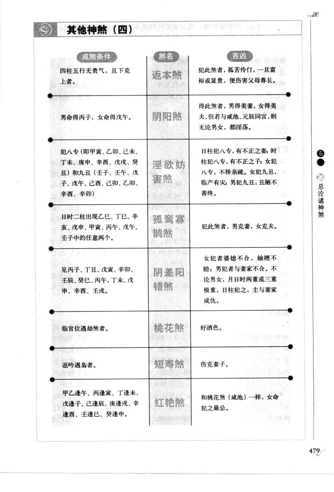
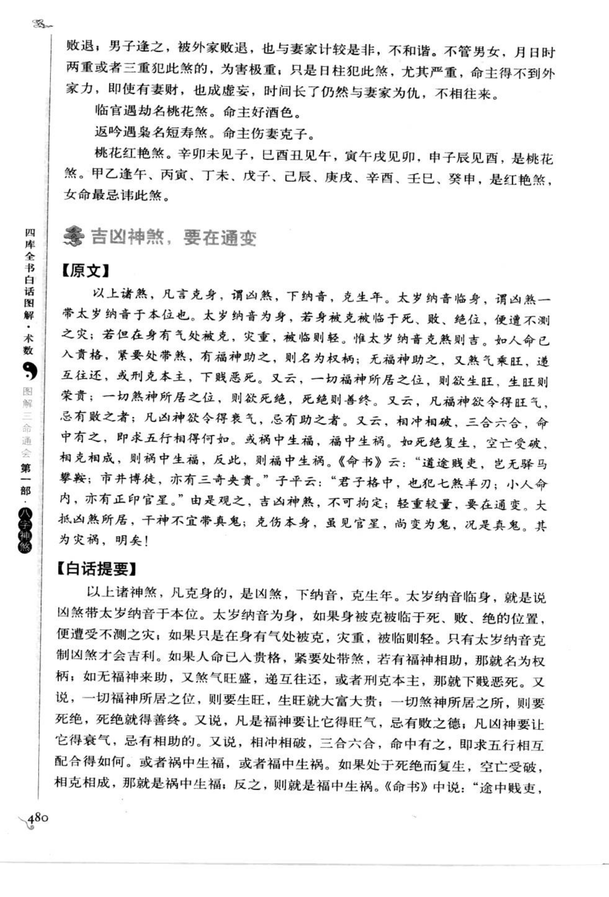
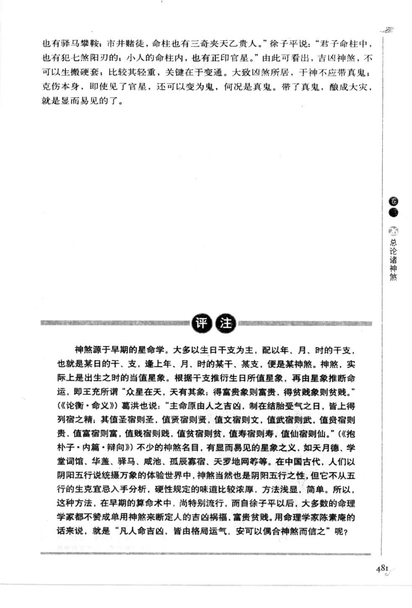

# 其他神煞（四）（古籍摘录）

> 资料状态：OCR/人工转录初稿，来源为《图解三命通会（第1部）：八字神煞》书内页 479-481（PDF 页 483-485）。原页截图已保存到项目本地；个别字形以 `[待校]` 标记。

## 成煞条件与吉凶

| 煞名 | 成煞条件（原图转录） | 吉凶（原图转录） |
| --- | --- | --- |
| 返本煞 | 四柱五行无贵气，且下克上者。 | 犯此煞者，孤苦伶仃；一旦富裕或显贵，便伤害父母尊长。 |
| 阴阳煞 | 男命得丙子，女命得戊午。 | 得此煞者，男得美妻，女得美夫；若与咸池、元辰同宫，不论男女都淫荡。 |
| 淫欲妨害煞 | 犯八专（甲寅、乙卯、己未、丁未、庚申、辛酉、戊戌、癸丑）和九丑（壬子、壬午、戊子、戊午、己巳、己卯、乙卯、辛酉、辛卯）等日。 | 日柱犯八专有不正之妻，时柱犯八专有不正之子；女犯八专不择亲疏，犯九丑临产有灾；男犯九丑相貌多丑陋、不善终。 |
| 孤鸾寡鹄煞 | 日时二柱出现乙巳、丁巳、辛亥、戊申、甲寅、丙午、戊午、壬子等任意两者。 | 犯此煞者，男克妻，女克夫。 |
| 阴差阳错煞 | 见丙子、丁丑、戊寅、辛卯、壬辰、癸巳、丙午、丁未、戊申、辛酉、壬戌、癸亥。 | 女犯之婆媳不合、姻亲不睦；男犯之与妻家不合；月日时两重或三重犯，凶害更重。 |
| 桃花煞 | 临官位遇劫，名桃花煞。 | 主好酒色。 |
| 短寿煞 | 返吟遇禄，名短寿煞。 | 主伤妻子。 |
| 桃花红艳煞 | 亥卯未见子，巳酉丑见午，寅午戌见卯，申子辰见酉，为桃花煞；甲乙逢午、丙寅、丁未、戊子、己辰、庚戌、辛酉、壬巳、癸申，为红艳煞。 | 桃花红艳与桃花煞相同，女命最忌。 |

## 【原文摘录】

返本煞。五行无贵气，且下克上者。

阴阳煞。男命得丙子，女命得戊午。

淫欲妨害煞。犯八专（即甲寅、乙卯、己未、丁未、庚申、辛酉、戊戌、癸丑）和九丑（壬子、壬午、戊子、戊午、己巳、己卯、乙卯、辛酉、辛卯）。日柱犯八专，有不正之妻；时柱犯八专，有不正之子；女犯八专，不择亲疏。女犯九丑，临产有灾；男犯九丑，丑陋不善终。

孤鸾寡鹄煞。日时二柱出现乙巳、丁巳、辛亥、戊申、甲寅、丙午、戊午、壬子中的任意两个。

阴差阳错煞。见丙子、丁丑、戊寅、辛卯、壬辰、癸巳、丙午、丁未、戊申、辛酉、壬戌、癸亥。

临官遇劫名桃花煞，主好酒色。返吟遇禄名短寿煞，主伤妻子。桃花红艳煞：亥卯未见子，巳酉丑见午，寅午戌见卯，申子辰见酉，为桃花煞；甲乙逢午、丙寅、丁未、戊子、己辰、庚戌、辛酉、壬巳、癸申，为红艳煞，女命最忌。

## 【白话提要】

返本煞是四柱五行无贵气而下克上，犯者孤苦；即使富贵，也容易伤害父母尊长。阴阳煞以男命丙子、女命戊午为正例，主配偶美貌，但与咸池、元辰同宫则主淫荡。淫欲妨害煞以八专、九丑为条件，日柱、时柱和男女命分别对应配偶、子女、婚姻、生产及善终方面的不利。

孤鸾寡鹄煞主男克妻、女克夫；阴差阳错煞主婚姻、姻亲关系不睦，日时重犯者更重。临官遇劫为桃花煞，主好酒色；返吟遇禄为短寿煞，主伤妻子；桃花红艳煞女命尤其忌讳。

## 吉凶神煞，要在通变

### 【原文摘录】

以上诸煞，凡言克身，谓凶煞，下纳音，克生年。大岁纳音临身，谓之煞；一带太岁纳音于本位也。太岁纳音为身，若身被克被临于死、败、绝位，便遭不测之灾；若但在身有气处被克，灾重，被临则轻。惟太岁纳音克煞则吉。如人命已入贵格，紧要处带煞，有福神相助，别名为权柄；无福神相助，又煞气乘旺，递互往还，或刑克本主，下贱恶死。又云，一切福神所居之位，则欲生旺；生旺则荣贵；一切煞神所居之位，则欲死绝，死绝则善终。凡煞神要令得旺气，忌有败之者；凡凶神要令得衰气，忌有助之者。又云，相冲相破、三合六合，命中有之，即求五行相得何如，或祸中生福，福中生祸。如果死绝复生，空亡受破，相克相成，则祸中生福，反之则福中生祸。《命书》云：“道途贼吏，岂无驿马攀鞍；市井博徒，亦有三奇夹天乙贵人。”徐子平说：“君子命柱中，也犯七煞羊刃；小人命柱内，也有正印官星。”由此可见，吉凶神煞，不可拘泥硬套；比较其轻重，关键在于变通。大抵凶煞所居，干神不宜带真鬼；克伤本身，即使见了官星，还是鬼，况是真鬼。其为灾祸，明矣！

### 【白话提要】

判断神煞不能只看名称。凡说“克身”，要看凶煞纳音是否克生年；太岁纳音临身，以及身处死、败、绝位时，灾祸更明显。命入贵格而带煞，若有福神相助，煞可转为权柄；若无福神而煞气乘旺，或刑克本命，则可能下贱恶死。福神宜生旺，煞神宜死绝；相冲、相破、三合、六合以及空亡受破，都要结合五行生克、旺衰和岁运通变，不能机械套用。

## 取用边界

- 本条为第 26 章子条目“其他神煞（四）”，覆盖书内页 479-481（PDF 483-485）；PDF 485 的“吉凶神煞，要在通变”作为章末评论一并保存。
- 八专、九丑、红艳煞等日柱清单在不同传本中可能有异文，正式实现前应逐字回看底图校勘。
- 古籍吉凶断语仅作知识资料保存，不等同于现代命理结论。
