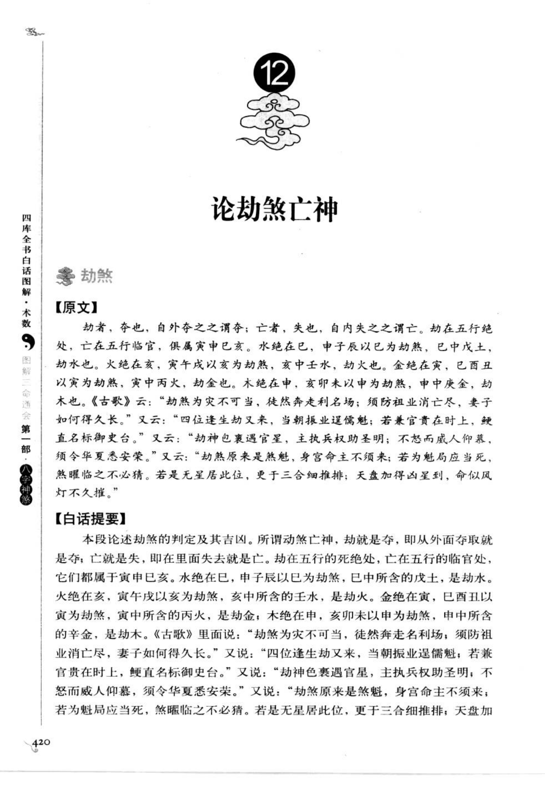
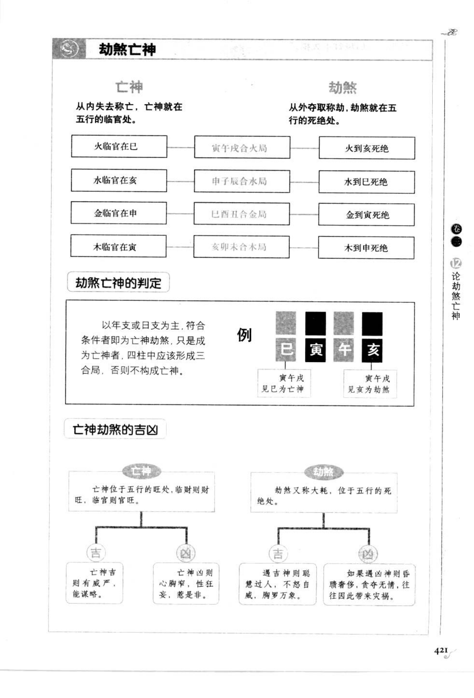
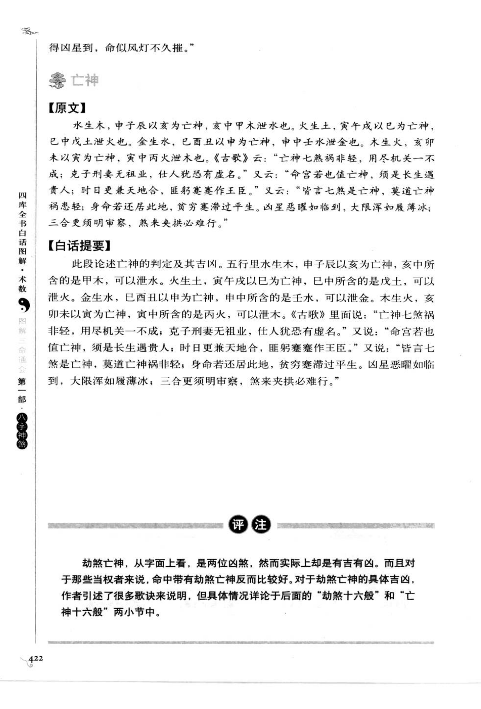

# 劫煞、亡神（古籍摘录）

> 资料状态：OCR 转录初稿，来源为《图解三命通会（第1部）：八字神煞》书内页 420-422（PDF 页 424-426）。原页截图保存在 `docs/bazi/img/san_ming_tong_hui/page-424.png` 至 `page-426.png`。

## 劫煞与亡神

### 【原文】

劫者，夺也，自外夺之之谓夺；亡者，失也，自内失之之谓亡。劫在五行绝处，亡在五行临官，俱属寅申巳亥。水绝在巳，申子辰以巳为劫煞，巳中戊土，劫水也；火绝在亥，寅午戌以亥为劫煞，亥中壬水，劫火也；金绝在寅，巳酉丑以寅为劫煞，寅中丙火，劫金也；木绝在申，亥卯未以申为劫煞，申中庚金，劫木也。亡神则取五行临官之处：水临官在亥，申子辰以亥为亡神；火临官在巳，寅午戌以巳为亡神；金临官在申，巳酉丑以申为亡神；木临官在寅，亥卯未以寅为亡神。

《古歌》云：“劫煞为灾不可当，徒然奔走利名场；须防祖业消亡尽，妻子如何得久长。”又云：“四位逢生劫又来，当朝振业遇儒魁；若兼官贵在时上，便直名标御史台。”又云：“劫神包裹遇官星，主执兵权助圣明；不怒而威人仰慕，须令华夏悉安荣。”又云：“劫煞原来是煞魁，身宫命主不须来；若为魁局应当死，煞曜临之不必猜。若是无星居此位，更于三合细推排；天盘加得凶星到，命似风灯不久摧。”

### 【白话提要】

劫煞和亡神都属于凶煞，但有时也主吉。劫煞在五行绝处，亡神在五行临官处，分别由外夺和内失取义。命中生旺、逢贵煞时，劫煞可以主聪慧、权力或名望；落死绝、再逢凶煞时，则主灾祸、争斗、贫困和性情偏激。具体吉凶必须结合刑冲、三合、官贵和岁运判断。

## 劫煞、亡神的地支定位

| 三合局 | 劫煞（五行绝处） | 亡神（五行临官） |
| --- | --- | --- |
| 申子辰（水） | 巳 | 亥 |
| 寅午戌（火） | 亥 | 巳 |
| 巳酉丑（金） | 寅 | 申 |
| 亥卯未（木） | 申 | 寅 |

## 亡神诸位格局

原图将亡神按吉凶分列多种组合，名称与取象如下。部分小标题为书中别名，保留截图供校勘：

| 类别 | 书中别名/构成 | 吉凶取象 |
| --- | --- | --- |
| 亡神富藏 | 又名贵驿亡神，亡神为年柱纳音所克 | 主大富贵 |
| 亡神长生 | 又名珪玉亡神，亡神在长生位且兼带日辰 | 飞腾早发 |
| 亡神临官 | 又名轩冕亡神，亡神入临官位而落空亡，纳音与日柱相生 | 有乘轩戴冕之贵，亦有酒色 |
| 亡神塞舆 | 又名鼎舆亡神，位于时柱且年时互换亡神并有贵人 | 主贵 |
| 亡神自如 | 又名规矩亡神，亡神居弱地而年人强宫、不克煞，日辰带贵 | 主贤能、谦谨中正 |
| 亡神生本 | 又名父母亡神，亡神五行生年干且逢生旺 | 精神富聚 |
| 亡神义门 | 又名罗绮亡神，贵人同到，日时带亡神，干支不克日干 | 有福荣华 |
| 亡神锦里 | 又名儿女亡神，岁与五行生亡神且带禄马贵人 | 主吉 |
| 亡神未降 | 又名停力亡神，岁与亡神五行同而无贵气 | 巫医、屠行、丹青之类 |
| 亡神妄作 | 又名掠掠亡神，亡神五行克岁且日柱五行生亡神 | 凭花言巧语赚取不义之财 |
| 亡神啰宅 | 又名沟壑亡神，亡神同时为破宅煞且克岁、日无情 | 生为乞丐，死无棺椁 |
| 亡神舞群 | 又名鼓乐亡神，亡神与四柱不降不克却与其他地支相合 | 花酒立身、行为浪荡 |
| 亡神薄恶 | 又名喷血亡神，亡神劫煞俱全、年时干合、纳音克岁 | 遭刑罚，否则患恶病 |
| 亡神迷溺 | 又名花柳亡神，亡神单来而强、我却柔弱 | 以歌舞花酒度日 |
| 亡神乖张 | 又名柳锁亡神，日时皆带亡神且相合 | 刺面流放之胥吏 |

## 取用边界

- 劫煞取五行绝处，亡神取五行临官处；二者都须先按三合局确定地支。
- 古籍对亡神诸格局的吉凶受年柱纳音、日时、贵人、禄马、空亡和刑冲影响，不能只凭单一地支判定。
- 表中个别别名因底图字形紧密，保留候选转录；正式实现前应逐项回看截图。

