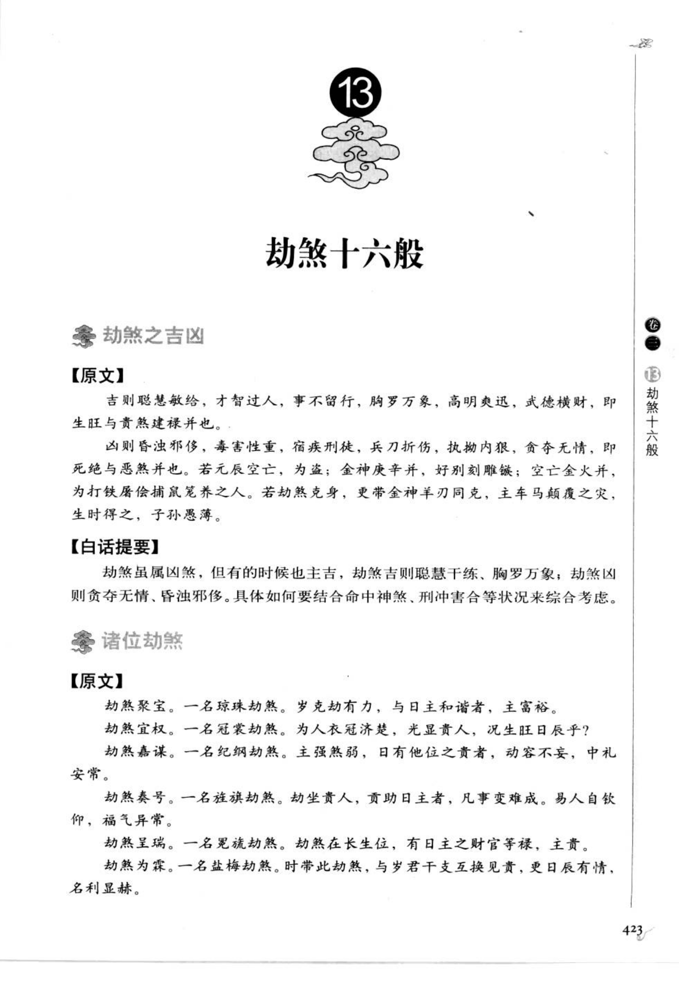
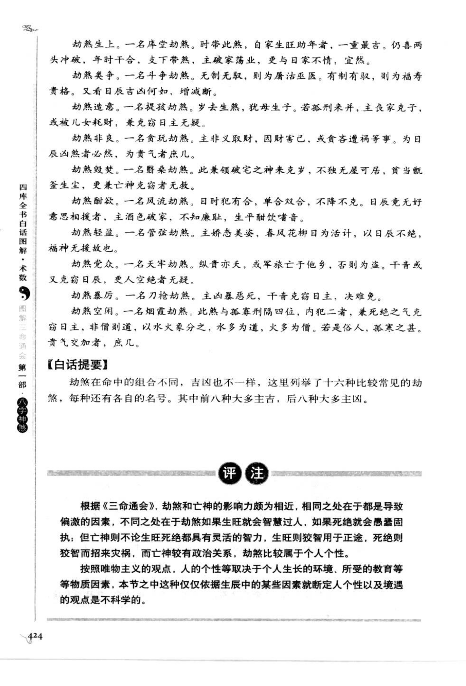
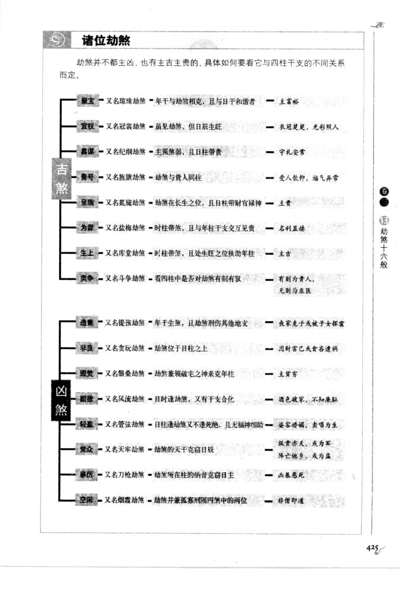

# 劫煞十六般（古籍摘录）

> 资料状态：OCR 转录初稿，来源为《图解三命通会（第1部）：八字神煞》书内页 423-425（PDF 页 427-429）。原页截图保存在 `docs/bazi/img/san_ming_tong_hui/page-427.png` 至 `page-429.png`。

## 劫煞之吉凶

### 【原文】

吉则聪慧敏敏，才智过人，事不留行，胸罗万象，高明爽迅，武德横财，即生旺与贵煞建禄并也。凶则昏浊邪侈，毒害性重，宿疾刑徒，兵刃折伤，执拗内狼，贪夺无情，即死绝与恶煞并也。若元辰空亡，为盗；金神庚辛并，好别刻雕镂；空亡金火并，为打铁屠伐捕鼠猥养之人。若劫煞克身，更带金神羊刃同克，主车马颠覆之灾，生时得之，子孙愚薄。

### 【白话提要】

劫煞虽属凶煞，但有时也主吉。劫煞生旺、与贵煞建禄同见，主聪慧干练、才智过人；劫煞死绝、与恶煞同见，则主昏浊邪侈、刑伤和贪夺。元辰空亡、金神、羊刃等组合会进一步改变取象，需结合全局判断。

## 劫煞十六般

原图将劫煞按组合分为十六种，前八种多取吉，后八种多取凶：

| 类别 | 别名及构成 | 吉凶取象 |
| --- | --- | --- |
| 聚宝 | 又名琼珠劫煞，年干与劫煞相克且与日干和谐 | 主富裕 |
| 宜权 | 又名冠冕劫煞，虽见劫煞但日辰生旺 | 衣冠楚楚，光彩照人 |
| 嘉谋 | 又名纪纲劫煞，主强煞弱，且日柱带贵 | 守礼安常 |
| 奏号 | 又名旌旗劫煞，劫煞与贵人同柱 | 受人钦仰，福气异常 |
| 星瑞 | 又名冕旒劫煞，劫煞在长生位且日柱带财官禄神 | 主贵 |
| 为禄 | 又名盐梅劫煞，时柱带煞且与年柱干支交互见贵 | 名利显赫 |
| 生上 | 又名库堂劫煞，时柱带煞且处生旺之位扶助年柱 | 主吉 |
| 类争 | 又名斗争劫煞，四柱中劫煞有制有取 | 有制为贵人，无制为巫医 |
| 造意 | 又名提孩劫煞，年干生劫煞且劫煞刑伤其他地支 | 良家克子，或被儿女耗财 |
| 非良 | 又名贪玩劫煞，劫煞位于日柱之上 | 因财害己，贪夺遭祸 |
| 毁焚 | 又名嚣桑劫煞，劫煞兼领破宅之神、来克年柱 | 主贫穷 |
| 酬欲 | 又名风流劫煞，日时逢劫煞又有干支合化 | 酒色破家 |
| 轻盈 | 又名管弦劫煞，日柱逢劫煞而不逢死绝、无福神相助 | 妻妾娇娆，卖唱为生 |
| 党众 | 又名天牢劫煞，劫煞的天干克日辰 | 纵贵亦夭，或军旅亡于他乡 |
| 暴厉 | 又名刀枪劫煞，劫煞所在柱的纳音克日主 | 凶暴恶死 |
| 空闲 | 又名烟霞劫煞，劫煞兼孤寡刑隔四位 | 非僧即道 |

原文说明，劫煞十六般的吉凶仍须看生旺、贵煞、空亡、刑冲和日时位置；不能只按名称孤立判断。

## 取用边界

- 劫煞十六般是劫煞与四柱干支、纳音、贵煞及刑冲的组合分类，本文不将名称直接当作程序判定。
- 图表中的别名部分字形较密，文档保留截图作为校勘依据。
- 古籍吉凶断语仅作知识资料保存，不等同于现代命理结论。

