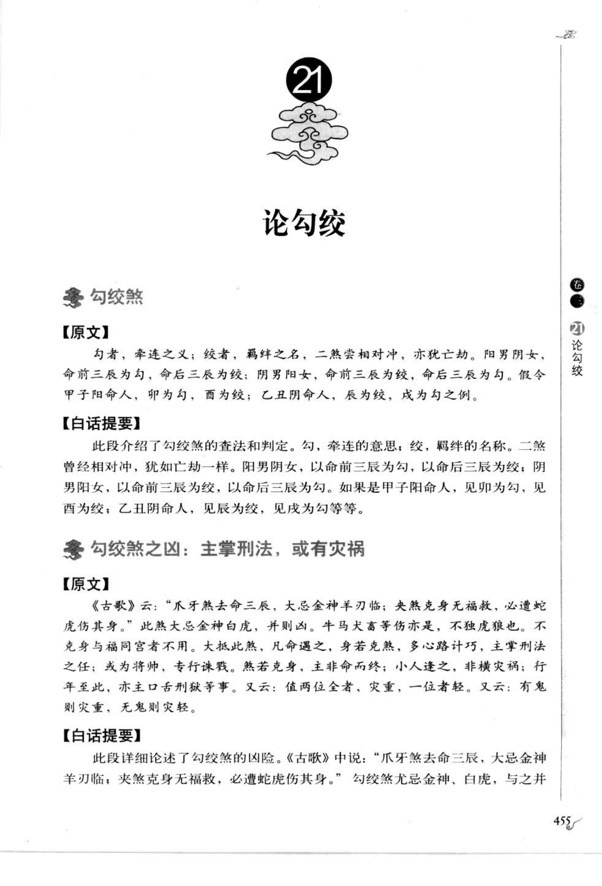
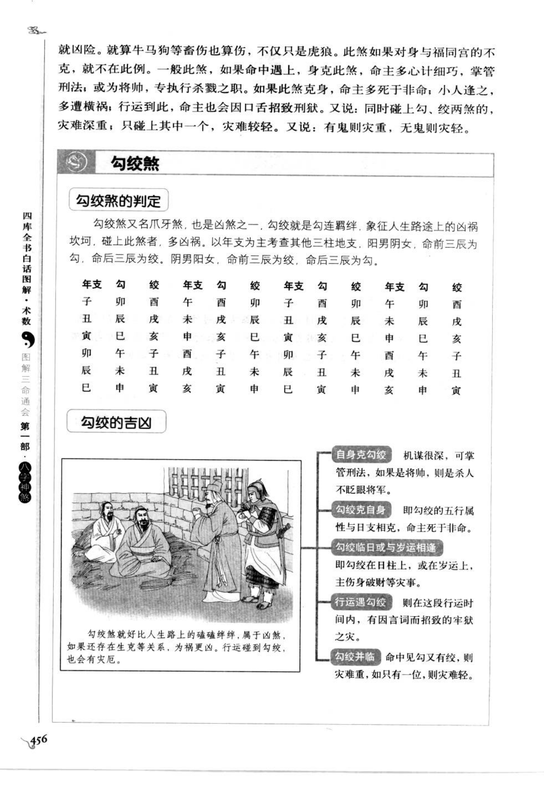

# 勾绞煞（古籍摘录）

> 资料状态：OCR/人工转录初稿，来源为《图解三命通会（第1部）：八字神煞》书内页 455-456（PDF 页 459-460）。原页截图已保存到项目本地。

## 勾绞煞

### 【原文】

勾者，牵连之义；绞者，羁绊之名，二煞常相对冲，亦犹亡劫。阳男阴女，命前三辰为勾，命后三辰为绞；阴男阳女，命前三辰为绞，命后三辰为勾。假令甲子阳命人，卯为勾，酉为绞；乙丑阴命人，辰为绞，戌为勾之例。

《古歌》云：“爪牙煞去命三辰，大忌金神羊刃临；夹煞克身无福救，必遭蛇虎伤其身。”此煞大忌金神、白虎，并则凶。牛马犬害等伤亦是，不独虎狼也。不克身与福同宫者不用。大抵此煞，凡命遇之，身若克煞，多心多计巧，主掌刑法之任；或为将帅，专行诛戮。然若克身，主非命而终；小人逢之，非横灾祸；行年至此，亦主口舌刑狱等事。又云：值两位全者，灾重；一位者轻。又云：有鬼则灾重，无鬼则灾轻。

### 【白话提要】

勾是牵连，绞是羁绊，二煞通常相对冲，性质类似亡神、劫煞。阳男阴女以命前三辰为勾、命后三辰为绞；阴男阳女则相反。甲子阳命人见卯为勾、酉为绞；乙丑阴命人见辰为绞、戌为勾。

勾绞煞忌金神、白虎、羊刃等同见，容易有刑伤、口舌和灾祸；牛马犬等冲害也可形成伤害，不只是蛇虎。若勾绞不克身，且与福神同宫，凶性可不论；若身能克煞，反可能多谋善断，掌刑法或为将帅。但若煞反过来克身，则可能非命而终；小人遇之多横灾，行年遇之主口舌刑狱。勾绞两位俱全则重，一位则轻；有鬼煞则重，无鬼煞则轻。

## 勾绞定位

### 取法

以年支为主，顺数或逆数三位：

| 性别阴阳 | 命前三辰 | 命后三辰 |
| --- | --- | --- |
| 阳男、阴女 | 勾 | 绞 |
| 阴男、阳女 | 绞 | 勾 |

“前三辰”与“后三辰”均按地支顺序取三位；例如子之前三位为卯，之后三位为酉。日、月、时柱见到相应勾或绞，作为叠加参考。

### 年支速查

| 年支 | 阳男/阴女：勾 | 阳男/阴女：绞 | 阴男/阳女：勾 | 阴男/阳女：绞 |
| --- | --- | --- | --- | --- |
| 子 | 卯 | 酉 | 酉 | 卯 |
| 丑 | 辰 | 戌 | 戌 | 辰 |
| 寅 | 巳 | 亥 | 亥 | 巳 |
| 卯 | 午 | 子 | 子 | 午 |
| 辰 | 未 | 丑 | 丑 | 未 |
| 巳 | 申 | 寅 | 寅 | 申 |
| 午 | 酉 | 卯 | 卯 | 酉 |
| 未 | 戌 | 辰 | 辰 | 戌 |
| 申 | 亥 | 巳 | 巳 | 亥 |
| 酉 | 子 | 午 | 午 | 子 |
| 戌 | 丑 | 未 | 未 | 丑 |
| 亥 | 寅 | 申 | 申 | 寅 |

## 勾绞煞的吉凶图示转录

- 自身克勾绞：机谋很深，可掌管刑法；若为将帅，则有杀伐之权。
- 勾绞克自身：即勾绞的五行属性与日支相克，命主可能非命而终。
- 勾绞临日或与岁运相逢：勾绞在日柱或大运上，主伤身破财、口舌刑狱等事。
- 行运遇勾绞：在该段行运中，容易因言词而招致牢狱灾祸。
- 勾绞并临：命中勾、绞同时出现，灾难较重；只有其中一位，灾难较轻。

## 取用边界

- 勾绞煞以年支和性别阴阳取命前三辰、后三辰为主，其他柱和岁运属于叠加判断。
- 金神、白虎、羊刃、鬼煞、福神及身煞生克会改变轻重，本文不固化为单一吉凶结论。
- 古籍吉凶断语仅作知识资料保存，不等同于现代命理结论。
