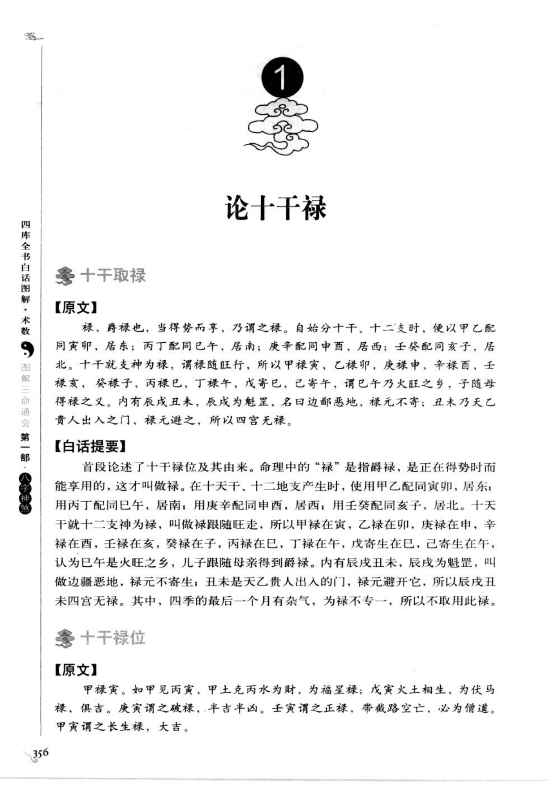
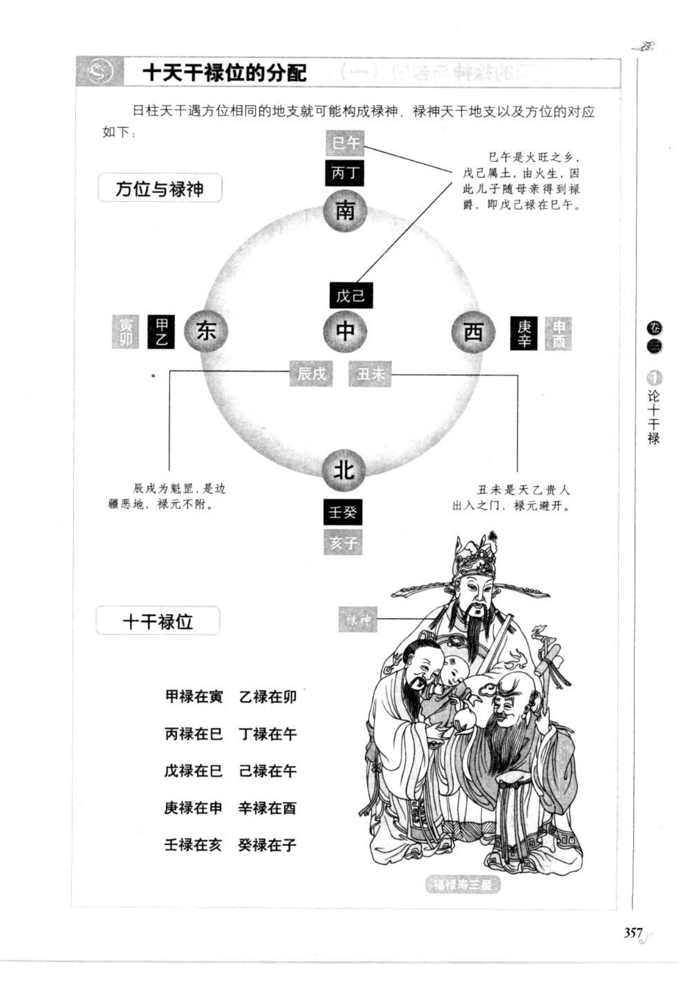
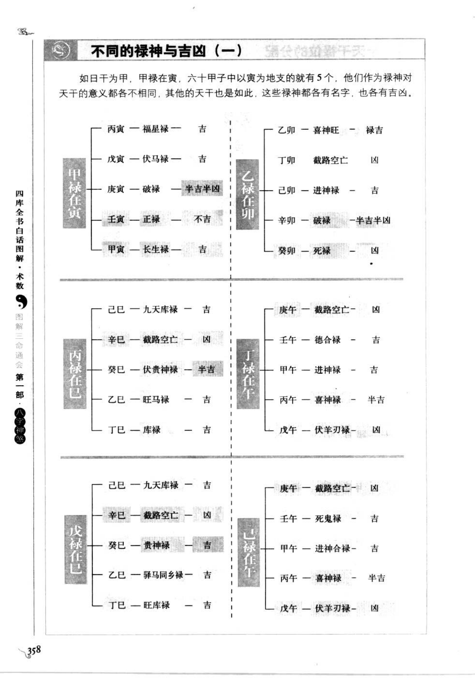
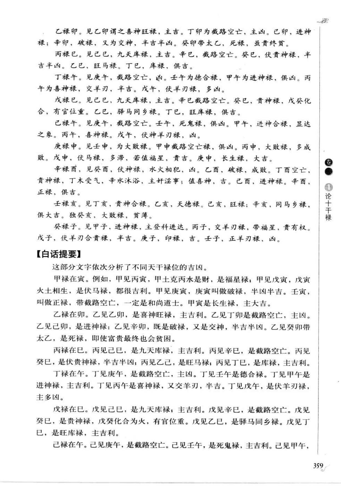
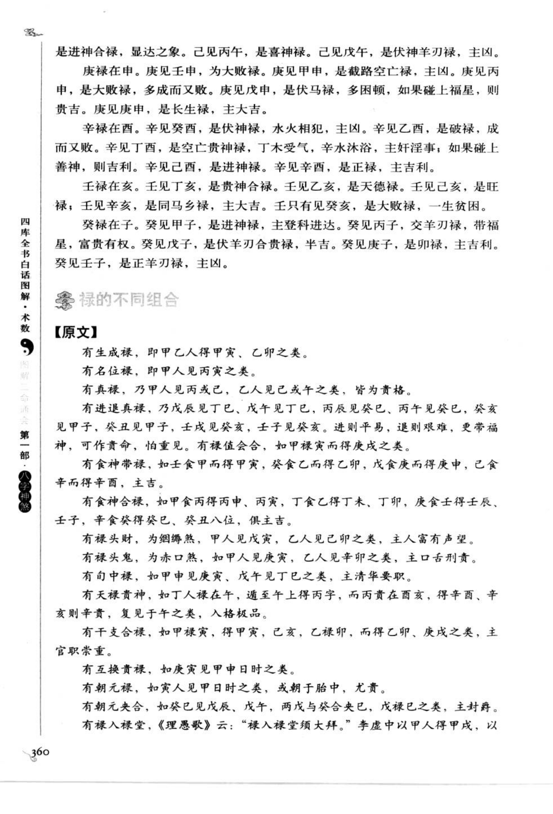
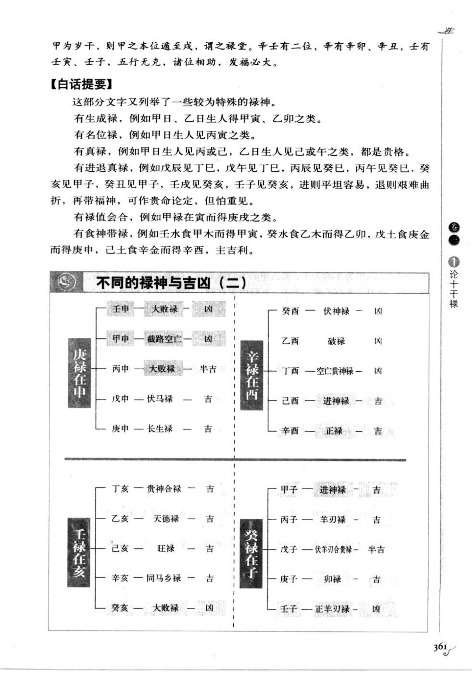
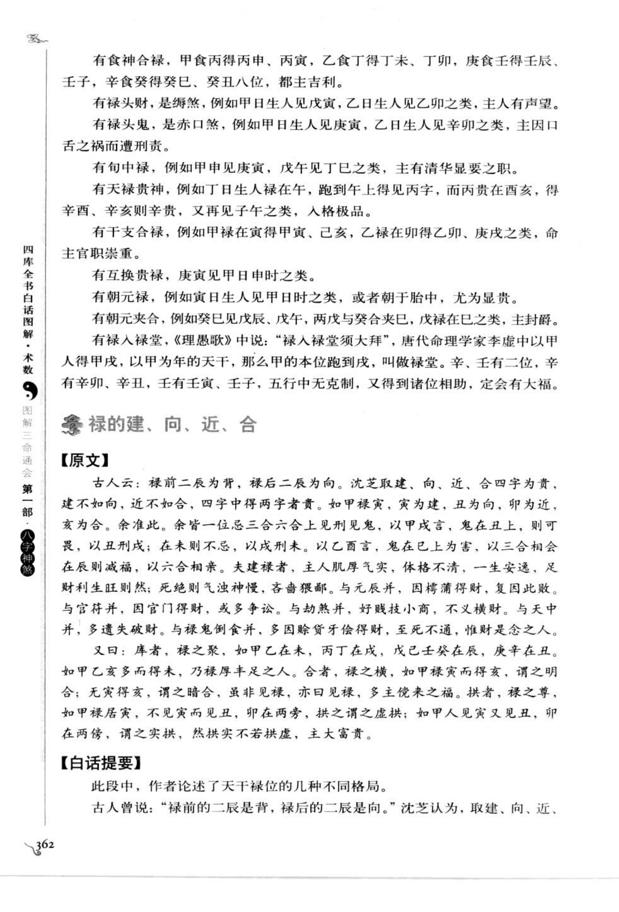
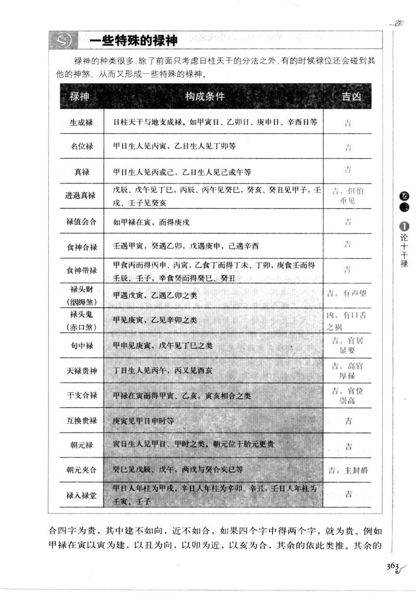
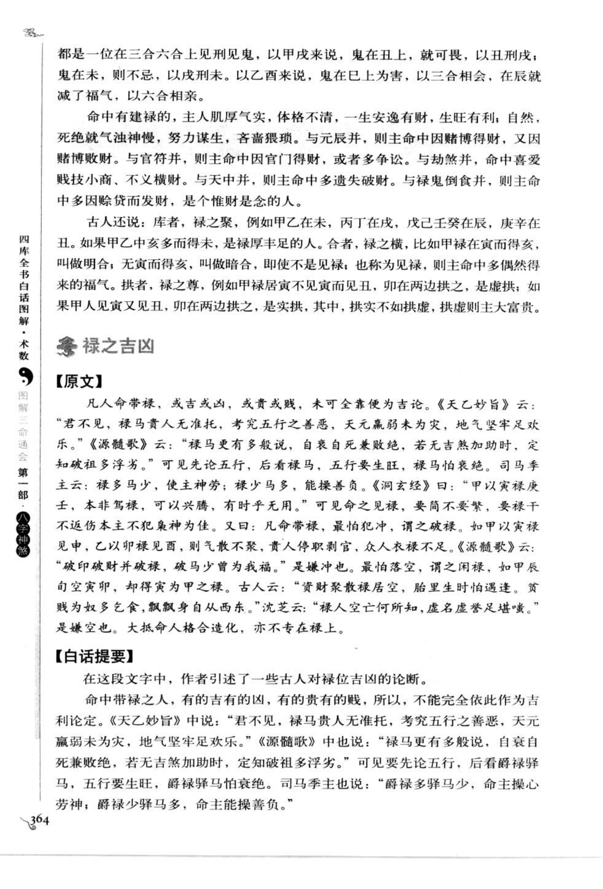
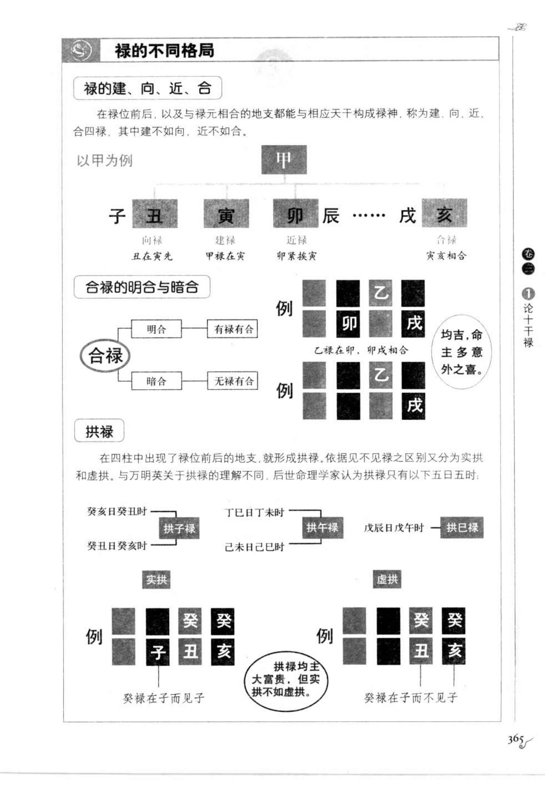

# 十干禄（第 1 号，古籍摘录）

> 资料状态：按用户指定的 PDF 阅读器页码整理。来源范围为 PDF 第 360–369 页，对应书内印刷页 356–365。需要特别说明：PDF 366–367 已进入第 2 号“金舆”，PDF 368–369 已进入第 3 号“驿马”，这些页作为连续原始范围保存，但不把后续章节正文误算为十干禄内容。

## 原始页面

## 十干禄取法【原文转录】

禄，爵禄也，当得势而享，乃谓之禄。自始分十干、十二支时，便以甲乙配同寅卯，居东；丙丁配同巳午，居南；庚辛配同申酉，居西；壬癸配同亥子，居北。十干就支神为禄，谓禄随旺行，所以甲禄寅，乙禄卯，庚禄申，辛禄酉，壬禄亥，癸禄子，丙禄巳，丁禄午，戊寄巳，己寄午，谓巳午乃火旺之乡，子随母得禄之义。内有辰戌丑未，辰戌为魁罡，名曰边鄙恶地，禄元不寄；丑未乃天乙贵人出入之门，禄元避之，所以四宫无禄。

## 十干禄表

| 天干 | 禄位 |
| --- | --- |
| 甲 | 寅 |
| 乙 | 卯 |
| 丙 | 巳 |
| 丁 | 午 |
| 戊 | 巳（寄禄） |
| 己 | 午（寄禄） |
| 庚 | 申 |
| 辛 | 酉 |
| 壬 | 亥 |
| 癸 | 子 |

辰、戌、丑、未四支不寄禄：辰戌为魁罡、边鄙恶地；丑未为天乙贵人出入之门，禄元避之。

## 不同的禄神（PDF 360–365）

原图继续按天干与禄支的组合区分福星禄、伏马禄、破禄、截路空亡禄、长生禄、旺禄、进神禄、正禄、羊刃禄等。具体干支名称、吉凶和例证以 `config/bazi/shen_sha/lu_shen.json` 的 `variants` 字段保存，并以 PDF 原图为校勘底本。

PDF 365（书内页 361）为“不同的禄神与吉凶（二）”图示，补充了庚禄在申、辛禄在酉、壬禄在亥、癸禄在子等组合：例如庚申长生禄、戊申伏马禄、甲申截路空亡禄、丙申大败禄；辛酉正禄、己酉进神禄、丁酉空亡贵神禄、乙酉破禄、癸酉伏神禄；壬亥旺禄、辛亥同马乡禄、己亥旺禄、乙亥天德禄、丁亥贵神合禄、癸亥大败禄；癸子正羊刃禄、庚子卯禄、戊子伏羊刃合贵、丙子羊刃禄、甲子进神禄。图示吉凶仍须结合命局，不作现代断定。

## PDF 范围内的章节边界

- PDF 360–365：十干禄正文、不同禄神组合及吉凶图示。
- PDF 366–367：第 2 号“论金舆”，详见 [`金舆.md`](金舆.md)。
- PDF 368–369：第 3 号“论驿马”开篇及驿马认定图示，详见 [`驿马.md`](驿马.md)。

## 知识化取法

禄神以日干定禄，四柱年、月、日、时地支见对应禄位即可记录为命中候选；甲寅、乙卯、丙巳、丁午、戊巳、己午、庚申、辛酉、壬亥、癸子为固定映射。禄的吉凶不能脱离旺衰、空亡、冲破、食神、财官和贵人等条件单独判断。

## 校勘说明

- 本文采用 PDF 阅读器页码作为目录页码；书内页脚同时记录为 356–365。
- PDF 366–369 虽属于用户指定的连续范围，但章节标题已分别转入金舆、驿马，故只保存页面并标明边界。
- 原文断语保留为古籍知识资料，不等同于现代现实决策建议。
