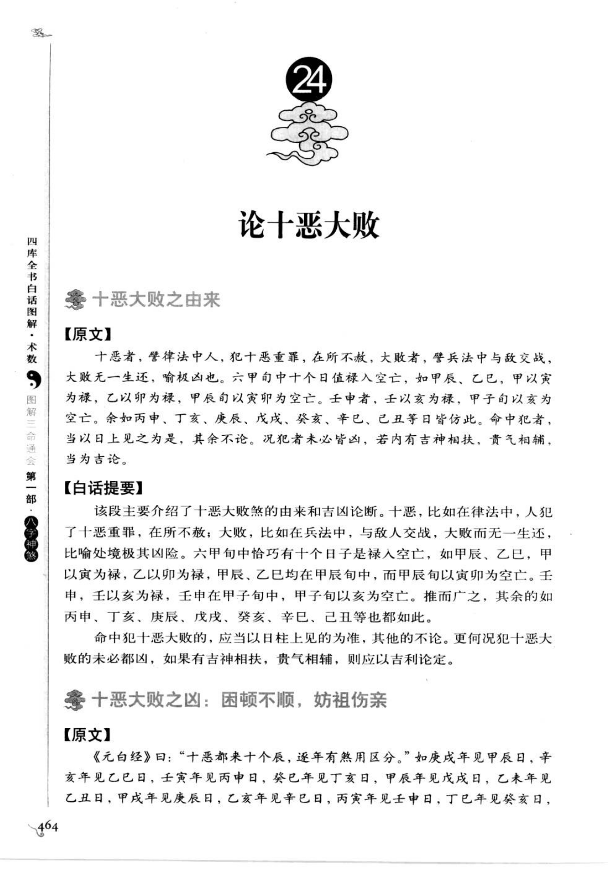
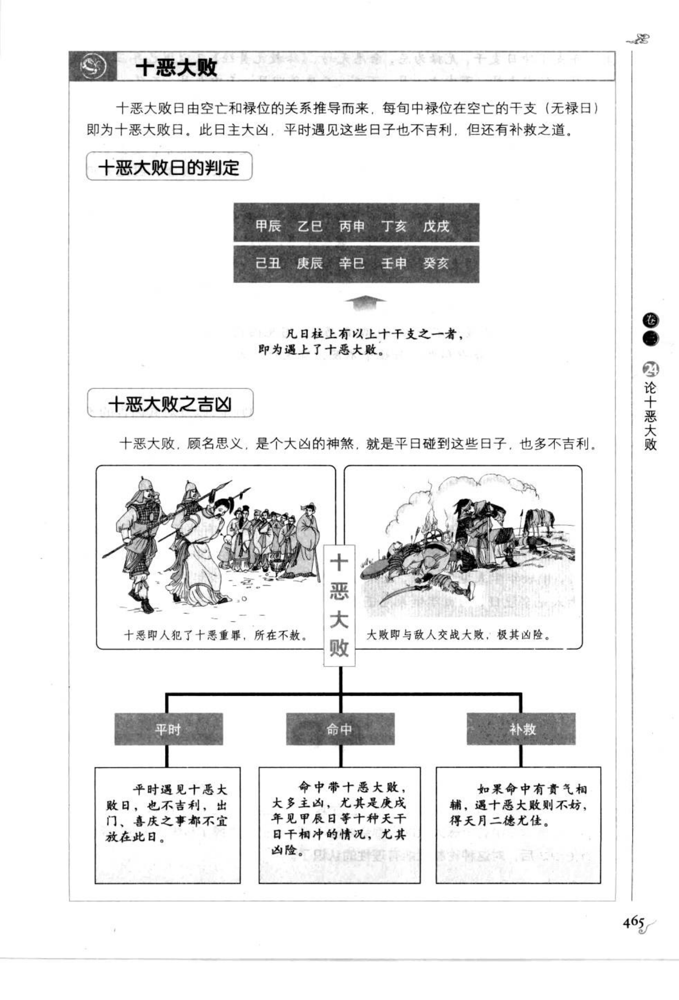
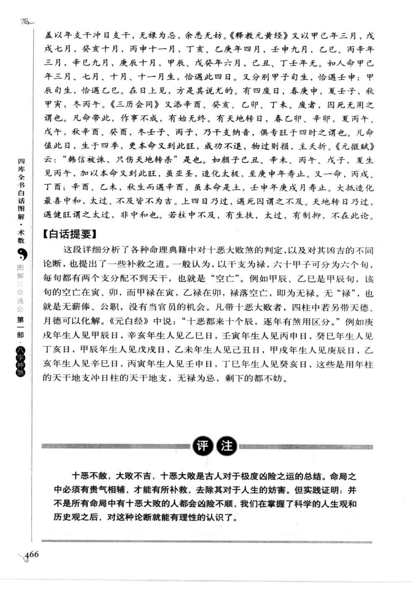

# 十恶大败（古籍摘录）

> 资料状态：OCR/人工转录初稿，来源为《图解三命通会（第1部）：八字神煞》书内页 464-466（PDF 页 468-470）。原页截图已保存到项目本地。

## 十恶大败之由来

### 【原文】

十恶者，譬律法中人，犯十恶重罪，在所不赦；大败者，譬兵法中与敌交战，大败而无一生还，喻极险其凶也。六甲旬中十个日值禄入空亡，如甲辰、乙巳、丙申、丁亥、戊戌、己丑、庚辰、辛巳、壬申、癸亥，皆在旬中禄位空亡。甲辰旬中甲以寅为禄，乙以卯为禄，甲辰、乙巳均在甲辰旬，而甲辰旬以寅卯为空亡；壬申旬中壬以亥为禄，癸以子为禄，推而广之，其余各旬同此。命中犯者，当以日上见之为是，其余不论。况犯者未必皆凶，若内有吉神相扶，贵气相辅，当为吉论。

### 【白话提要】

“十恶”借用律法中十恶重罪不可赦免来比喻，“大败”借用战场全军覆没来比喻，表示极其危险。十恶大败日是六甲旬中，日干禄位落入该旬空亡的十个日子。命中以日柱见到这些日子为主要判断，其他柱见到通常不取；若有吉神、贵气扶助，也不能一概断凶。

## 十恶大败日

| 日柱 | 所属旬 | 禄位 | 旬空中的禄位 |
| --- | --- | --- | --- |
| 甲辰 | 甲辰旬 | 寅 | 寅、卯 |
| 乙巳 | 甲辰旬 | 卯 | 寅、卯 |
| 丙申 | 甲午旬 | 巳 | 辰、巳 |
| 丁亥 | 甲申旬 | 午 | 午、未 |
| 戊戌 | 甲午旬 | 巳 | 辰、巳 |
| 己丑 | 甲申旬 | 午 | 午、未 |
| 庚辰 | 甲戌旬 | 申 | 申、酉 |
| 辛巳 | 甲戌旬 | 酉 | 申、酉 |
| 壬申 | 甲子旬 | 亥 | 戌、亥 |
| 癸亥 | 甲寅旬 | 子 | 子、丑 |

图示列出的十个日柱为：甲辰、乙巳、丙申、丁亥、戊戌、己丑、庚辰、辛巳、壬申、癸亥。具体旬空与禄位关系应以底图和所采用的旬表复核。

## 十恶大败之凶

### 【原文】

十恶大败，日由空亡和禄位的关系推导而来。每旬中禄位在空亡的干支（无禄日）即为十恶大败日。此日主大凶，平时遇见这些日子也不吉利，但还有补救之道。

盖以年支干中日支，无禄为忌，余悉无妨。凡命带十恶大败者，四柱中若另带天德、月德可以化解。命中犯十恶大败，若再逢天罗地网、官符、大耗等凶煞相并，凶险无比。

### 【白话提要】

十恶大败由空亡和禄位的对应关系推导，日柱为主要依据。平时择日遇到这些日子也多不利，但如果命局中有天德、月德等吉神，可以减轻凶性。若同时遇天罗地网、官符、大耗等凶煞，危险会明显加重。

## 图示条目转录

- 平时遇见十恶大败日也不吉利，出门、做事和投资不宜选在此日。
- 命中带十恶大败，大多主凶，尤其是戊戌年见甲辰日等日干支相冲的情形，凶险更明显。
- 命中有贵气相辅、天德月德等吉神，遇十恶大败可以获得补救，择日仍以吉神配合为佳。
- 十恶大败与天罗地网、官符、大耗等凶煞并临时，主困顿、灾祸和事业受挫。

## 取用边界

- 十恶大败以日柱十个日干支为核心，不应仅凭年、月、时柱出现同一干支就直接定论。
- 十日列表、旬空和禄位的传本表述存在差异，正式实现前应依据统一旬表重新校验。
- 古籍吉凶断语仅作知识资料保存，不等同于现代命理结论。
