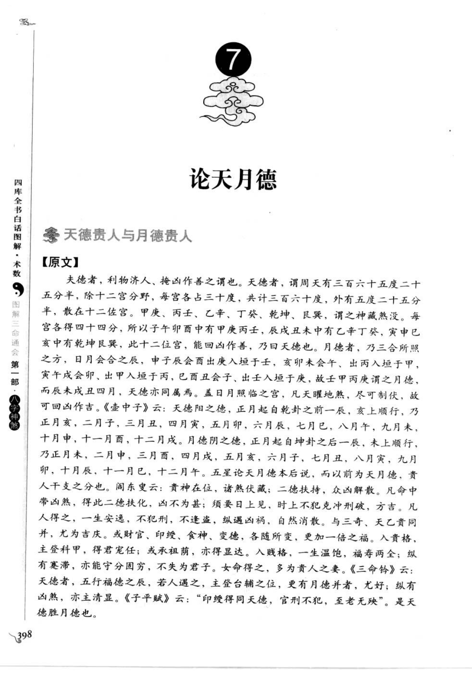
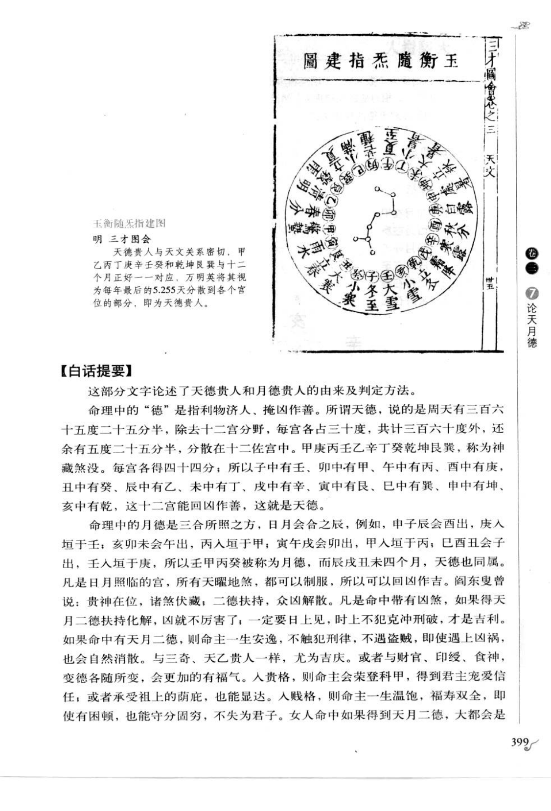
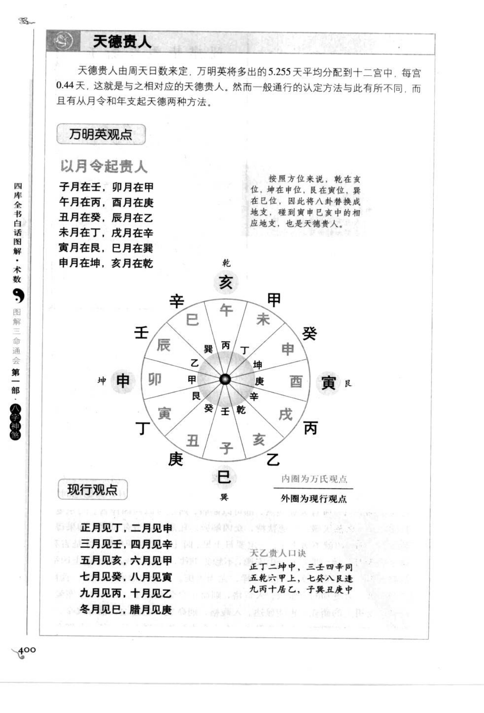
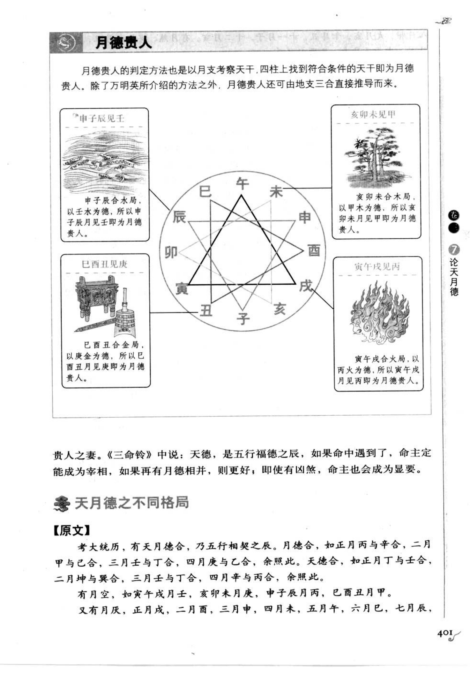
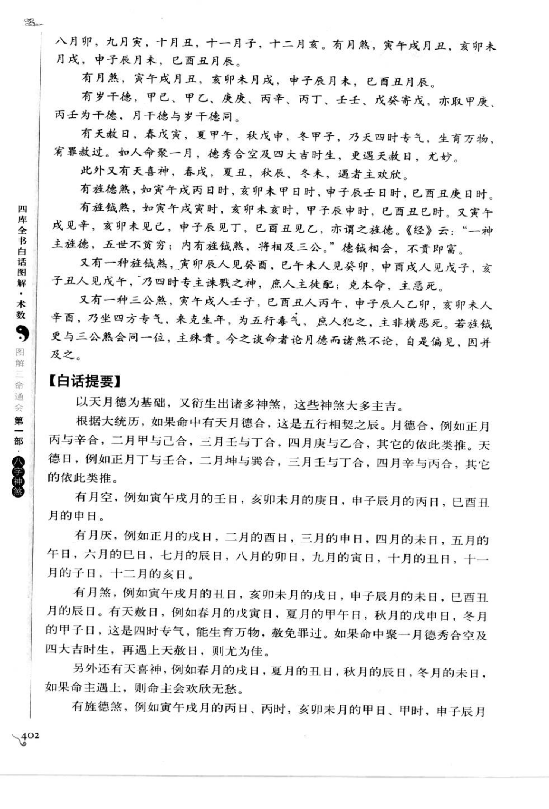
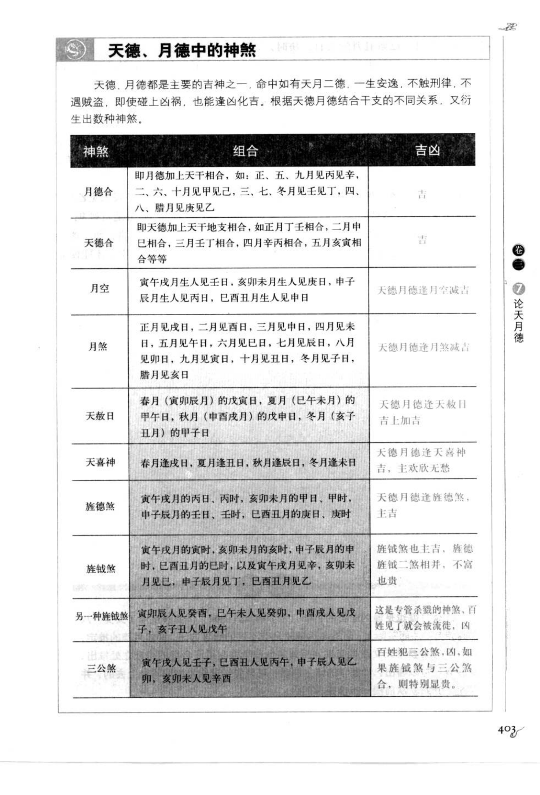
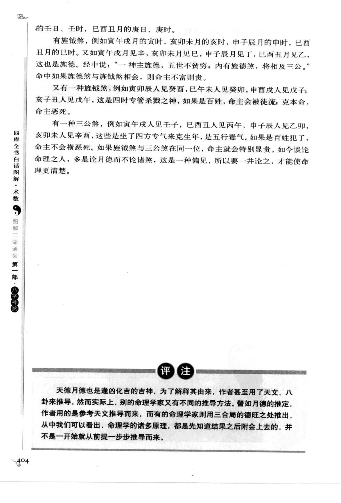

# 天月德（古籍摘录）

> 资料状态：OCR 转录初稿，来源为《图解三命通会（第1部）：八字神煞》书内页 398-404（PDF 页 402-408）。原页截图保存在 `docs/bazi/img/san_ming_tong_hui/page-402.png` 至 `page-408.png`。

## 论天月德

### 天德贵人与月德贵人

#### 【原文】

夫德者，利物济人、掩凶作善之谓也。天德者，谓周天有三百六十五度二十五分半，除十二宫分野，每宫各占三十度，共计三百六十度，外有五度二十五分半，散在十二位宫。甲庚、丙壬、乙辛、丁癸、乾坤、艮巽，谓之神藏煞没。每宫各得四十四分，所以子午卯酉中有甲庚丙壬，辰戌丑未中有乙辛丁癸，寅申巳亥中有乾坤艮巽，此十二位宫，能回凶作善，乃曰天德也。

月德者，乃三合所照之方。日月会合之辰，申子辰会西出庚入垣于巳，亥卯未会午出丙入垣于申，寅午戌会卯出甲入垣于亥，巳酉丑会子出壬入垣于寅，故壬丙甲庚谓之月德，而辰未戌丑四月，天德也同属焉。盖日月照临之宫，凡天曜地煞，尽可制伏，故可回凶作吉。

《壶中子》云：天德阳之德，正月起自乾卦之前一辰，亥上顺行，乃正月亥，二月子，三月丑，四月寅，五月卯，六月辰，七月巳，八月午，九月未，十月申，十一月酉，十二月戌。月德阴之德，正月起自坤卦之后一辰，未上顺行，乃正月未，二月申，三月酉，四月戌，五月亥，六月子，七月丑，八月寅，九月卯，十月辰，十一月巳，十二月午。五星论天月德本后说，而以前为天月德，贵人干支之分也。

阎东叟云：贵神在位，诸煞伏藏；二德扶持，众凶解散。凡命中带凶煞，得此二德扶化，以不为甚；须要日上见，时上不犯克冲刑破，方吉。凡人得之，一生安逸，不犯刑，不逢盗，纵遇凶祸，自然消散。与三奇、天乙贵同并，尤为吉庆。或财官、印绶、食神、变德，各随所变，更加一倍之福。入贵格，则命主会荣登科甲，得到君主宠爱信任；或承祖荫，也能显达。入贱格，则命主一生温饱，福寿两全，即使有困顿，也能守分固穷，不失为君子。女命得之，多为贵人之妻。

《三命铃》云：天德者，五行福德之辰，若人遇之，主登台辅之位，更有月德并者，尤好；纵有凶煞，亦主清显。《子平赋》云：“印绶得同天德，官刑不犯，至老无殃。”是天德胜月德也。

### 【白话提要】

这部分文字论述了天德贵人和月德贵人的由来及判定方法。命理中的“德”是指利物济人、掩凶作善。天德以周天度数分配十二宫，甲庚丙壬、乙己丁癸及乾坤艮巽分布其中，能够回凶作善。月德是三合局所照之方，壬、丙、甲、庚分别为申子辰、亥卯未、寅午戌、巳酉丑的月德。

天月二德能够制伏天曜地煞、化解凶煞。命中带凶煞而有天月二德扶化，凶性会减轻；最好日柱见，时柱不犯克冲刑破。与三奇、天乙贵人同见，或与财官、印绶、食神等配合，福力更强。入贵格主显达，入贱格也主温饱福寿；女命得之，多为贵人之妻。

## 万民英观点：以月令起贵人

书中说明，天德贵人由周天日数定立：余下的 5.255 天平均分配到十二宫，每宫约 0.44 天。万民英将其分配到十二宫后，得到天德贵人的对应位置。

| 月令 | 天德贵人（万民英观点） |
| --- | --- |
| 子月 | 壬 |
| 卯月 | 甲 |
| 寅月 | 丙 |
| 酉月 | 庚 |
| 丑月 | 癸 |
| 辰月 | 乙 |
| 未月 | 丁 |
| 戌月 | 辛 |
| 寅月 | 艮 |
| 巳月 | 巽 |
| 申月 | 坤 |
| 亥月 | 乾 |

原图口诀按两组列出：

> 子月在壬，卯月在甲；寅月在丙，酉月在庚；丑月在癸，辰月在乙；未月在丁，戌月在辛。
>
> 寅月在艮，巳月在巽；申月在坤，亥月在乾。

## 现行观点

原图列出的现行天德贵人口诀为：

> 正月见丁，二月见申；三月见壬，四月见辛；五月见亥，六月见甲；七月见癸，八月见寅；九月见丙，十月见乙；冬月见己，腊月见庚。

图中注明：内圈为万民英观点，外圈为现行观点。旁列《天乙贵人口诀》：

> 正丁二坤申，三壬四辛同；五乾六甲上，七癸八艮逢；九丙十乙己，子癸丑庚中。

## 取用边界

- 本文保存古籍原文、书中白话提要及两套天德贵人取法，不将其直接视为已校准的工程规则。
- “天德”与“月德”的名称、干支/方位对应存在古今不同口诀，应按采用的流派分别记录。
- 书中天德贵人的周天度数解释与现行口诀并列，实际判定前需明确使用万民英观点还是现行观点。
