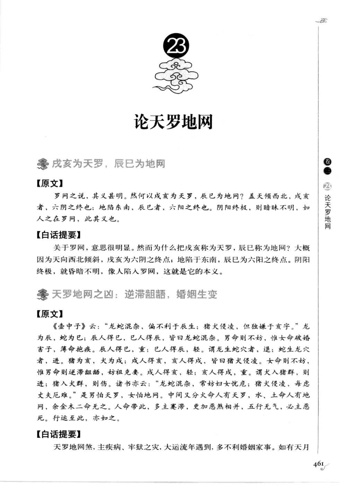
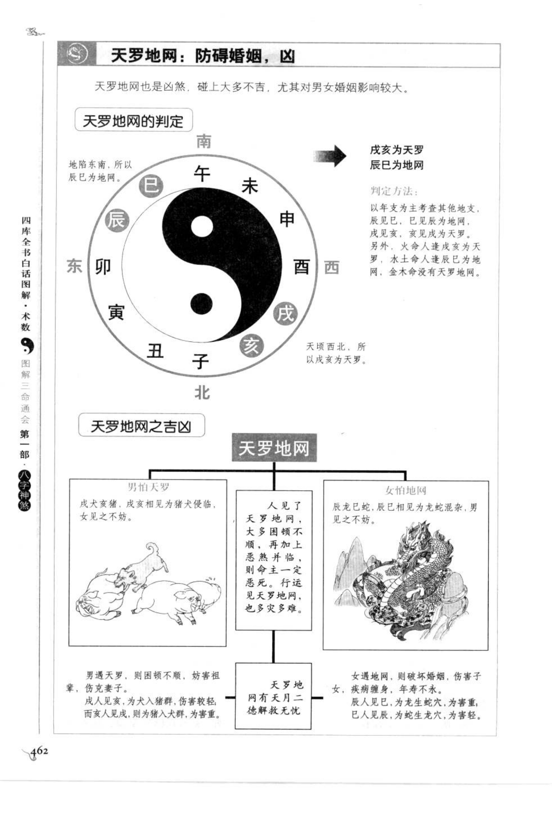
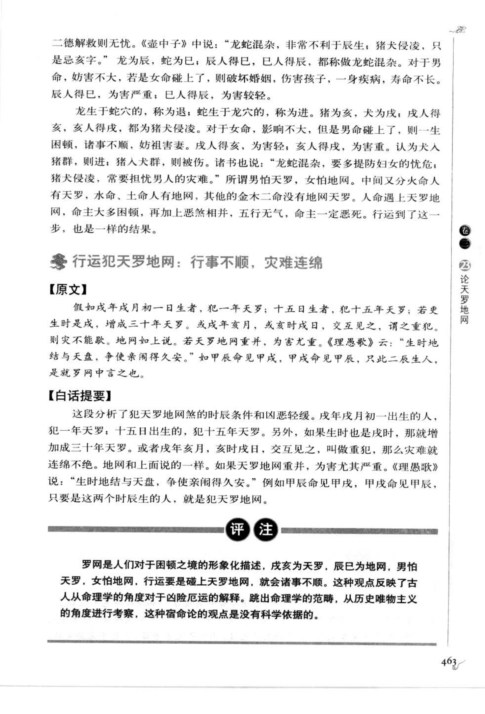

# 天罗地网（古籍摘录）

> 资料状态：OCR/人工转录初稿，来源为《图解三命通会（第1部）：八字神煞》书内页 461-463（PDF 页 465-467）。原页截图已保存到项目本地。

## 戊亥为天罗，辰巳为地网

### 【原文】

罗网之说，其义甚明。然何以戌亥为天罗，辰巳为地网？盖天倾西北，戌亥者，六阴之终也；地陷东南，辰巳者，六阳之终也。阴阳终极，则暗昧不明，如人之在罗网，此其义也。

### 【白话提要】

天罗地网的含义很明显。天向西北倾斜，戌亥是六阴的终点，所以戌亥为天罗；地向东南陷落，辰巳是六阳的终点，所以辰巳为地网。阴阳到了终极，昏暗不明，好像人落入罗网。

## 天罗地网之凶

### 【原文】

《壶中子》云：“龙蛇混杂，偏不利于辰生；猪犬侵凌，但独嫌于亥字。”龙为辰，蛇为巳；辰人得巳，巳人得辰，皆曰龙蛇混杂。男命则不妨，惟女命破婚害子，薄命抱疾。辰人得巳，重；巳人得辰，轻。谓龙生蛇穴者，退；蛇生龙穴者，进。猪为亥，犬为戌；戌人得亥，亥人得戌，皆曰猪犬侵凌。女命则不妨，惟男命则逆滞蛊毒，妨祖克妻。戌人得亥，轻；亥人得戌，重。谓犬入猪群，则进；猪入犬群，则伤。

诸书亦云：“龙蛇混杂，常妨妇女忧；猪犬侵凌，每感丈夫厄难。”是男怕天罗，女怕地网。中间又分火命人有天罗，水土命人有地网，余金木二命无之。人命带此，多主寒滞，更加恶煞相并，五行无气，必主恶死。行运至此，亦如之。

### 【白话提要】

辰巳相见称为龙蛇混杂，戌亥相见称为猪犬侵凌。龙蛇混杂对女命较不利，可能破婚、害子、抱疾；辰人得巳较重，巳人得辰较轻。猪犬侵凌对男命较不利，可能逆滞、蛊毒、妨祖克妻；戌人得亥较轻，亥人得戌较重。

古籍概括为“男怕天罗，女怕地网”。又有火命带天罗、水土命带地网，金木二命不取的说法。命中带天罗地网，多主寒滞；再遇恶煞、五行无气，则凶性加重，行运遇之也按此论。

## 天罗地网定位

| 名称 | 地支 | 取法与象义 |
| --- | --- | --- |
| 天罗 | 戌、亥 | 天倾西北，六阴之终；男命尤忌 |
| 地网 | 辰、巳 | 地陷东南，六阳之终；女命尤忌 |

判定以年支为主考察其他三柱地支。图示示例：戊戌为天罗，辰巳为地网；年柱、日柱或时柱见对应支，即可作为命中带天罗地网的参考。

## 图示条目转录

- 男怕天罗：男命见天罗，若再与凶煞相并，逆滞、妨祖克妻等应较明显。
- 女怕地网：女命见地网，可能破婚、伤子、疾病缠身；辰人见巳重，巳人见辰轻。
- 人见天罗地网：大多困顿，遇恶煞并临，命局五行无气，主恶死；行运见天罗地网也有灾难。
- 天罗地网有天月二德解救：图示说明天月二德等吉神可以缓解凶性，但仍需结合全局。

## 行运犯天罗地网

### 【原文】

假如戊年戌月初一日生者，犯一年天罗；十五日生者，犯十五年天罗；若更生时是戌，增成三十年天罗。戌年亥月，或亥时戌日，交互见之，谓之重犯，则灾不能躲。地网如上说。若天罗地网重并，为害尤重。《理愚歌》云：“生时地结与天盘，争使亲闱得久安。”如甲辰命见甲戌，甲戌命见甲辰，只此二辰生人，是就罗网中言之也。

### 【白话提要】

出生年月日时与天罗地网反复交见，会按年、十五年、三十年等层次加重；天罗地网交互重犯时，灾难难以躲避。天罗地网同时重叠，危害尤其严重。图示以甲辰命见甲戌、甲戌命见甲辰为例，说明辰戌互见属于罗网相犯。

## 取用边界

- 天罗地网以戌亥、辰巳及年柱为主要定位，男女命、纳音五行和岁运属于叠加口径；行运重犯时还要考虑年月日时的交互。
- 龙蛇混杂、猪犬侵凌、火命天罗及水土命地网等各家说法有差异，本文保留原书异说，不固化为单一结论。
- 古籍吉凶断语仅作知识资料保存，不等同于现代命理结论。
