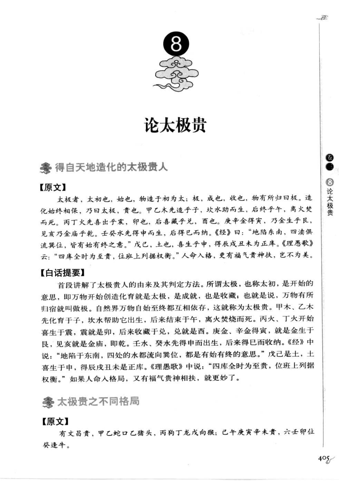
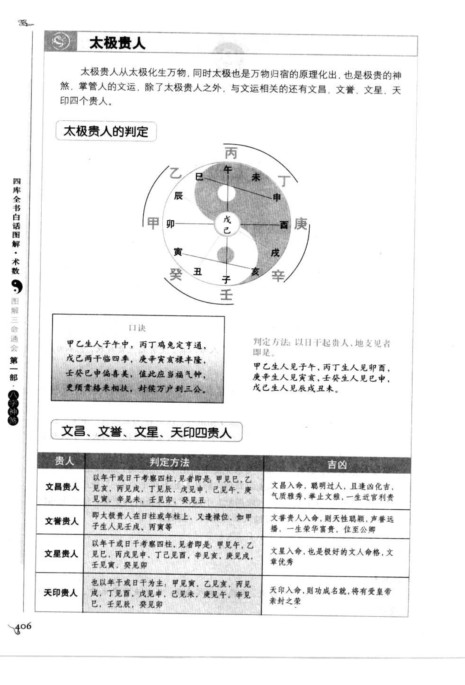
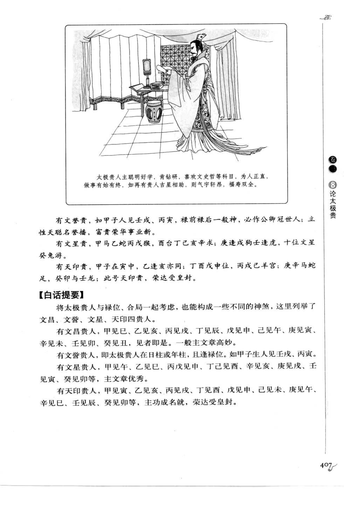

# 太极贵（太极贵人，古籍摘录）

> 资料状态：OCR 转录初稿，来源为《图解三命通会（第1部）：八字神煞》书内页 405-407（PDF 页 409-411）。原页截图保存在 `docs/bazi/img/san_ming_tong_hui/page-409.png` 至 `page-411.png`。

## 得自天地造化的太极贵人

### 【原文】

太极者，太初也，始也，物造于初为太；极，成也，收也，物有所归回极。造化始终相保，乃曰太极，贵也。甲乙木先造于子，坎水助而生，后终于午，离火焚而死。丙丁火先喜出于震，卯也，后喜藏于兑，酉也。庚辛金得寅，乃金生于艮，见亥乃金庐于乾。壬癸水先得申而生，后得巳而纳。《经》曰：“地陷东南，四渎俱流巽位，皆有始有终之意。”戊己，土也，喜生于申，得辰戌丑未为正库。《理愚歌》云：“四库全时为至贵，位班上列据权衡。”人命入格，更有福气贵神相扶，岂不为美。

### 【白话提要】

太极也称太初，是开始的意思；万物开始创造化育就是太，完成并收藏、万物有所归宿就是极。自然界万物自始至终相互依存，所以称为太极贵。甲乙木先在子处生成，得到坎水帮助，后来在午处终止，被离火焚灭；丙丁火开始在震卦（卯）显露，后来在兑卦（酉）收藏；庚辛金得寅为生，见亥则归藏于乾；壬癸水得申而生，后来在巳收纳。戊己土喜生于申，辰戌丑未为其正库。《理愚歌》说四库俱全最为尊贵。命局入格又有福气、贵神相扶，格局更佳。

## 太极贵人的判定

书中判定方法为“以日干起贵人，地支见者即是”。口诀如下：

> 甲乙生人子午中，丙丁鸡兔定亨通；戊己两干临四季，庚辛寅亥禄丰隆；壬癸申巳最为贵，值此应当福气钟；更须贵格来相扶，封侯万户到三公。

| 日干 | 太极贵人地支 |
| --- | --- |
| 甲、乙 | 子、午 |
| 丙、丁 | 卯、酉 |
| 戊、己 | 辰、戌、丑、未 |
| 庚、辛 | 寅、亥 |
| 壬、癸 | 申、巳 |

## 太极贵的不同格局

原图将太极贵与禄位等组合分为文昌贵人、文誉贵人、文星贵人、天印贵人：

| 贵人 | 判定方法（原图转录） | 吉凶取象 |
| --- | --- | --- |
| 文昌贵人 | 以年干或日干考察四柱：甲见巳，乙见午，丙见申，丁见酉，戊见申，己见酉，庚见亥，辛见子，壬见寅，癸见卯 | 聪明过人，逢凶化吉，气质雅秀，举止文雅，一生近官利贵 |
| 文誉贵人 | 太极贵人在日柱或年柱，又逢禄位，如甲子生人见壬戌、丙寅等 | 天性聪颖，名誉播扬，富贵荣华 |
| 文星贵人 | 以年干或日干考察四柱，见相应文星支：甲见午，乙见巳，丙见申，丁见酉，戊见戌，己见亥，庚见戌，壬见寅，癸见卯等 | 文章优秀 |
| 天印贵人 | 以年干或日干为主：甲见寅，乙见亥，丙见戌，丁见酉，戊见申，己见未，庚见午，辛见巳，壬见辰，癸见卯 | 功成名就，得受皇帝封赏 |

### 【原文：四类格局例证】

有文誉贵，如甲子人见壬戌、丙寅，禄前禄后一位神，必作公卿冠世人；立性天聪名誉播，富贵荣华事业新。

有文星贵，甲马乙蛇丙戊猴，酉亥丁己亥辛求；庚逢戌狗壬逢虎，十位文星癸兔游。

有天印贵，甲子在寅中，乙逢亥亦同；丁酉戊申位，丙戌己羊宫；庚辛马蛇足，壬卯与壬龙；此号天印贵，荣达受皇封。

### 【白话提要】

太极贵与禄位、四柱干支组合，还能形成文昌、文誉、文星、天印四种贵人。文昌主聪明文雅、近官利贵；文誉主名誉传播、富贵荣华；文星主文章优秀；天印主功成名就、受皇封赏。

## 取用边界

- 本文保存书中太极贵及四类相关贵人的原文和判定表，不将吉凶断语直接作为已校准的工程规则。
- 判定主法以日干为起点；文昌、文星、天印等条目另有以年干考察四柱的说法，需按流派区分。
- 四类贵人的个别口诀在底图中存在版式紧密或字形模糊处，正式实现前应继续逐字校勘。

