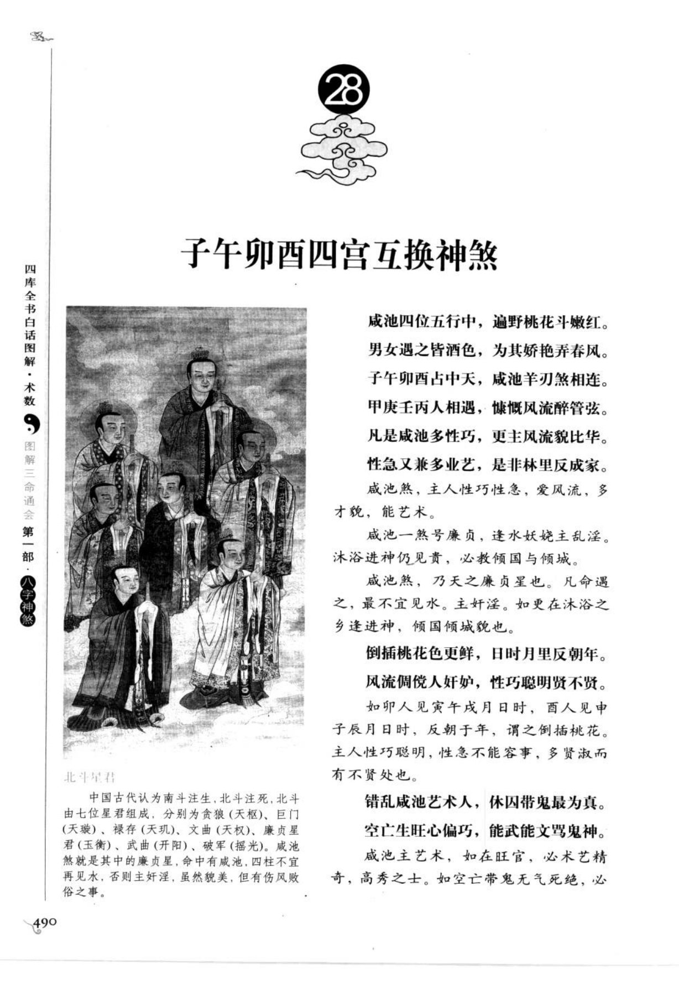
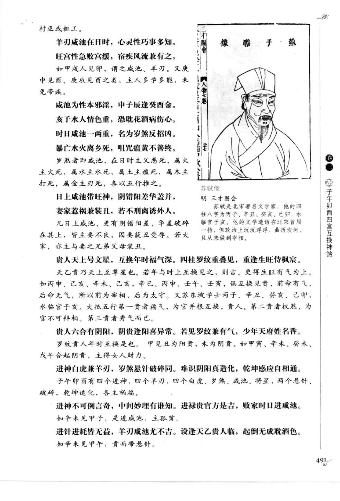
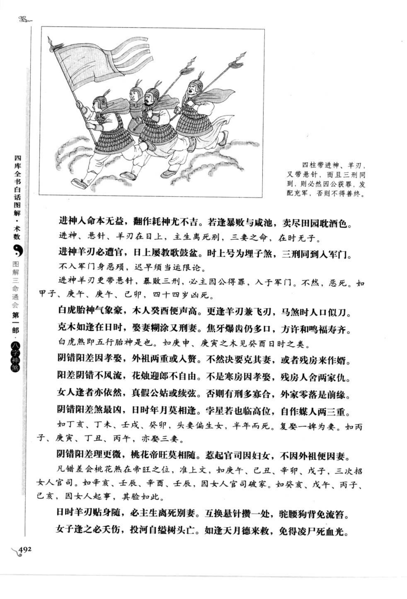
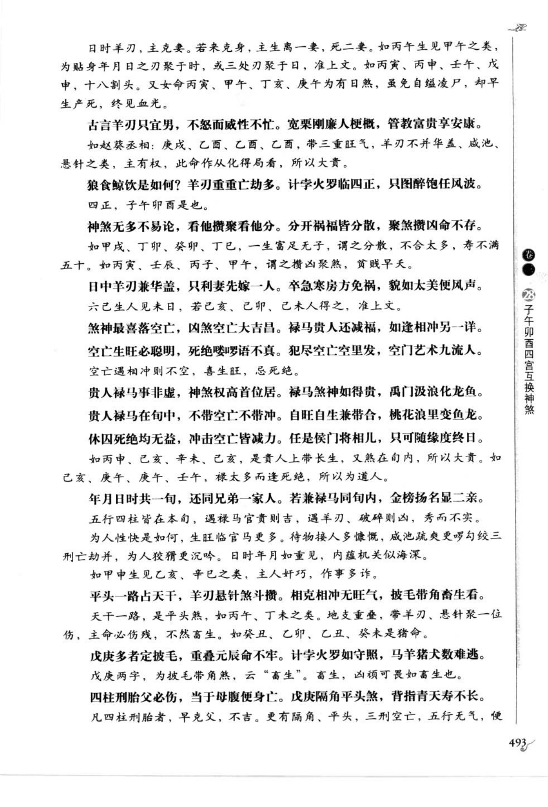
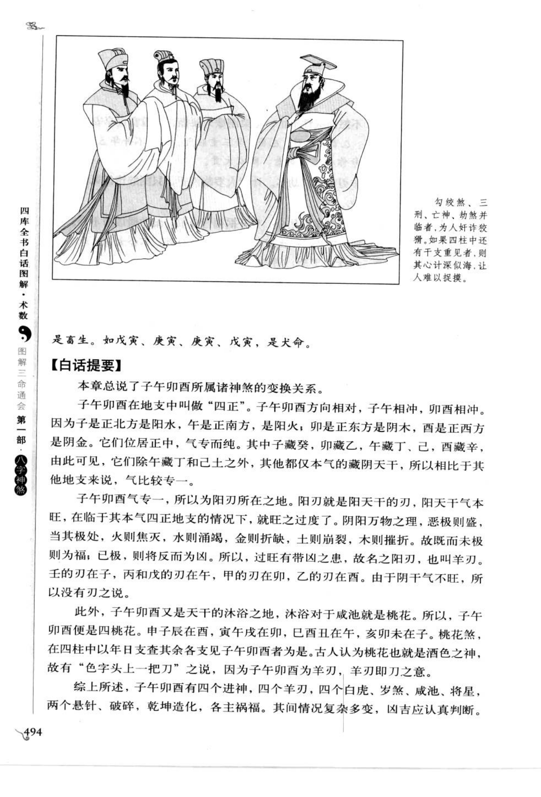

# 子午卯酉四宫互换神煞（第 28 章）

> 资料状态：OCR/人工转录初稿，来源为《图解三命通会（第1部）：八字神煞》书内页 490-494（PDF 页 494-498）。原页截图已保存到项目本地；古诗、日时例证和个别字形以 `[待校]` 标记。

## 四正、四桃花与咸池

### 【原文摘录】

子午卯酉在地支中叫作“四正”：子为正北阳水，午为正南阳火，卯为正东阴木，酉为正西阴金。子午相冲，卯酉相冲；子藏癸、卯藏乙、午藏丁、酉藏辛，除本气外，几乎不杂他气，所以气专而纯。

子午卯酉又是天干的沐浴之地，沐浴对于咸池就是桃花，因此子午卯酉便是四桃花。申子辰在酉，寅午戌在卯，巳酉丑在午，亥卯未在子；以年、日支查其余各支见子午卯酉者，皆为桃花煞。

咸池四位五行中，遍野桃花斗嫣红。男女遇之皆酒色，为其娇艳弄春风。子午卯酉占中天，咸池羊刃煞相连。甲庚壬丙人相遇，慷慨风流醉管弦。凡是咸池多性巧，更主风流貌比华；性急又兼多业艺，是非林里反成家。

## 四宫互换与吉凶

咸池一煞号廉贞，逢水妖娆主乱淫；沐浴进神仍见贵，必教倾国与倾城。咸池煞乃天之廉贞星，凡命遇之，最不宜见水，主奸淫；如更在沐浴之乡逢进神，倾国倾城貌也。倒插桃花更鲜，日时月里反朝年；如卯人见寅午戌月日時，西人见申子辰月日時，反朝于年，谓之倒插桃花。

咸池为性本邪淫，申子辰逢癸酉金；亥子水人情色重，恐耽花酒病伤心。日时咸池一两重，名为岁煞反招凶。暴亡水火离乡死，咒咀瘟黄不善终。

日上咸池带旺神，阴错阳差华盖并；妻家惹祸兼装丑，若不刑离诱外人。凡日上咸池，更有阴错阳差、华盖破碎在其上，皆主妻不良，因妻获丑受辱；若大家，亦主与妻之兄弟父母装丑。

贵人天上号文星，互换年时福气深；四柱罗纹重叠见，重逢生旺时极荣。天乙贵乃天上至尊星也，若年与时上互换见之则吉，更得生旺有气为上。

贵人六合有阴阳，阴贵逢阳喜异常；若见罗纹兼有气，少年天府姓名香。罗纹贵人年时互换：甲见丑为阳贵，未为阴贵；如甲寅、辛未、癸未、戊午合起阴贵，主得女人财力。

## 进神、羊刃、悬针及其他组合

进神白虎兼羊刃，岁煞悬针破碎同。子午卯酉有四个进神、四个羊刃、四个白虎、岁煞、咸池、将星、两个悬针、破碎、乾坤造化，各主祸福。

进神不可例言首，中间妙理有谁知。进禄贵官方是吉，败家时日进咸池。进针进耗皆无益，羊刃咸池尤不吉。设逢天乙贵人临，起倒无成耽酒色。四柱带进神、羊刃，又带悬针，且三刑同到，必然因公获罪，发配充军，否则不得善终。

进神人命本无益，翻作耗神尤不吉。若逢暴败与咸池，卖尽田园耽酒色。进神羊刃必遭官，日上屡数歌鼓盆，时上号为埋子煞，三刑同到人军门；不入军门身恶殒，迟早须当运限论。

白虎胎神气象衰，木人癸酉便声高；更逢羊刃兼飞刃，马煞时人只似刀。克木如逢在日时，娶妻柳缘又刑妻；焦牙爆齿仍多口，方许和鸣福寿齐。

## 阴错阳差、华盖、孤辰及刑冲

阴错阳差因孝娶，外祖两重或人赘；不然决要克其妻，或者败房来作婿。阳差阴错不风流，花烛迎郎不自由；不是寒房因孝娶，残房人舍两家仇。女人逢者亦依然，真个公姑或续弦；否则有刑多寡合，外家零落是前缘。

阴错阳差煞最凶，日时年月份相逢；字星若也临高位，自作媒人两三重。日时羊刃贴身随，必主生离死别妻；互换悬针攒一处，驼腰狗背免流离。女子逢之必天伤，投河自缢树头亡；如逢天月德来救，免得凌尸死血光。

## 【白话提要】

子午卯酉是四个正方位，位置居中、气专而纯，又是沐浴和桃花之地。四柱以年支或日支查见子午卯酉，常取咸池、桃花、酒色和才艺之象；但若同时叠见羊刃、白虎、悬针、破碎、阴错阳差、华盖或刑冲，可能转为刑伤、婚姻不顺、破财、疾病和孤克。

本章反复强调“互换”和旺衰：贵人、禄马、长生在有气处互换，多主贵显；咸池、羊刃、亡神等凶煞重叠，尤其落在死绝、空亡或刑冲位置，则凶象加重。咸池并非一概为凶，需结合纳音、五行、贵人和全局通变判断。

## 取用边界

- 本条为第 28 章章节资料，覆盖书内页 490-494（PDF 494-498），不等同于单一神煞算法。
- 子午卯酉、咸池、进神、羊刃、白虎、悬针及阴错阳差的组合规则必须结合四柱、纳音、旺衰和岁运，本文不将古诗断语直接固化为程序判定。
- 古诗、日时例证和吉凶断语仅作知识资料保存，正式实现前应逐字回看底图校勘。
