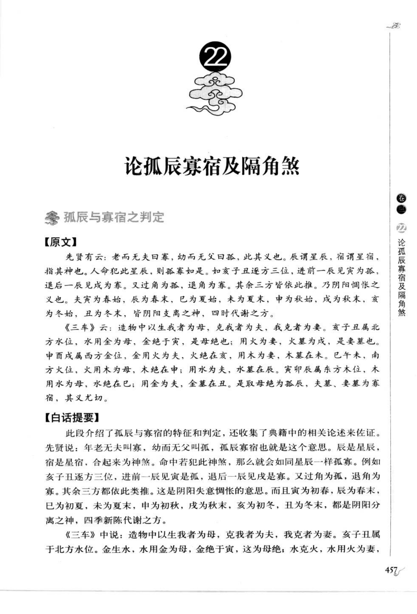
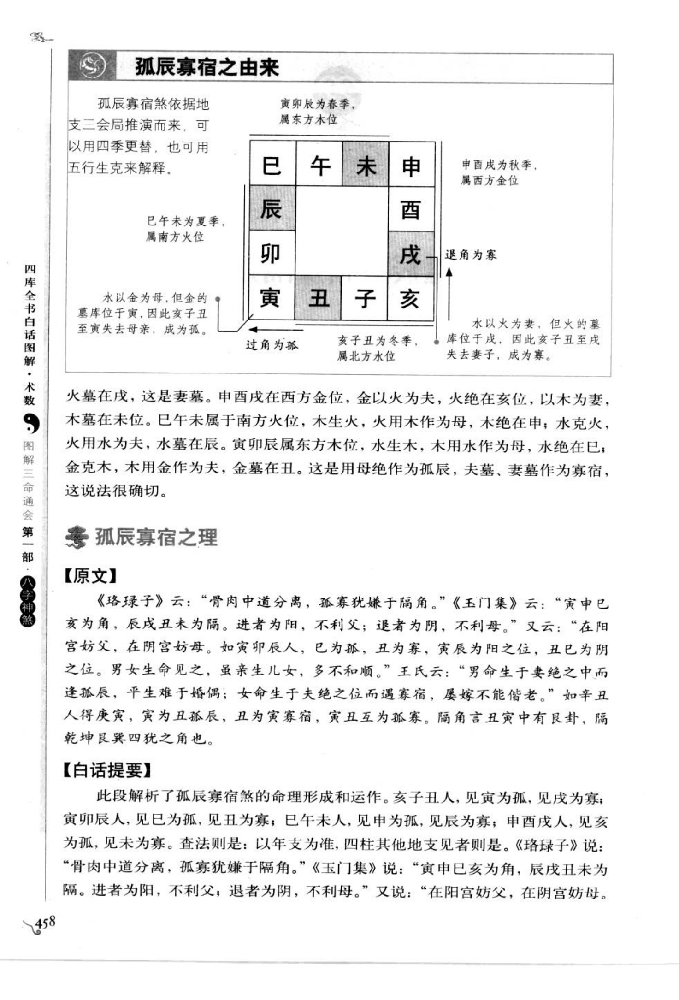
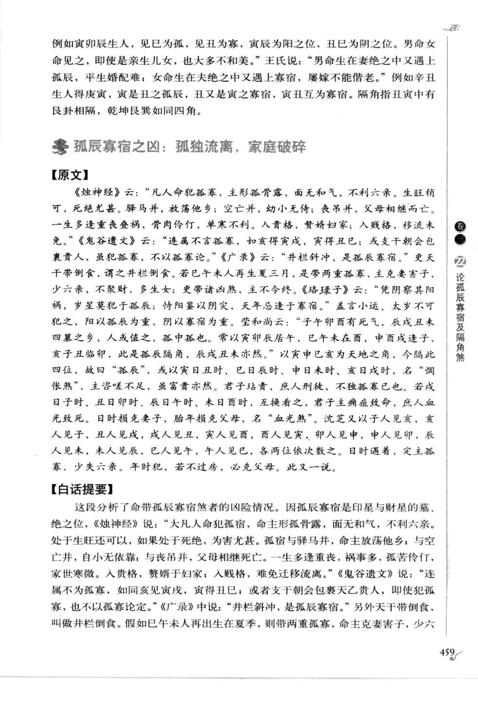
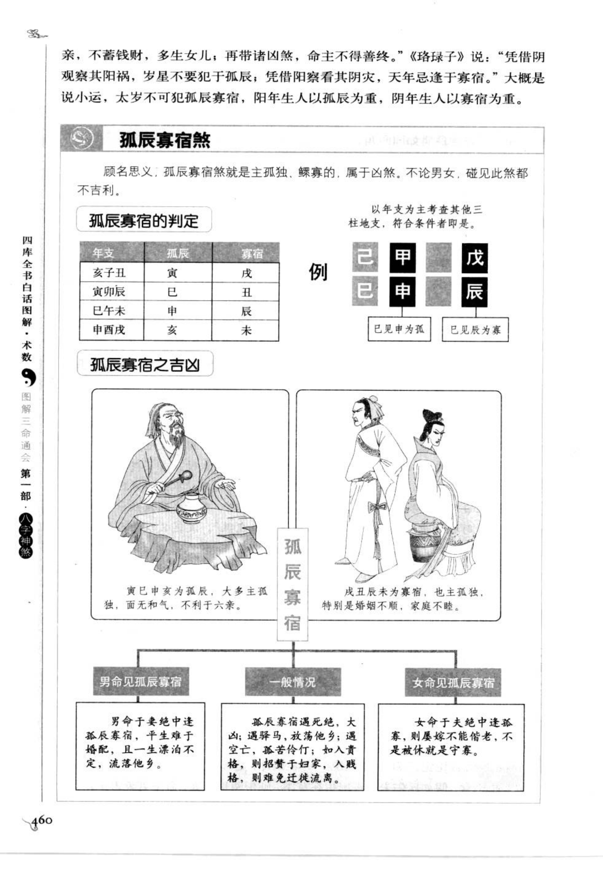

# 孤辰寡宿及隔角煞（古籍摘录）

> 资料状态：OCR/人工转录初稿，来源为《图解三命通会（第1部）：八字神煞》书内页 457-460（PDF 页 461-464）。原页截图已保存到项目本地。

## 孤辰寡宿之判定

### 【原文】

先贤有云：老而无夫曰寡，幼而无父曰孤，此其义也。辰谓星辰，宿谓星宿，指其神也。人命犯此星辰，则孤寡如是。如亥子丑逐方三位，进前一辰见寅为孤，退后一辰见戌为寡。又过角为孤，退角为寡。其余三方皆依此推。乃阴阳失意悖忤之义也。夫寡为春始，辰为春末，巳为夏始，未为夏末，申为秋始，戌为秋末，亥为冬始，丑为冬末，皆阴阳支离之神，四时代谢之方。

《三车》云：造物中以生我者为母，克我者为夫，我克者为妻。亥子丑属北方水位，水用金为母，金绝于寅，是母绝也；用火为妻，火墓在戌，是妻墓也。申酉戌属西方金位，金用火为夫，火绝在亥，以木为妻，木墓在未。巳午未属南方火位，火用木为母，木绝在申；用水为夫，水墓在辰。寅卯辰属东方木位，木用水为母，水绝在巳；用金为夫，金墓在丑。是取母绝为孤辰，夫墓、妻墓为寡宿，其义尤切。

### 【白话提要】

孤辰寡宿是孤独、寡居之象。先贤说，年老无夫为寡，年幼无父为孤；命中犯此星辰，也有孤寡之意。按三方地支推算，亥子丑方进前三位见寅为孤，退后一位见戌为寡；其他三方依此类推。隔角同样有过角为孤、退角为寡的说法。

孤辰寡宿所在的地支，都是阴阳支离、四时更替的位置。依据五行生克，母绝之处取孤辰，夫墓或妻墓之处取寡宿：亥子丑见寅为孤、戌为寡；寅卯辰见巳为孤、丑为寡；巳午未见申为孤、辰为寡；申酉戌见亥为孤、未为寡。

## 孤辰寡宿之由来

### 【原文】

孤辰寡宿煞依地支三会局推演而来，可以用四季更替，也可用五行生克来解释。火墓在戌，这是妻墓；申酉戌在西方金位，金以火为夫，火绝在亥，以木为妻，木墓在未。巳午未属南方火位，火生木，火用木为母，木绝在申；水为夫，水墓在辰。寅卯辰属东方木位，木生水，木用水为母，水绝在巳；金为夫，金墓在丑。这是用母绝作为孤辰，夫墓、妻墓作为寡宿，其说法很确切。

### 【白话提要】

孤辰寡宿按地支三会局推演，也可以从四季和五行生克解释。各三会局取其母绝为孤辰、夫墓或妻墓为寡宿，是图示判定的理论来源。

## 孤辰寡宿之理

### 【原文】

《珞琭子》云：“骨肉中道分离，孤寡犹嫌于隔角。”《玉门集》云：“寅申巳亥为角，辰戌丑未为隔。进者为阳，利利父；退者为阴，不利母。”又云：“在阳宫妨父，在阴宫妨母。如寅卯辰人，巳为孤，丑为寡，辰巳为阳之位，丑巳为阴之位。男命生而见之，虽亲生儿女，多不和顺。”王氏云：“男命生于妻绝之中而逢孤辰，平生婚配难；女命生于夫绝之位而遇寡宿，屡嫁不能偕老。”如辛丑人得庚寅，寅为丑孤辰，丑为寅寡宿。隔角言丑寅中有艮卦相隔，乾坤艮巽如同四角。

### 【白话提要】

诸家认为孤辰寡宿会造成骨肉分离，隔角会加重孤独。寅申巳亥为角，辰戌丑未为隔；顺进为阳、逆退为阴，分别有妨父、妨母的说法。男命在妻绝处遇孤辰，婚姻较难；女命在夫绝处遇寡宿，婚姻难以长久。孤辰、寡宿同时出现，或再逢隔角，凶性更重。

## 孤辰寡宿之凶

### 【原文】

《烛神经》云：“凡人命犯孤寡，主形孤骨露，面无和气，不利六亲。生旺稍可，死绝尤甚。驿马并，放荡他乡；空亡并，幼小无依；丧吊并，父母相继而亡。一生多逢重丧重祸，骨肉伶仃，单寒不利。入贵格，赘婿妇家；入贱格，移流未免。”《鬼谷遗文》云：“连属不言孤寡，如亥得寅寅，寅得丑巳；或支干朝会包裹贵人，虽犯孤寡，不以孤寡论。”《广录》云：“井栏斜冲，是孤辰寡宿。”更天干带倒食，谓之井栏倒食。若巳午未人再生夏三月，是带两重孤寡，主克妻害子，少六亲，不聚财，多生女；更带诸凶，主不得善终。若寅午未人再生夏三月，是带两重孤寡，主克妻害子，少六亲，不聚财，多生女；更带诸凶，主不得善终。

《珞琭子》云：“凭借阴阳察其阳祸，岁星不要犯孤辰；凭借阳察看其阴灾，天年忌逢于寡宿。”大概小运、太岁不可犯孤辰寡宿，阳年生人以孤辰为重，阴年生人以寡宿为重。

### 【白话提要】

孤辰寡宿是印星与财星的墓、绝之位，属于凶煞。命中犯孤辰寡宿，可能形孤骨露、面无和气、不利六亲；处生旺时稍轻，处死绝时更重。与驿马并，容易放荡漂泊；与空亡并，幼年无依；与丧吊并，可能父母相继而亡。一生多有重丧重祸，骨肉伶仃，家庭寒薄。

入贵格时可能成为赘婿或寄居妇家，入贱格则难免迁移流离。若有合会包裹贵人，虽犯孤寡也可不按孤寡论。小运、太岁不宜再犯；阳年生人以孤辰为重，阴年生人以寡宿为重。男命在妻绝处逢孤辰多主婚姻困难，女命在夫绝处逢寡宿多主婚姻不顺。

## 孤辰寡宿定位表

| 年支三会局 | 孤辰 | 寡宿 | 五行解释 |
| --- | --- | --- | --- |
| 亥子丑 | 寅 | 戌 | 水局母绝于寅，妻墓于戌 |
| 寅卯辰 | 巳 | 丑 | 木局母绝于巳，夫墓于丑 |
| 巳午未 | 申 | 辰 | 火局母绝于申，夫墓于辰 |
| 申酉戌 | 亥 | 未 | 金局夫绝于亥，妻墓于未 |

原图判定以年支为主，其他三柱见对应孤辰、寡宿也可参考。示例：己巳年见寅为孤辰，己巳年见辰为寡宿；己酉年见亥为孤辰，己酉年见未为寡宿。

## 隔角煞

隔角与孤辰寡宿同属孤独、分离之象。原文称“孤寡犹嫌于隔角”，并以寅申巳亥为角、辰戌丑未为隔；顺进为阳、逆退为阴。隔角与孤辰寡宿同见时，主骨肉分离、婚姻不顺等象，但若命局有合会、贵人和生旺扶助，仍须按整体格局取舍。

## 图示条目转录

| 图示情形 | 原图取象 |
| --- | --- |
| 男命见孤辰寡宿 | 男命在妻绝处逢孤辰寡宿，平生难于婚配，且一生漂泊不定；与驿马等并时，放荡他乡。 |
| 女命见孤辰寡宿 | 女命在夫绝处逢孤辰寡宿，屡嫁不能偕老；与寡宿、驿马等并时，婚姻和家庭更不稳定。 |
| 一般情形 | 孤辰寡宿遇死绝、大运流年或凶煞并，主孤独、流离、家庭破碎；入贵格或得贵人扶助，凶性可减。 |
| 孤辰寡宿并临 | 孤辰、寡宿同时出现，通常较单见为重；小运、太岁再遇时，灾应加重。 |

## 取用边界

- 孤辰寡宿以年支所属三会局、母绝和夫妻墓取法为主，男女命、阳阴年及岁运属于叠加条件。
- 隔角、驿马、空亡、丧吊、倒食、贵人和合会等会改变轻重，本文保留古籍多种口径，未固化为单一吉凶结论。
- 古籍吉凶断语仅作知识资料保存，不等同于现代命理结论。
