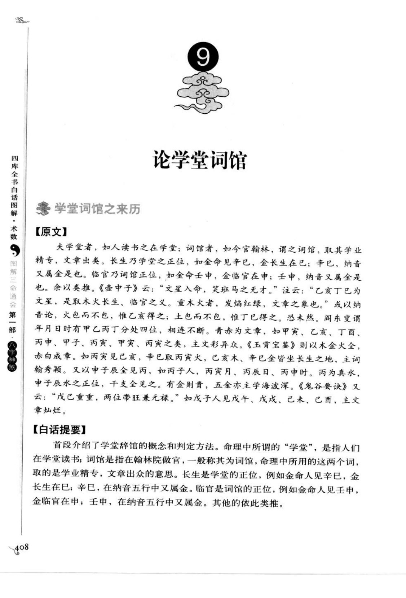
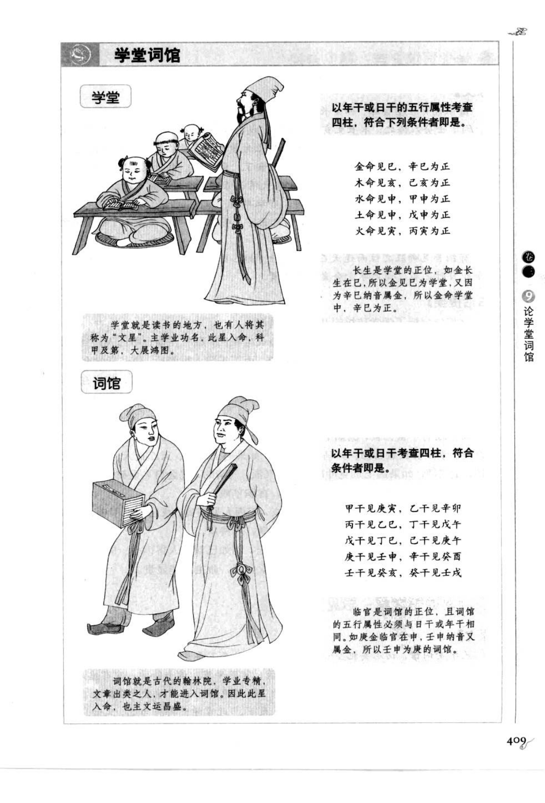
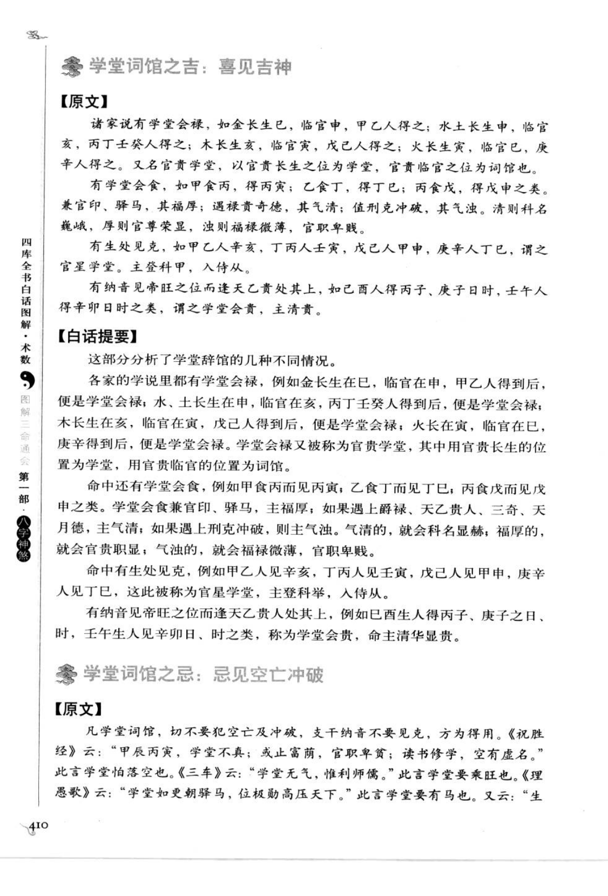
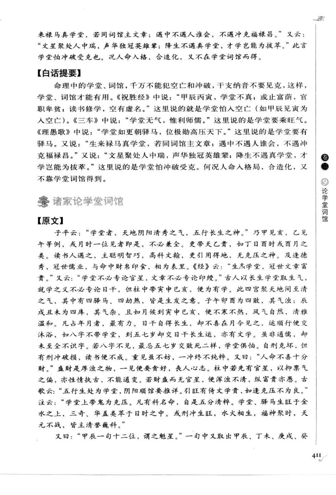
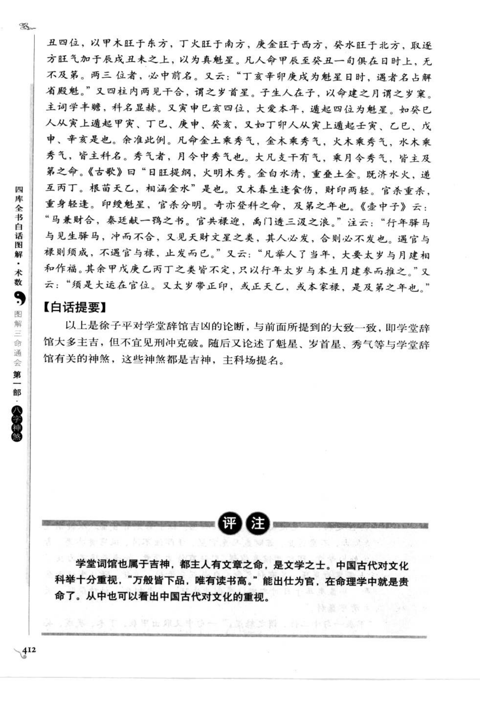

# 学堂词馆（古籍摘录）

> 资料状态：OCR 转录初稿，来源为《图解三命通会（第1部）：八字神煞》书内页 408-412（PDF 页 412-416）。原页截图保存在 `docs/bazi/img/san_ming_tong_hui/page-412.png` 至 `page-416.png`。

## 学堂词馆之来历

### 【原文】

夫学堂者，如人读书之在学堂；词馆者，如今官翰林，谓之词馆，取其学业精专，文章出类。长生乃学堂之正位，如金命见辛巳，金长生在巳；辛巳，纳音又属金是也。临官乃词馆正位，如金命壬申，金临官在申；壬申，纳音又属金是也。

余以类推。《壶中子》云：“文星入命，奕蹄马之无才。”注云：“乙亥丁巳为文星，是取木火长生、临官之义。重木火者，发焰红绿，文章之象也。”或以纳音论，火色而不白，惟乙亥得之；土色而不白，惟丁巳得之。恐未然。阎东叟谓年月日時有甲乙丙丁分处四位，相连不断。青赤为文章，如甲寅、乙亥、丁酉、丙申、甲子、丙寅、甲寅、丙寅之类，主文彩异众。

《玉霄宝鉴》则以木金火全，赤白成章。如丙寅见己亥，辛巳取丙寅火、己亥木、辛巳金皆生长生之地，主词翰秀颖。又以申子辰全见丙，如丙子人、丙寅月、丙辰日、丙申时，丙为真水，申子辰水之正位，干支全见之，有金则贵，五金亦主学海波深。

《鬼谷遗诀》又云：“戊己重重，两位带旺兼无禄。”如戊子人见戊午、戊戌、己未、己巳，主文章灿烂。

### 【白话提要】

学堂是读书学习之地，词馆是翰林院一类的官署，取学业精专、文章出众之意。长生是学堂的正位，临官是词馆的正位；例如金命见辛巳为学堂，见壬申为词馆。其余五行依此类推。命局中青赤相连、木金火俱全、申子辰与丙火等组合，古籍多以文章秀颖、科名显达论。

## 学堂词馆的判定

原图按年干或日干考查四柱，符合下列条件者即是：

| 五行命 | 学堂（长生） | 词馆（临官） |
| --- | --- | --- |
| 金命 | 见巳，辛巳纳音属金 | 见申，壬申纳音属金 |
| 木命 | 见亥，乙亥纳音属木 | 见寅，甲寅纳音属木 |
| 水命 | 见申，丙申纳音属水 | 见亥，壬亥纳音属水 |
| 土命 | 见申，戊申纳音属土 | 见亥，己亥纳音属土 |
| 火命 | 见寅，丙寅纳音属火 | 见巳，丁巳纳音属火 |

原图口诀：

> 金命见巳，辛巳为正；木命见亥，乙亥为正；水命见申，丙申为正；土命见申，戊申为正；火命见寅，丙寅为正。

## 学堂词馆之吉凶

### 【原文】

有文誉贵，如甲子人见壬戌、丙寅，禄前禄后一位神，必作公卿冠世人；立性天聪名誉播，富贵荣华事业新。

有文星贵，甲马乙蛇丙戊猴，酉亥丁己亥辛求；庚逢戌狗壬逢虎，十位文星癸兔游。

有天印贵，甲子在寅中，乙逢亥亦同；丁酉戊申位，丙戌己羊宫；庚辛马蛇足，壬卯与壬龙；此号天印贵，荣达受皇封。

有学堂会禄，如金长生巳，临官申，甲乙人得之；水土长生申，临官亥，丙丁壬癸人得之；木长生亥，临官寅，戊己人得之；火长生寅，临官巳，庚辛人得之。又名官贵学堂，以官贵长生之位为学堂，官贵临官之位为词馆也。

有学堂会食，如甲食丙，得丙寅；乙食丁，得丁巳；丙食戊，得戊申之类。兼官印、驿马，其福厚；遇禄贵奇德，其气清；值刑克冲破，其气浊。清则科名巍峨，厚则官尊荣显，浊则福禄微薄，官职卑贱。

有生处见克，如甲乙人辛亥、丁丙人壬寅、戊己人甲申、庚辛人丁巳，谓之官星学堂，主登科甲、入侍从。

有纳音见帝旺之位而逢天乙贵处其上，谓之学堂会贵，主清贵。

凡学堂词馆，切不要犯空亡及冲破，支干纳音不要见克，方为得用。《祝胜经》云：“甲辰丙寅，学堂不真；或止富庶，官职卑贱；读书修学，空有虚名。”《三车》云：“学堂无气，惟利师儒。”《理愚歌》云：“学堂如更朝驿马，位极勋高压天下。”又云：“生来禄马真学堂，若同词馆主文章；遇中不遇人谁会，不遇冲克福禄昌。”

### 【白话提要】

学堂词馆大多主吉，但怕空亡、冲破和克制。学堂会禄、学堂会食并兼官印驿马，主福厚；遇禄贵、三奇、天月德等，主气清；受刑冲破害则气浊，科名、官职和福禄都会降低。命中有生处见克，或纳音临帝旺又遇天乙贵人，也可形成官星学堂、学堂会贵等格局。

## 其他组合与原图例

原图列举“学堂”“词馆”判定图，并以年干或日干考查四柱。学堂例：金命见巳、辛巳为正；木命见亥、乙亥为正；水命见申、丙申为正；土命见申、戊申为正；火命见寅、丙寅为正。词馆例：甲干见庚寅、乙干见辛卯、丙干见己巳、丁干见戊午、戊干见丁巳、己干见庚午、庚干见壬申、辛干见癸酉等，具体以底图为准。

## 取用边界

- 本文保存学堂、词馆的古籍定义、长生/临官判定及组合断语，不将古籍吉凶直接作为已校准的工程规则。
- 原图同时使用年干、日干、纳音和四柱位置等不同口径；正式实现前应明确采用的流派与优先级。
- 个别口诀存在版本异文，文档保留截图作为最终校勘依据。

