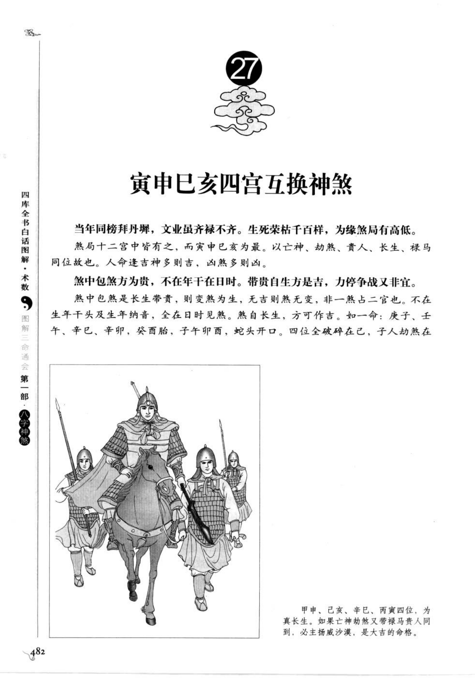
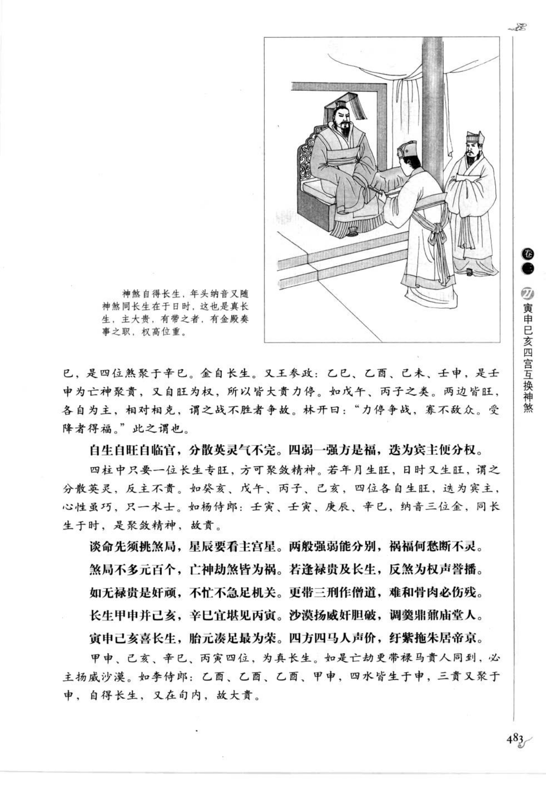
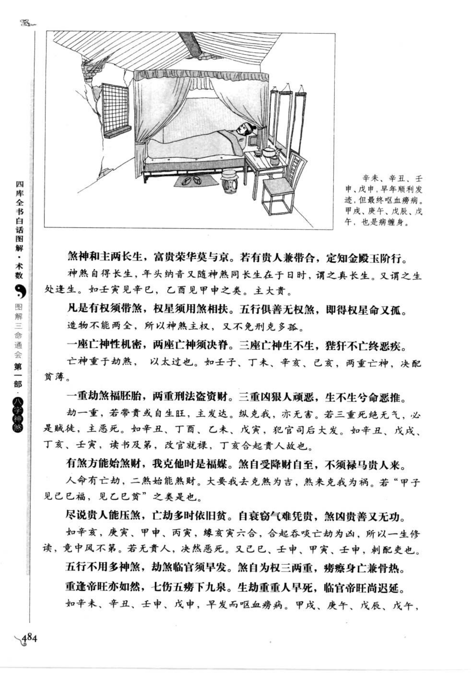
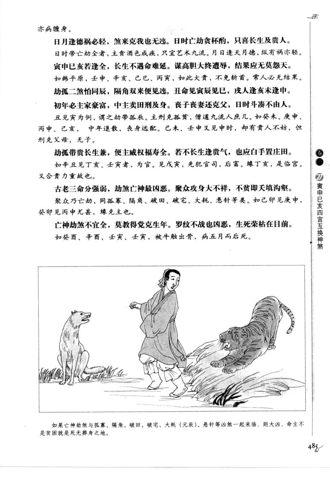
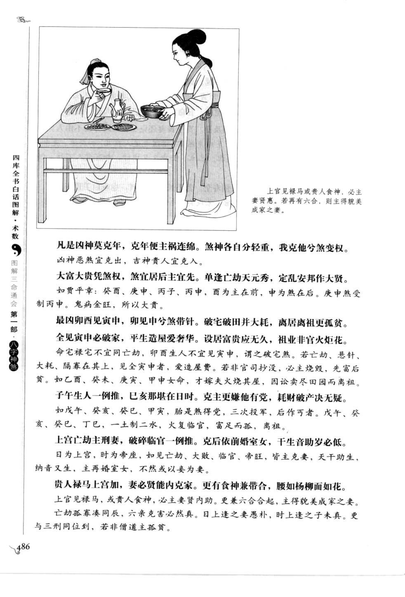
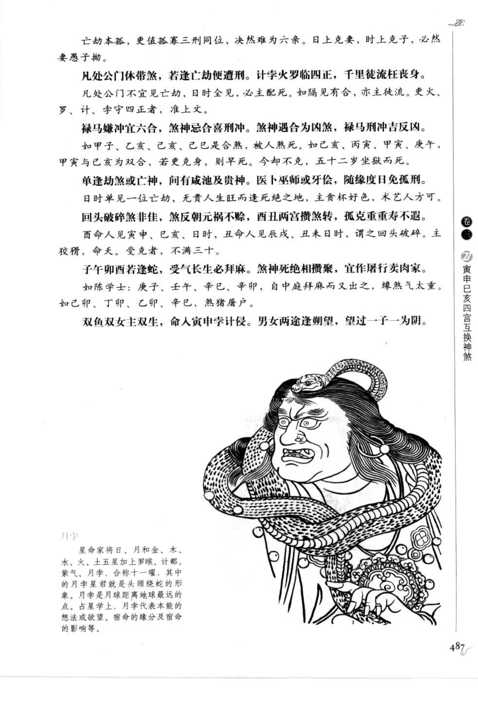
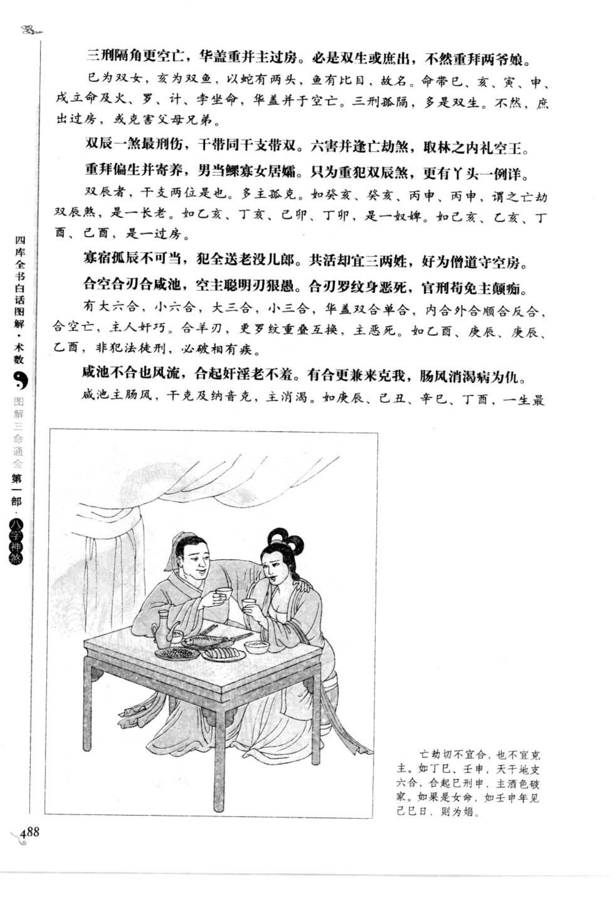
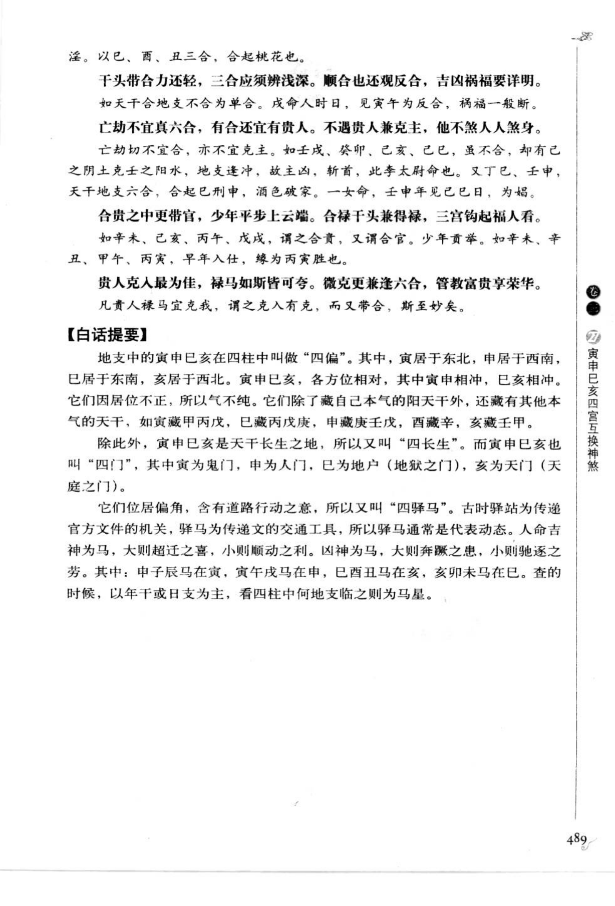

# 寅申巳亥四宫互换神煞（第 27 章）

> 资料状态：OCR/人工转录初稿，来源为《图解三命通会（第1部）：八字神煞》书内页 482-489（PDF 页 486-493）。原页截图已保存到项目本地；古诗、日时例证和个别字形以 `[待校]` 标记。

## 四宫与互换

寅申巳亥在四柱中称为“四偏”：寅居东北，申居西南，巳居东南，亥居西北；寅申相冲，巳亥相冲，因居偏角，气不纯。四宫又称“四门”，寅为鬼门，申为人门，巳为地户，亥为天门。

寅申巳亥又是天干长生之地，故称“四长生”；四位有道路行动之意，故又称“四驿马”。查驿马通常以年干或日支为主，看四柱何地支临之。

## 驿马、劫煞、贵人、长生、禄马

### 【原文摘录】

煞局十二宫中皆有之，而寅申巳亥为最。以亡神、劫煞、贵人、长生、禄马同位故也。人命逢吉神多则吉，凶煞多则凶。

煞中包煞方为贵，不在年干在日时。带贵自生方是吉，力停争战又非宜。煞中包煞是长生带贵，则变煞为生；无吉则煞无变，非一煞占二宫也。

甲申、己巳、辛巳、丙寅四位，为真长生。若亡神劫煞又带禄马贵人同到，必主扬威沙漠，是大吉的命格。

煞神自得长生，年头纳音又随神煞同长生在于日时，这也是真长生，主大贵；有带之者，有金殿奏事之职，权高位重。

巳，是四位煞聚于辛巳。金自长生。又王参政：乙巳、乙酉、己未、壬申为亡神聚贵，又自旺为权，所以皆大贵力停。如戊午、丙子之类，两边皆旺，各自为主，相对相克，谓之战不胜者争故。

自生自旺自临官，分散英灵气不完。四柱中只要一位长生专旺，方可聚煞精神；若年月生旺而日时又生旺，谓之分散英灵，反主不贵。

## 互换格局断语

以下为书中按煞、禄、贵人、长生及刑冲合害互换所列的断语（原文次序保留）：

- 煞神主两长生，富贵荣华莫与京；若有贵人兼带合，定知金殿玉阶行。
- 凡是有权须带煞，权星须用煞相扶；五行俱善无权煞，即得权星命又孤。
- 一座亡神性机密，两座亡神须决荡；三座亡神不生，犹恐不终恶疾。
- 一重劫煞福胚胎，两重刑法盗资财；三重凶狠人顽恶，生不生兮命恶推。劫一重，若带贵或自生旺，主发达；纵克我，亦无害；若三重死绝无气，必是贼徒，主恶死。
- 有煞方能煞财，我克他时是福媒；煞自受降财自至，不须禄马贵人来。
- 尽说贵人能压煞，亡劫多时依旧贫；自衰劫气难凭贵，煞凶财善又无功。
- 五行不用多神煞，劫煞临官须早发；煞自为权三两重，劳瘵身亡兼骨热。
- 日月逢德祸必轻，煞来克我也无迍；日时亡劫分杯酌，只喜长生及贵人。
- 寅申巳亥若逢全，长生不遇命难延；谋高胆大终遭辱，结果应无莫怨天。
- 劫孤二煞怕同辰，隔角双来便见迍；丑命见寅辰见巳，成人逢亥未逢申。
- 初年必主家豪富，中主卖田刑及身；丧子丧妻还克父，日时斗凑不由人。
- 凡处公门休带煞，若逢亡劫便遭刑；计字火罗临四正，千里徒流枉费身。
- 禄马嫌冲宜六合，煞神忌合喜刑冲；煞神遇合为凶煞，禄马刑冲古反凶。
- 单逢劫煞或亡神，间有咸池及贵神；医卜巫师或牙保，随缘度日免孤刑。
- 回头破碎煞非佳，煞反朝元祸不除；酉丑两宫攒煞转，孤克重重寿不遐。
- 子午卯酉若逢蛇，受气长生必拜麻；煞神死绝相攒聚，宜作屠行卖肉家。
- 双鱼双女主双生，命入寅申亥巳长生；男女两途逢朔望，望过一子为阴。

## 【白话提要】

寅申巳亥是四个偏角、四门、四长生和四驿马之地，既可藏长生、禄马、贵人，也可聚亡神、劫煞。吉神与长生、禄马同位，常主富贵、权柄和行动；凶煞重叠、死绝、刑冲失制，则主贫困、疾病、刑伤和孤克。判断关键是看煞是否得长生、是否带禄贵、是否被冲合，以及年月日时中是否过度重复，不能只凭一个神煞名称定吉凶。

## 取用边界

- 本条为第 27 章章节资料，覆盖书内页 482-489（PDF 486-493），不等同于单一神煞算法。
- 原书大量使用“互换”“包煞”“煞中带贵”等格局术语，需结合四柱旺衰和岁运解释；本文仅保存知识内容，不固化为程序规则。
- 古诗和部分日时例证在低清底图中存在识读风险，正式实现前应逐字回看截图校勘。
