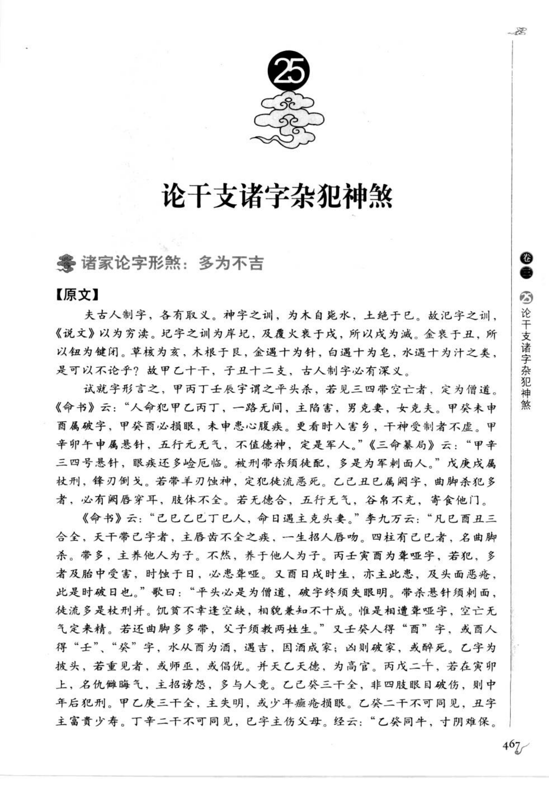
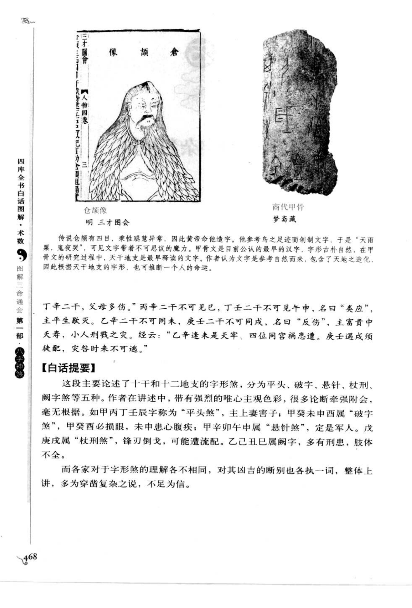
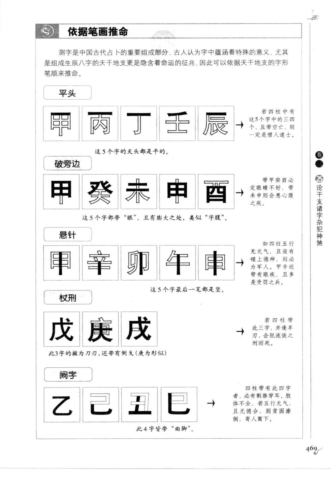

# 干支诸字杂犯神煞（古籍摘录）

> 资料状态：OCR/人工转录初稿，来源为《图解三命通会（第1部）：八字神煞》书内页 467-469（PDF 页 471-473）。原页截图已保存到项目本地。

## 诸家论字形：多为不吉

### 【原文摘录】

夫古人制字，各有取义。神字之训，为木自能水，上绝于己；故泥字之训，《说文》以为旁法。把字之训为岸把，及震火禄于戊，所以戊为减。金衰于丑，所以纽为健困。草核为亥，木根于艮，金遇十为针，白遇十为皂，水遇十为汁之类，是可以不论干支？故甲乙十干，子丑十二支，古人制字必有深义。

### 【白话提要】

古人造字各有取义，天干地支的字形和笔画也被命理家用来推断吉凶。书中列举平头、破字、悬针、杖刑、曲脚等字形，认为四柱中出现相应字形组合，多主刑伤、疾病、孤苦或不利；这些说法属于古代术数推演，不能脱离命局整体理解。

## 五类字形杂犯

### 【原文摘录】

试就字形言之，甲丙丁壬辰字谓之平头煞，若见三四带空亡者，定为僧道。命书又论甲乙丙丁一路无间，主陷害，男克妻，女克夫；甲戌未申酉属破字，甲辛卯午申属悬针，五行无气、不值德神者，定是军人。戊庚戌属杖刑，锋刃倒戈，若带羊刃劫神，定犯徒流恶死。乙己丑己属曲脚，多有刑患、肢体不全；若五行无气、且无德合，则贫困孤苦。

### 【白话提要】

字形杂犯主要分为五类：

- **平头煞**：甲、丙、丁、壬、辰等字头平整。四柱中若三四字同时出现并带空亡，古书多取僧道、孤独之象。
- **破字煞**：甲、癸、未、申、酉等字带“眼”或破坏形态，主疾病、破败、刑伤。
- **悬针煞**：甲、辛、卯、午、申等字末笔如针，五行无气又无德神时，古书多取军人、刑伤之象。
- **杖刑煞**：戊、庚、戌等字的撇捺像刀刃，兼有倒戈形态；若再带羊刃、劫神，主徒流、恶死等凶应。
- **曲脚煞**：乙、己、丑、己等字带曲脚形态，主刑患、肢体不全；五行无气且无德合时，主贫困孤苦。

## 字形条件速查

| 煞名 | 图示字形组合 | 原图主要取象 |
| --- | --- | --- |
| 平头煞 | 甲、丙、丁、壬、辰 | 带空亡多取僧道、孤苦 |
| 破字煞 | 甲、癸、未、申、酉 | 破败、疾病、心腹之疾 |
| 悬针煞 | 甲、辛、卯、午、申 | 五行无气者多刑伤、军人之象 |
| 杖刑煞 | 戊、庚、戌 | 杖刃、倒戈，羊刃劫神并见更凶 |
| 曲脚煞 | 乙、己、丑、己 | 刑患、肢体不全、贫困孤苦 |

## 依据笔画推命图示

测字是中国古代占卜的重要组成部分，古人认为字中蕴涵特殊意义，尤其组成生辰八字的天干地支更是隐含着命运征兆，因此可以依据天干地支的字形笔顺来推命。图示以五类字形说明：

| 图示类别 | 图示说明 |
| --- | --- |
| 平头 | 甲、丙、丁、壬、辰五字的天头都是平的；四柱中有三个或四个并带空亡，定为僧道。 |
| 破旁边 | 甲、癸、未、申、酉五个字都带“眼”，并有破大之处，类似“字腹”；带甲癸酉必定眼睛不好，带未申则会患心腹之疾。 |
| 悬针 | 甲、辛、卯、午、申五个字最后一笔都是竖；甲辛还带有眼病之象，且多受刑之苦。 |
| 杖刑 | 戊、庚、戌三字的撇捺为刀刃，还带倒戈形态；四柱带这些字并逢羊刃，可能犯流徒之刑而死。 |
| 曲脚 | 乙、己、丑、己四字皆带“曲脚”；四柱带此四字，若五行无气、又无德合，则贫困孤苦。 |

## 取用边界

- 本条保存的是古籍的字形、笔画和干支杂犯说法，不应与现代文字结构或工程规则直接等同。
- 平头、破字、悬针、杖刑、曲脚的具体字表存在版本和字形异文，正式实现前应回看底图校勘。
- 古籍吉凶断语仅作知识资料保存，不等同于现代命理结论。
