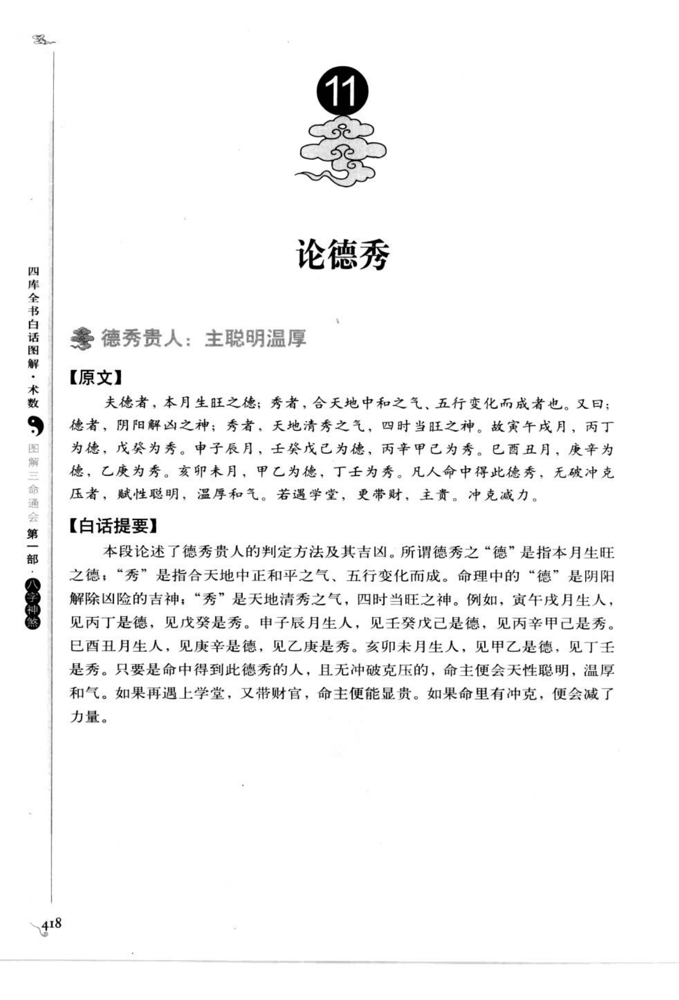
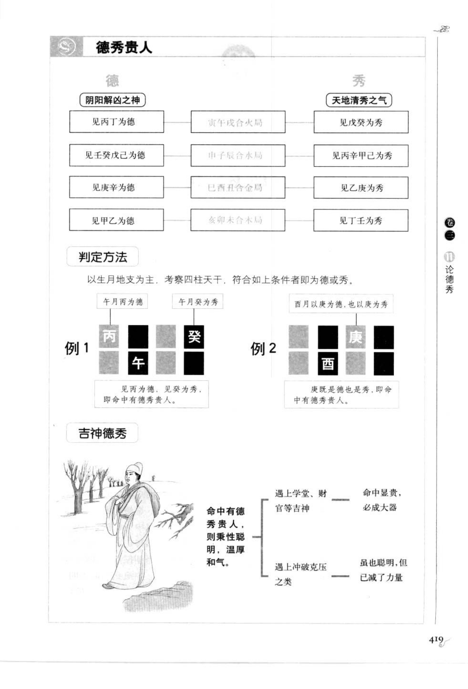

# 德秀贵人（古籍摘录）

> 资料状态：OCR 转录初稿，来源为《图解三命通会（第1部）：八字神煞》书内页 418-419（PDF 页 422-423）。原页截图保存在 `docs/bazi/img/san_ming_tong_hui/page-422.png`、`page-423.png`。

## 德秀贵人：主聪明温厚

### 【原文】

夫德者，本月生旺之德；秀者，合天地中和之气、五行变化而成者也。又曰：德者，阴阳解凶之神；秀者，天地清秀之气，四时当旺之神。故寅午戌月，丙丁为德，戊癸为秀。申子辰月，壬癸戊己为德，丙辛甲己为秀。巳酉丑月，庚辛为德，乙庚为秀。亥卯未月，甲乙为德，丁壬为秀。凡人命中得此德秀，无破冲克压者，赋性聪明，温厚和气。若遇学堂，更带财，主贵；冲克减力。

### 【白话提要】

德秀贵人按出生月份取本月生旺之德，以及合天地中和、五行变化而成的秀气。德是阴阳解凶之神，秀是天地清秀、四时当旺之气。寅午戌月以丙丁为德、戊癸为秀；申子辰月以壬癸戊己为德、丙辛甲己为秀；巳酉丑月以庚辛为德、乙庚为秀；亥卯未月以甲乙为德、丁壬为秀。命中得到德秀且无冲破克压，主聪明、温厚、和气；再遇学堂、财官则更贵，遇冲克则力量减弱。

## 德秀贵人的月令对应

| 月令三合局 | 德 | 秀 |
| --- | --- | --- |
| 寅午戌月 | 丙、丁 | 戊、癸 |
| 申子辰月 | 壬、癸、戊、己 | 丙、辛、甲、己 |
| 巳酉丑月 | 庚、辛 | 乙、庚 |
| 亥卯未月 | 甲、乙 | 丁、壬 |

原图用四行图示说明：见丙丁为德、见戊癸为秀；见壬癸戊己为德、见丙辛甲己为秀；见庚辛为德、见乙庚为秀；见甲乙为德、见丁壬为秀。判定以生月地支为主，再考察四柱天干。

## 取用边界

- 本文只保存德秀贵人的月令干支对应与古籍断语，不将其直接作为已校准的工程规则。
- 申子辰月的德、秀干支在不同版本中可能有异文，正式实现前应回看底图。
- 命局冲破克压、学堂和财官等组合属于古籍附加条件，需与主规则分层记录。

