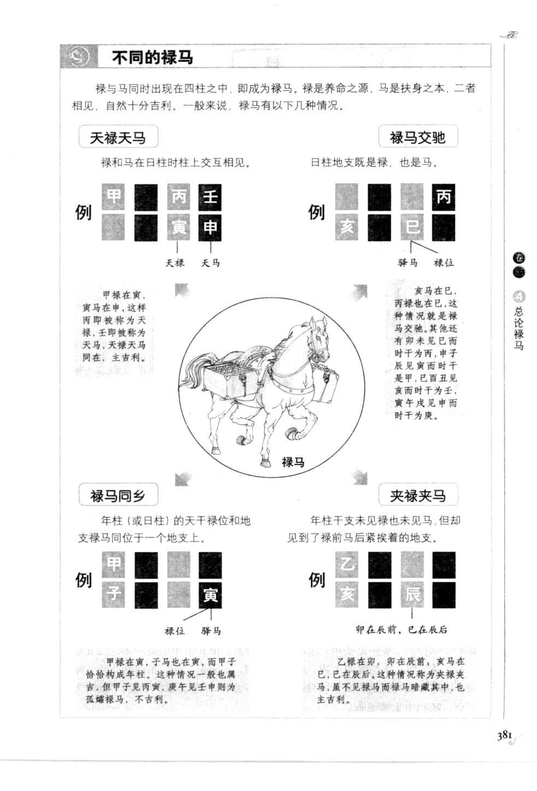
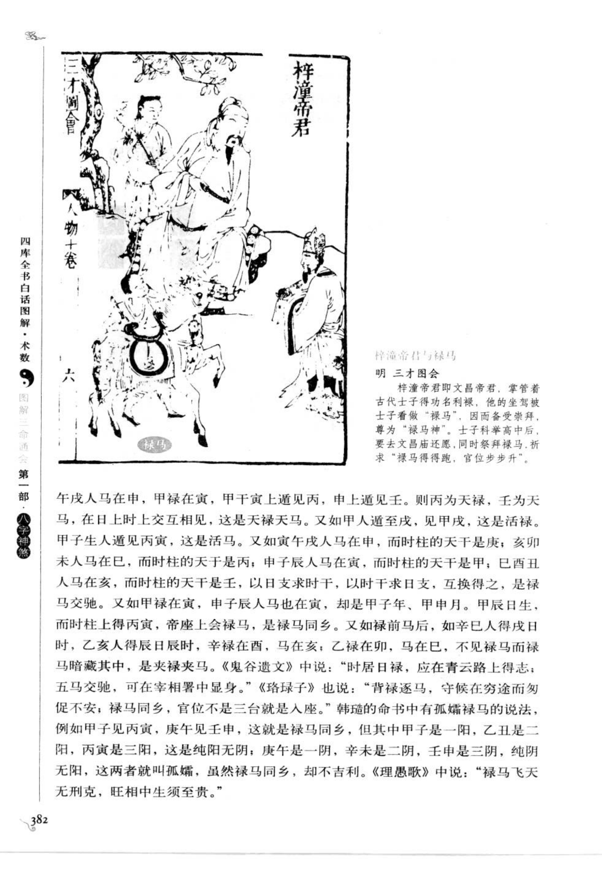
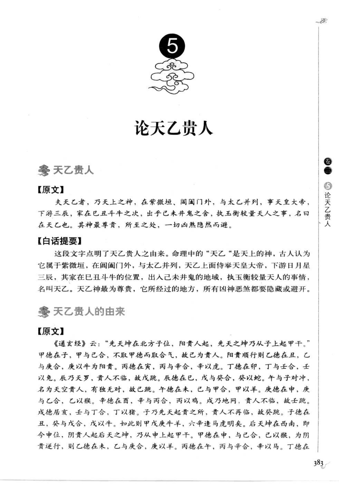
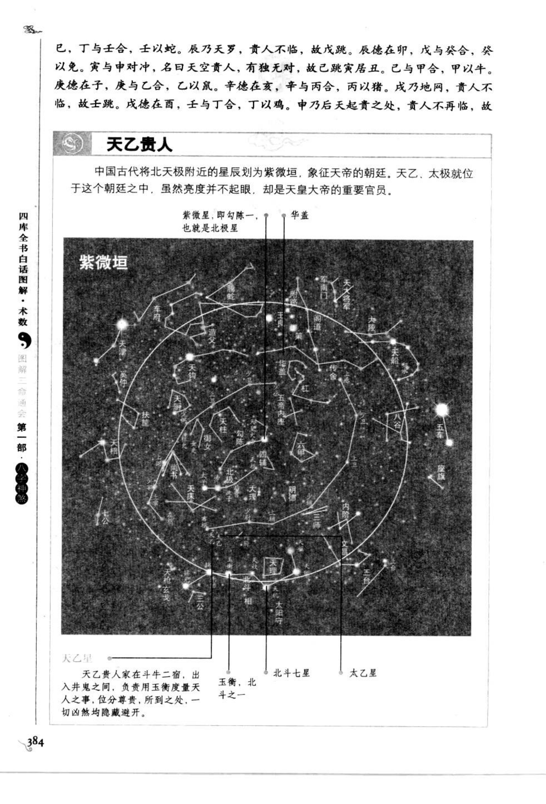
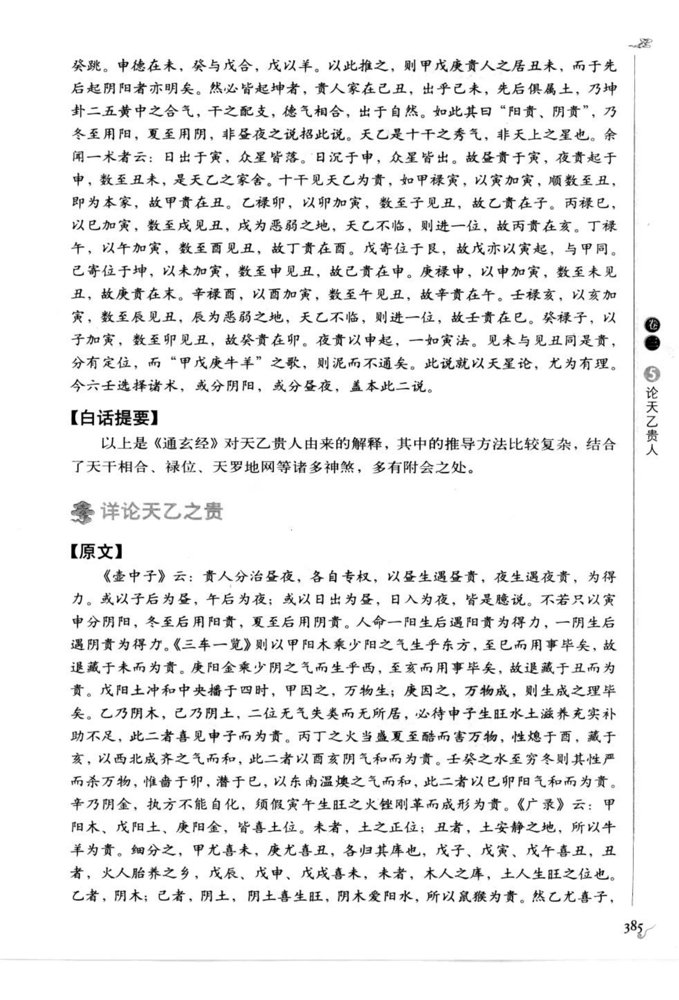

# 总论禄马（第 4 号，古籍摘录）

> 资料状态：OCR/人工转录初稿，来源为《图解三命通会（第1部）：八字神煞》书内页 381-385（PDF 页 385-389）。原页截图已保存到项目本地；格局名称和部分例证以 `[待校]` 标记。

## 【原文摘录】

禄为养命之源，马是扶身之本，两者最喜相见。且如寅午戌马在申中，甲禄在寅，甲干壬上通见丙，申中逢壬，阴干见王，所以丙为天禄，壬为天马，在日时上交互见之，谓之天禄天马。甲申逢寅，甲中逢丙，丙为天禄；甲午逢申，申中逢壬，壬为天马。又如寅午戌在中，而时干得庚；亥卯未在巳，而时干得甲；巳酉丑在亥，而时干得壬；申子辰在寅，而时干得甲；互换得之，谓之禄马交驰。

又如甲禄在寅，申子辰马亦在寅，却是甲子年、甲申、甲寅、甲辰，而时得丙寅，帝座上会禄马，谓之禄马同乡。又如禄前马后，如辛巳人得戊日时，乙亥人得辰日辰时，辛禄在西，马在亥；乙禄在卯，马在巳，不见禄马而禄马暗藏其中，谓之夹禄夹马。

《鬼谷遗文》说：“时居日禄，应在青云路上得志；五马交驰，可在宰相中显身。”《珞琭子》说：“背禄逐马，守穷途而恸悔；禄马同乡，官位不是三台就是八座。”

## 不同的禄马

| 格局 | 构成条件 | 吉凶取象 |
| --- | --- | --- |
| 天禄天马 | 禄和马在日柱、时柱交互相见 | 主吉，贵显 |
| 禄马交驰 | 日时干支互换得到禄、马 | 主官禄顺利 |
| 禄马同乡 | 年柱（或日柱）天干禄位与地支驿马同支 | 常主吉；若孤禄孤马则不利 |
| 夹禄夹马 | 年柱干支不见禄马，却见禄前、马后夹拱 | 主吉，暗得禄马 |
| 生旺禄 | 日柱天干与地支成禄，且处生旺 | 吉 |
| 名位禄 | 甲日见丙寅、乙日见丁卯等，马中逢食神 | 吉 |
| 真禄 | 甲日见丙或己，乙日见己或午等 | 贵格 |
| 进退真禄 | 辰戌、丙辰、癸巳、癸丑见甲子等进退组合 | 进则平坦，退则艰难，怕重见 |
| 食神合禄 | 食神与禄相合 | 多主吉 |
| 禄头财、禄头鬼 | 禄前遇财为禄头财，禄前遇鬼为禄头鬼 | 分主声望或口舌刑责 |
| 旬中禄 | 甲申见庚寅、戊午见丁巳等 | 主清华显要或官居显要 |
| 天禄贵神 | 丁日禄在午，年柱再见丙；或日禄与贵人互见 | 主高官厚禄 |
| 干支合禄、互换贵禄、朝元禄 | 干支相合、贵禄互换或朝元 | 主官位崇高、封爵或富贵 |

## 【白话提要】

禄代表养命之源，马代表扶身之本，禄马同见通常有利。禄马在日时互换称“天禄天马”或“禄马交驰”；禄位和马位同在一支称“禄马同乡”；禄马不直接出现、由前后地支夹拱称“夹禄夹马”。不同天干配合食神、财、鬼、贵人、长生和旺衰，又形成生旺禄、名位禄、真禄、进退真禄、食神合禄等格局。

命局中禄马虽多，仍要辨别是否空亡、冲破、倒食、病绝和孤立。书中认为禄马得生旺、贵人和合局则富贵；被冲克、空亡或凶煞重叠则可能贫困、疾病、刑伤或婚姻不利，须结合岁运通变。

## 取用边界

- 本条为第 4 号“总论禄马”，覆盖书内页 381-385（PDF 385-389）；PDF 390 起进入第 5 号天乙贵人。
- 本章为禄马格局总论，不是单一神煞；各格局的干支、纳音和旺衰条件需逐条校勘后再实现。
- 古籍吉凶断语仅作知识资料保存，不等同于现代命理结论。
