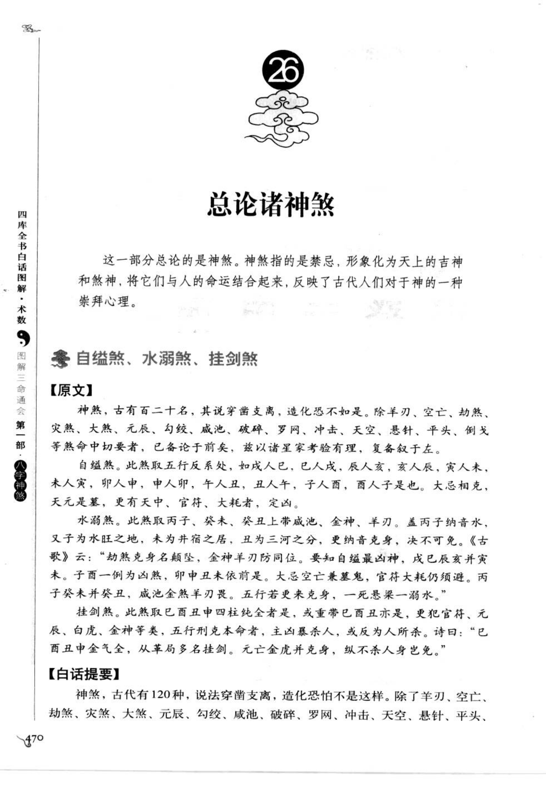
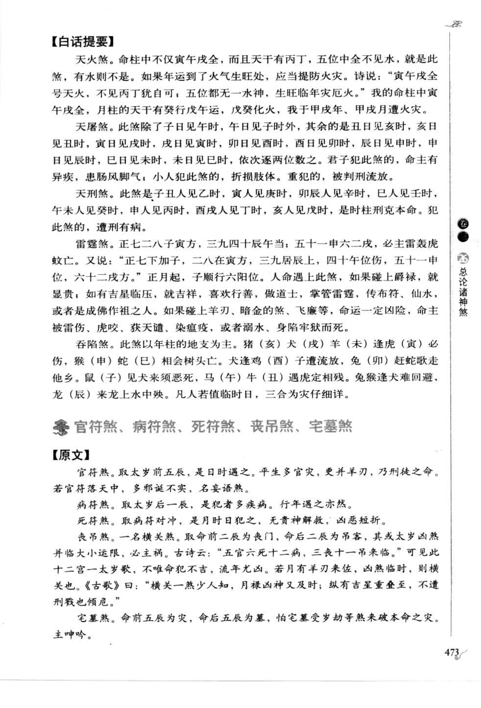
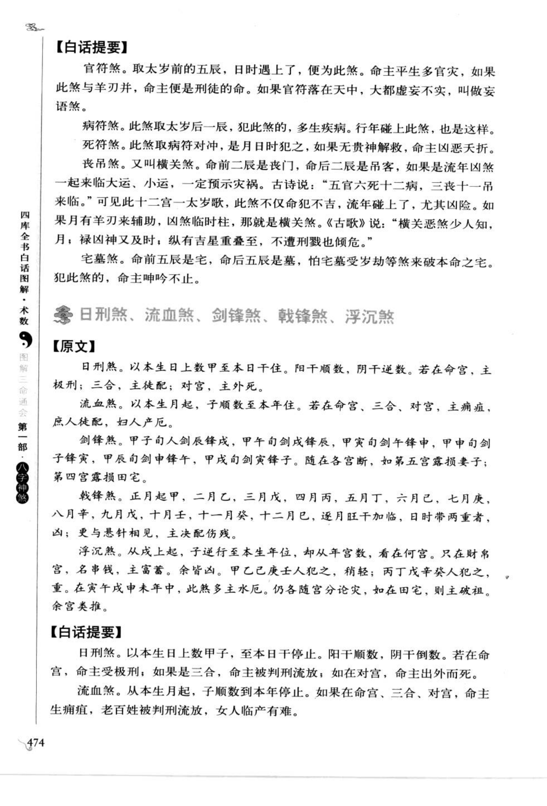
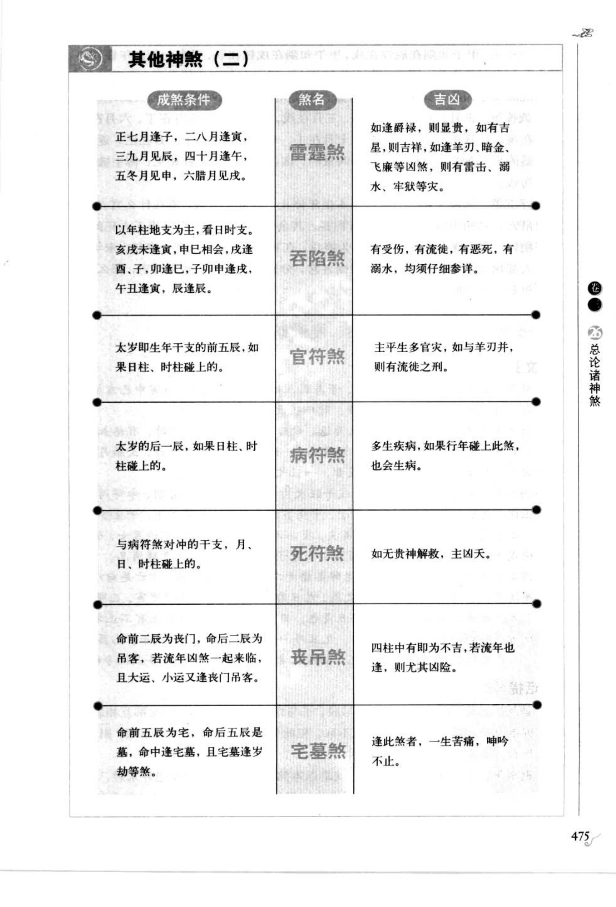
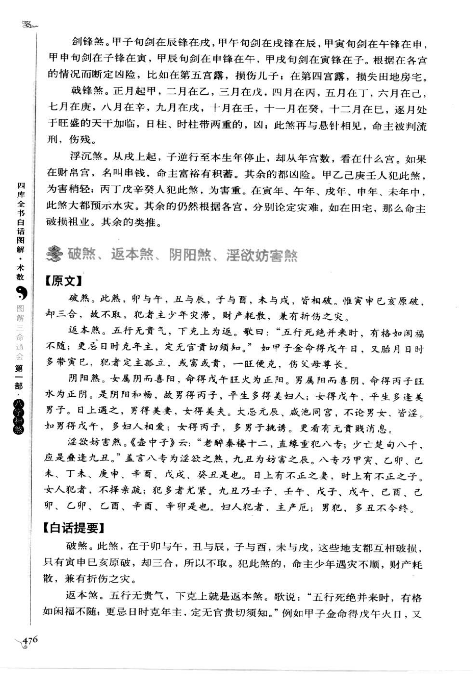

# 总论诸神煞（章节索引）

> 这是书中第 26 章的总论及其后续分组资料，不是单独神煞。来源范围为书内页 470-481（PDF 页 474-485），作为目录和来源索引保存。

## 【原文摘录】

神煞，古有百二十名，其说穿凿支离，造化恐不如是。除羊刃、空亡、劫煞、灾煞、大煞、元辰、勾绞、咸池、破碎、罗网、冲击、天空、悬针、平头、倒戈等命中切要者，已经详论于前，兹以诸星家考验有理，复各叙于后。

自缢煞，此煞取五行反系处；水溺煞，此煞取丙子、癸未、癸丑上带咸池、金神、羊刃；挂剑煞，此煞取巳酉丑申中四柱纯全者，或重带己酉丑，更犯官符、元辰、白虎、金神等凶煞，五行刑克本命；后续另列天火煞、天屠煞、天刑煞、雷霆煞、吞陷煞等。

## 【白话提要】

古籍神煞名目很多，但并非都可靠。本书先详论命理中较重要的神煞，再将诸家考验有理的其他神煞分组列出。第 26 章本页是后续资料的总索引，具体规则见第 27 号“其他神煞（一）”及后续条目。

## 章节边界

- PDF 474–485（书内页 470–481）为第 26 章总论及“其他神煞（一）至（四）”分组资料。
- 其中 PDF 474（书内页 470）为总论索引，后续页面按四个子条目分别保存。
- 本条不参与八字计算，只用于保留书中编号和章节来源。
