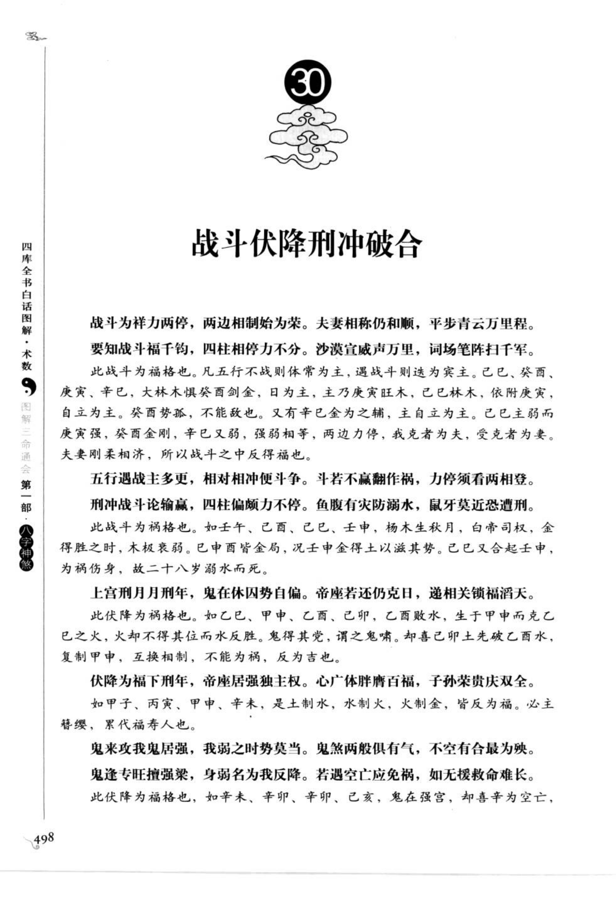
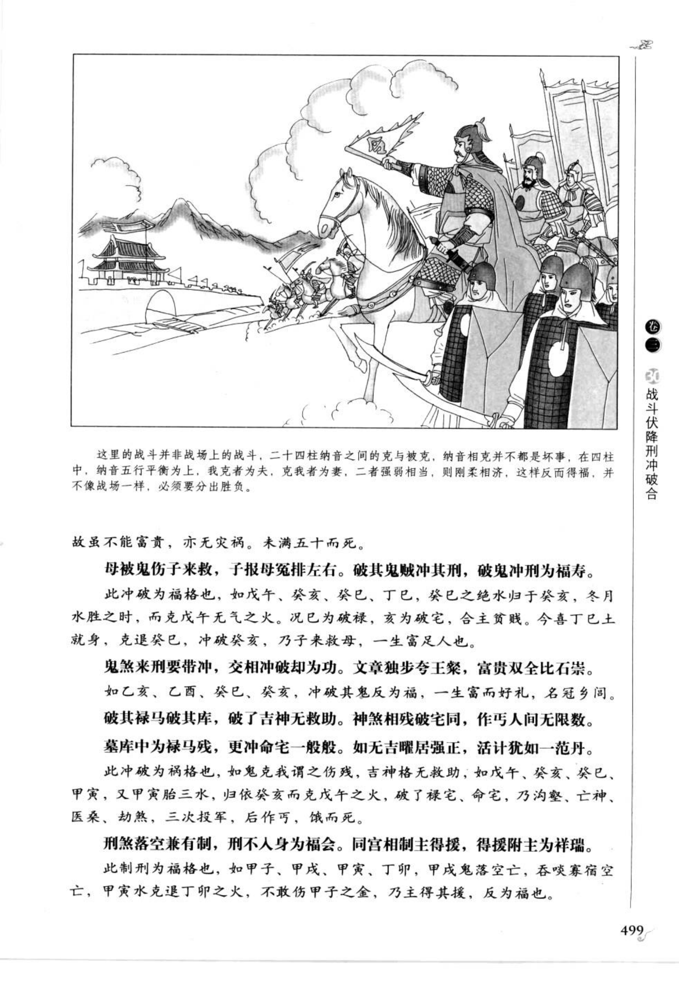
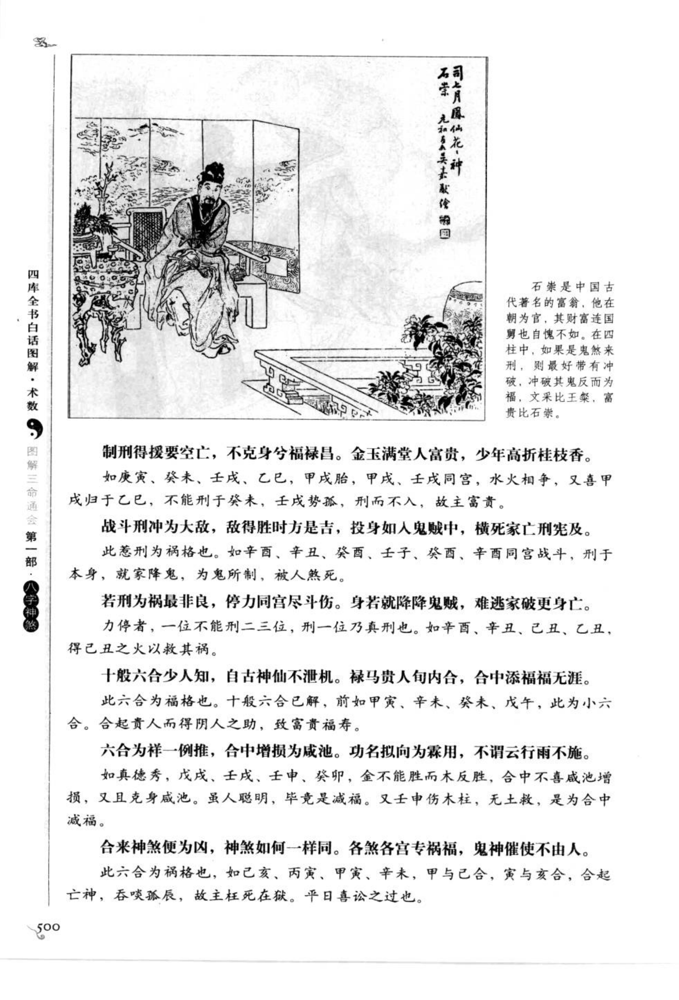
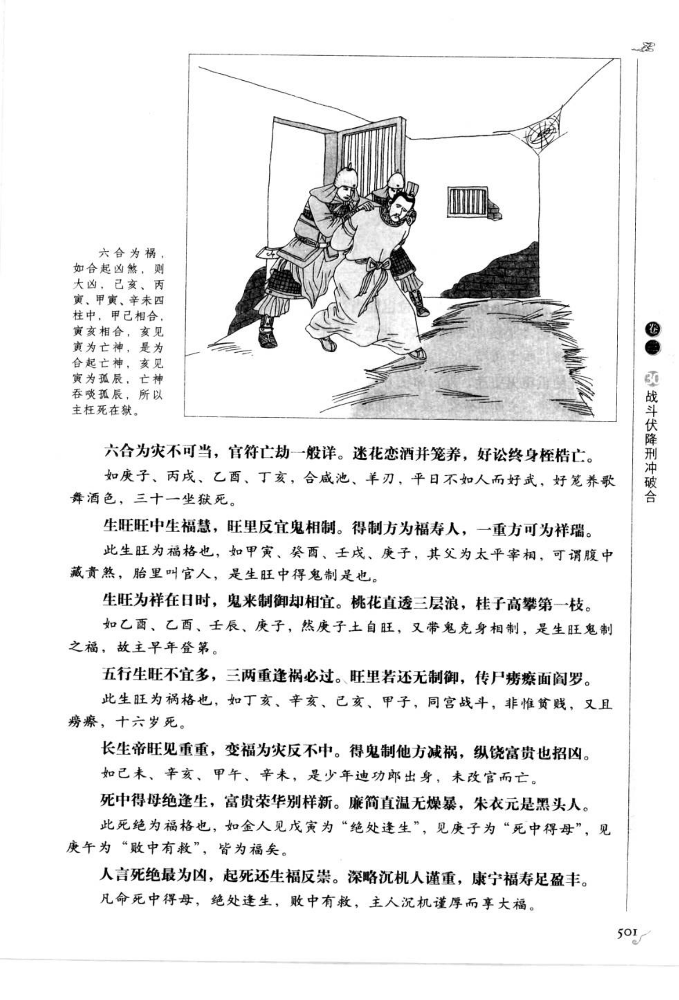
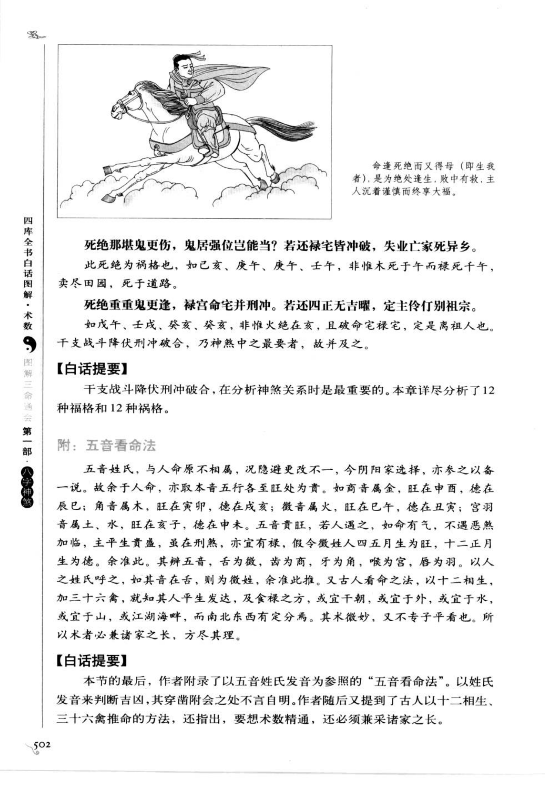
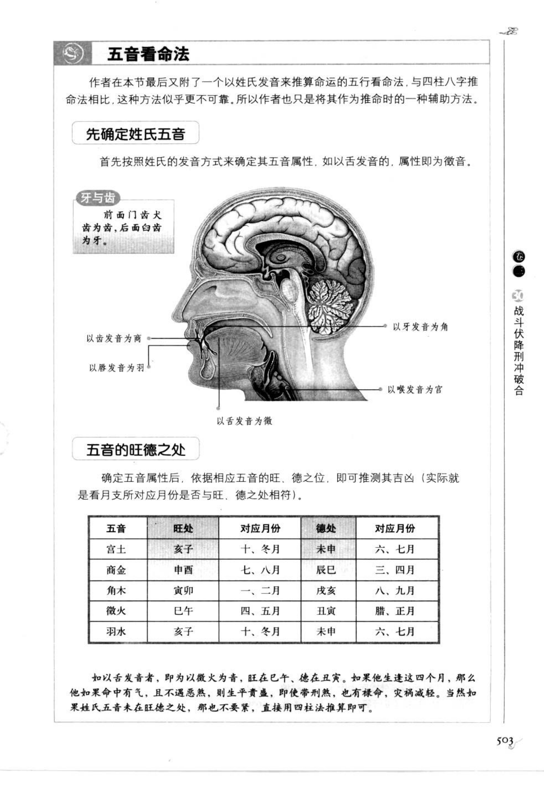

# 战斗伏降刑冲破合（第 30 章）

> 资料状态：古籍页面截图及章节边界已校对。来源为《图解三命通会（第1部）：八字神煞》（万民英），书内页 498-503，PDF 页 502-507。

## 章节范围

本章按原书标题保存“战斗伏降刑冲破合”相关的干支、五行和刑冲合害资料。原文页面以截图为准，文字转录和规则实现待逐页校勘。

## 校勘说明

- PDF 502（书内页 498）起进入第 30 章，PDF 507（书内页 503）仍属本章末页。
- 本条为章节级古籍资料，不将原书断语直接固化为程序判定。
