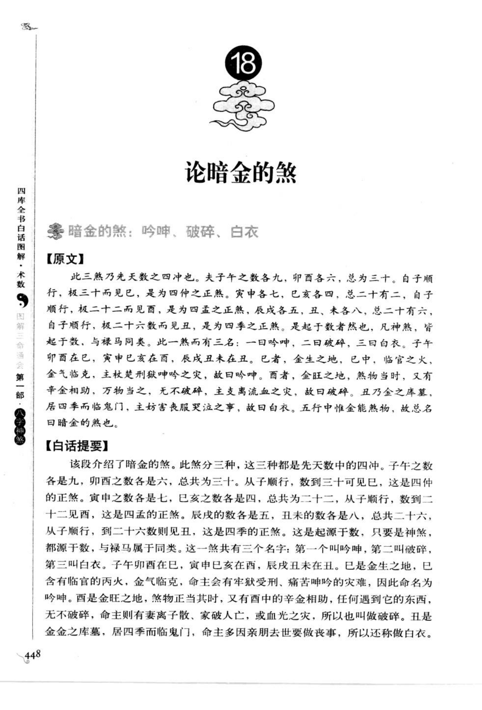
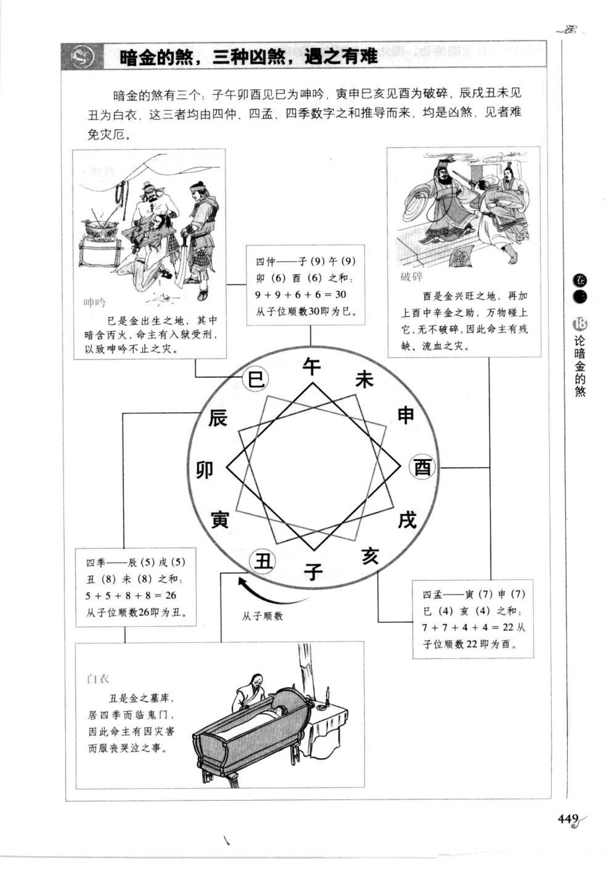
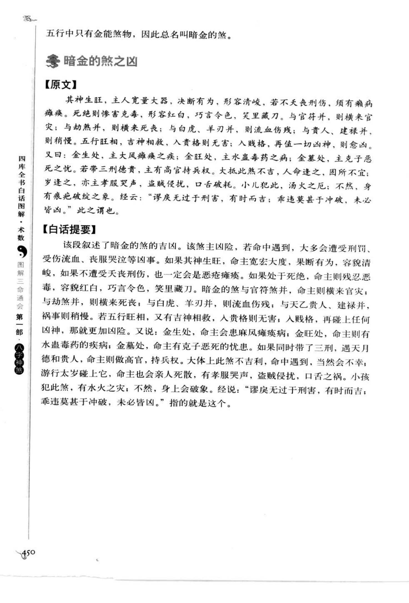

# 暗金的煞（古籍摘录）

> 资料状态：OCR/人工转录初稿，来源为《图解三命通会（第1部）：八字神煞》书内页 448-450（PDF 页 452-454）。原页截图已保存到项目本地。

## 论暗金的煞

### 【别名】

暗金的煞有三名：吟呻、破碎、白衣。

### 【原文】

此三煞乃先天数之四冲也。夫子午之数各九，卯酉各六，总为三十。自子顺行，极三十而见巳，是为四仲之正煞。寅申各七，巳亥各四，总二十二，自子顺行，极二十二而见酉，是为四孟之正煞。辰戌各五，丑未各八，总二十六，自子顺行，极二十六而见丑，是为四季之正煞。是起于数者然也，凡神煞，皆起于数，与禄马同类。此一煞而有三名：一曰吟呻，二曰破碎，三曰白衣。子午卯酉在巳，寅申巳亥在酉，辰戌丑未在丑。巳者，金生之地，巳中临官之火，金气临克，主杖楚刑狱吟呻之灾，故曰吟呻。酉者，金旺之地，煞物当时，又有辛金相助，万物当之无不破碎，主支离流血之灾，故曰破碎。丑乃金之库墓，居四季而临鬼门，主妨害丧服哭泣之事，故曰白衣。五行中惟金能煞物，故总名曰暗金的煞也。

### 【白话提要】

暗金的煞分为吟呻、破碎、白衣三种，都是由先天数推导出的四冲之煞。子午数各九、卯酉数各六，合三十，从子顺数三十到巳，为四仲正煞；寅申数各七、巳亥数各四，合二十二，从子顺数二十二到酉，为四孟正煞；辰戌数各五、丑未数各八，合二十六，从子顺数二十六到丑，为四季正煞。

子午卯酉见巳为吟呻，因巳为金生之地而有临官之火，主刑狱呻吟；寅申巳亥见酉为破碎，因酉为金旺之地，主破败、流血；辰戌丑未见丑为白衣，因丑为金库墓、临鬼门，主丧服哭泣。

## 暗金的煞定位

| 生年地支所属 | 暗金的煞 | 先天数计算 |
| --- | --- | --- |
| 子午卯酉（四仲） | 巳 | 9+9+6+6=30，自子顺数三十到巳 |
| 寅申巳亥（四孟） | 酉 | 7+7+4+4=22，自子顺数二十二到酉 |
| 辰戌丑未（四季） | 丑 | 5+5+8+8=26，自子顺数二十六到丑 |

## 暗金的煞之凶

### 【原文】

其神生旺，主人宽量大器，决断有为，形容清峻；若不天良刑伤，须有痈病瘫疽。死绝则惨毒克毒，形容红白，巧言令色，笑里藏刀。与官符并，则横来官灾；与劫煞并，则横来死丧；与白虎、羊刃并，则流血伤残；与贵人、建禄并，则稍慢。五行旺相，吉神相救，入贵格则无害；入贱格，再值一切凶神，则愈凶。

又曰：金生处，主大风瘫痪痈疽之疾；金旺处，主水蛊毒药之病；金墓处，主克子恶死之忧。若带三刑德贵，主有高官持兵权。大抵此煞不吉，人命逢之，囹圄不宜；岁逢之，亦主孝服哭声，盗贼侵扰，口舌破耗。小儿犯此，汤火之厄；不然，身有痕疵破绽之象。经云：“谩庚无过于刑害，有时而吉；乖违莫甚于冲破，未必皆凶。”此之谓也。

### 【白话提要】

暗金的煞主凶险，命中遇到多有刑罚、伤残、孝服哭泣等事。处生旺时，可能表现为宽宏有决断，但仍须防刑伤、痈疽；处死绝时，则多惨毒、破败、巧言令色和不良行为。与官符并主官灾，与劫煞并主死丧，与白虎、羊刃并主流血伤残；与贵人、建禄并，凶应稍缓。

按五行位置，金生处主风瘫痈疽，金旺处主水蛊毒药，金墓处主克子恶死。带三刑、德贵而入贵格，仍可能主高官持兵权；入贱格又遇凶神，则凶性加重。大运、流年遇此煞，也要结合原局旺衰和吉神救应判断。

## 三煞取法速查

| 名称 | 所在地支 | 主要取象 |
| --- | --- | --- |
| 吟呻 | 子午卯酉年见巳 | 刑狱、呻吟、血光 |
| 破碎 | 寅申巳亥年见酉 | 破败、流血、离散 |
| 白衣 | 辰戌丑未年见丑 | 丧服、哭泣、妨害 |

## 取用边界

- 暗金的煞以年支所属四仲、四孟、四季取法为主，先天数顺数的图示是来源规则的一部分。
- 吉凶必须结合生旺死绝、五行、官符、劫煞、白虎、羊刃、贵人、建禄及岁运，本文不将其固化为单一断语。
- 古籍吉凶断语仅作知识资料保存，不等同于现代命理结论。
