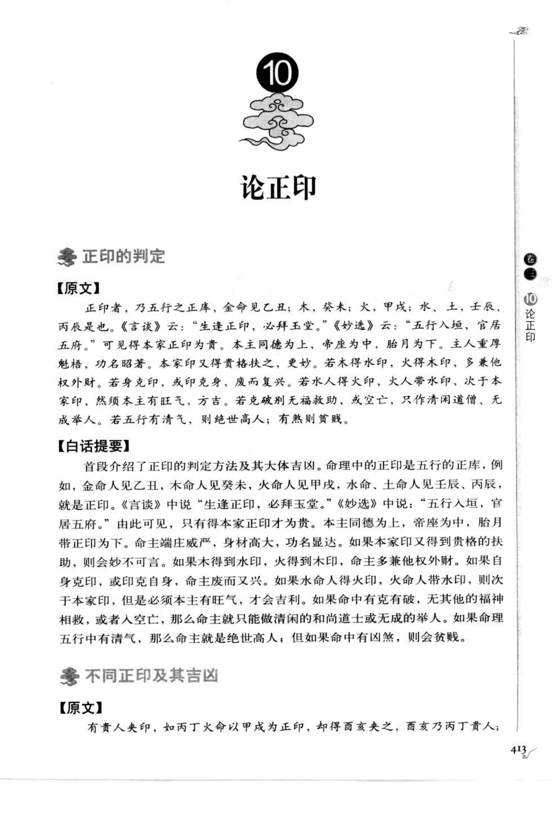
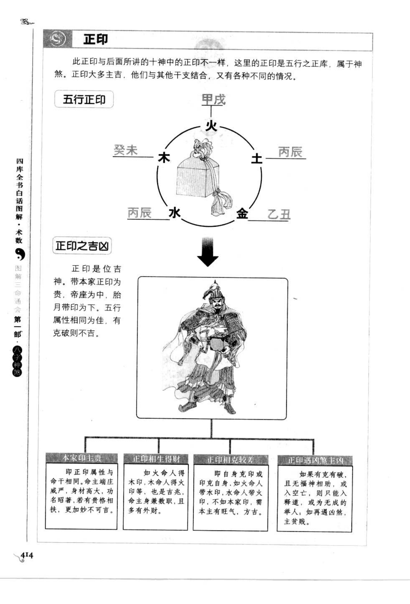
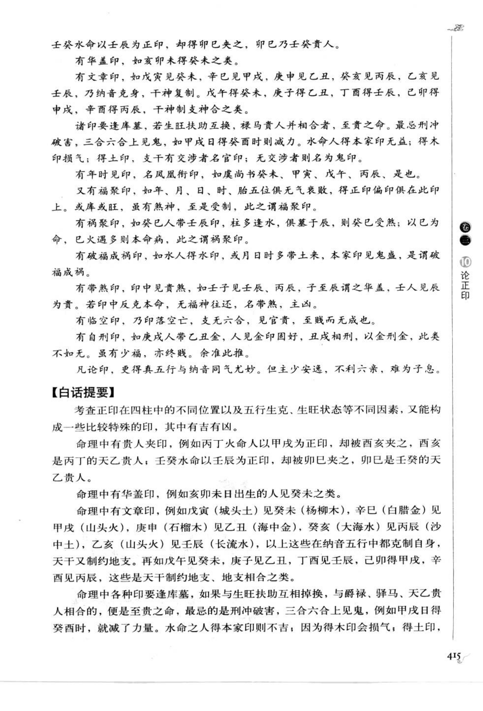
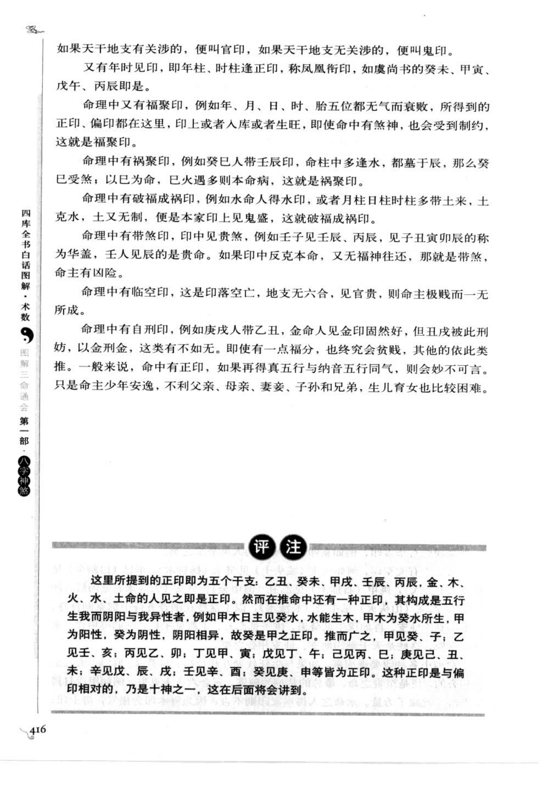
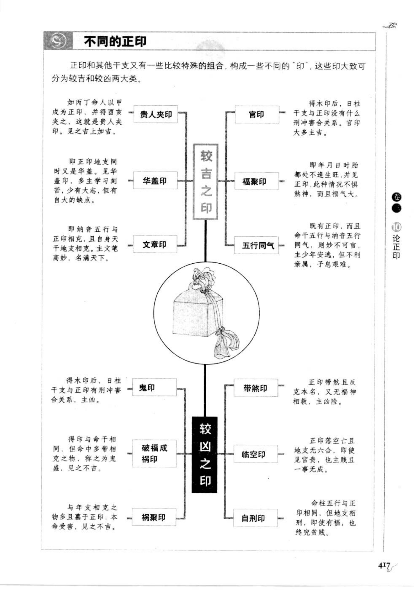

# 正印（古籍摘录）

> 资料状态：OCR 转录初稿，来源为《图解三命通会（第1部）：八字神煞》书内页 413-417（PDF 页 417-421）。原页截图保存在 `docs/bazi/img/san_ming_tong_hui/page-417.png` 至 `page-421.png`。

## 正印的判定

### 【原文】

正印者，乃五行之正库。金命见乙丑；木，癸未；火，甲戌；水、土，壬辰、丙辰是也。《言谈》云：“生逢正印，必拜玉堂。”《妙选》云：“五行入垣，官居五府。”可见得本家正印为贵。本主同德为上，帝座为中，胎月为下。主人重厚魁梧，功名昭著，本家印又得贵格扶之，更妙。若木得水印，火得木印，多兼他权外财。若身克印，或印克身，废而复兴。若水人得火印，火人带水印，次于本家印，然须本主有旺气，方吉。若克破别无福禄救助，或空亡，只作清闲道僧，无成举人。若五行有清气，则绝世高人；有煞则贫贱。

### 【白话提要】

正印是五行的正库。例如金命见乙丑、木命见癸未、火命见甲戌、水命和土命见壬辰或丙辰，即为正印。生逢正印主贵，本家正印最好，帝座次之，胎月再次。正印使人厚重魁梧、功名显达；再得贵格扶助更佳。印与五行相生、相克以及空亡、煞曜的关系，会影响吉凶；有清气主高贵，有煞则贫贱。

## 五行正印

原图说明正印属于五行正库，并列出：

| 五行命 | 正印（纳音/五行正库） |
| --- | --- |
| 金 | 乙丑 |
| 木 | 癸未 |
| 火 | 甲戌 |
| 水 | 丙辰 |
| 土 | 壬辰 |

正印为位吉之神。本家正印为贵，帝座为中，胎月带印为下；五行属性相同为佳，遇克破则不吉。

## 不同正印及其吉凶

书中将正印与其他干支组合分为较吉、较凶两类：

| 格局 | 构成与取象 |
| --- | --- |
| 贵人夹印 | 丙丁火命以甲戌为正印，却得酉亥夹之；酉亥为丙丁天乙贵人，主吉上加吉 |
| 华盖印 | 正印地支同日时又是华盖，主学习刻苦、有大志，但有自大的缺点 |
| 文章印 | 纳音五行与正印相克，且自身天干地支相克，主文笔高妙、名满天下 |
| 官印 | 得木印后日柱干支与正印无刑冲害合，官印多主吉 |
| 福聚印 | 年、月、日、时、胎五位俱无气衰败，正印、偏印俱在印上，入库或生旺亦有煞神受制，主福气聚集 |
| 禄聚印 | 癸巳人带壬辰印，柱中多逢水、俱墓于辰，癸巳受煞；以己为命，巳火遇多则本命病，主禄聚而有病 |
| 破福成祸印 | 水命得水印，月日时多带土，土克水而本家印见鬼盛，主因福成祸 |
| 带煞印 | 印中见贵煞，或印反克本命而无福神往还，主凶险 |
| 临空印 | 印落空亡，支无六合，见官贵也主贱而无成 |
| 自刑印 | 如庚戌人带乙丑金，丑戌相刑，以金刑金，虽有少福终究贫贱 |

### 【原文：组合断语】

有贵人夹印，如丙丁火命以甲戌为正印，却得酉亥夹之，酉亥乃丙丁贵人。

有华盖印，如亥卯未日得癸未之类。

有文章印，如戊寅见癸未、辛巳见甲戌、庚申见乙丑、癸亥见丙辰、乙亥见壬辰，乃纳音克身，干神复制，支神合之类。

诸印要逢库墓，若生旺扶助互换，禄马贵人并相合者，至贵之命。最忌刑冲破害，三合六合上见鬼；水命人得本家印无益，得木印损气；得土印，支干有交涉者名官印，无交涉者则名鬼印。

有年时见印，名凤凰衔印，如庚尚书癸未、甲寅、戊午、丙辰是也。

又有福聚印、禄聚印、破福成祸印、带煞印、临空印、自刑印等，均须结合五行生克、纳音、空亡和冲合判断。

### 【白话提要】

正印在四柱中的位置、五行生克、纳音关系不同，会形成贵人夹印、华盖印、文章印、官印、福聚印、禄聚印等特殊格局，也会形成破福成祸印、带煞印、临空印、自刑印等凶格。正印要逢库墓、生旺、禄马贵人扶助，最忌刑冲破害、空亡及鬼印。

## 取用边界

- 本文保存古籍正印的五行正库、四柱位置和组合断语，不将古籍吉凶直接作为已校准的工程规则。
- “正印”有本家正印与后文十神正印之别，不能未经区分直接合并。
- 原图中的纳音、日柱/年柱口径及特殊组合存在版本异文，正式实现前应继续逐字校勘。

