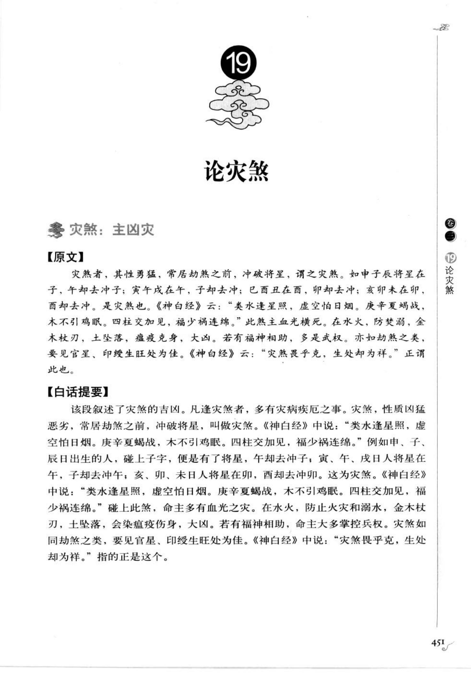
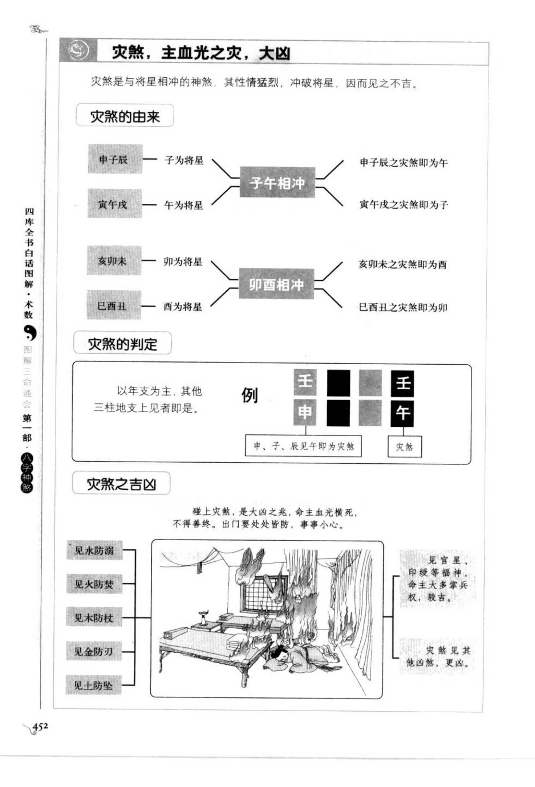

# 灾煞（古籍摘录）

> 资料状态：OCR/人工转录初稿，来源为《图解三命通会（第1部）：八字神煞》书内页 451-452（PDF 页 455-456）。原页截图已保存到项目本地。

## 论灾煞

### 【原文】

灾煞者，其性勇猛，常居劫煞之前，冲破将星，谓之灾煞。如申子辰将星在子，午却去冲子；寅午戌将星在午，子却去冲午；巳酉丑将星在酉，卯却去冲酉；亥卯未将星在卯，酉却去冲卯。是灾煞也。

《神白经》云：“类水逢星照，虚空怕日烟。庚辛夏蚕战，木不引鸡眠。四柱交加见，福少祸连绵。”此煞主血光横死。在水火，防焚溺；金木杖刃；土坠落；瘟疫克身，大凶。若有福神相助，多是武权。亦如劫煞之类，要见官星、印绶生旺处为佳。《神白经》云：“灾煞最乎克，生处却为祥。”正谓此也。

### 【白话提要】

灾煞性质勇猛，常在劫煞之前，能够冲破将星，所以称为灾煞。申子辰的将星在子，午来冲子；寅午戌的将星在午，子来冲午；巳酉丑的将星在酉，卯来冲酉；亥卯未的将星在卯，酉来冲卯，这些就是灾煞。

灾煞多主血光横死：在水、火方面要防焚烧和溺水，在金、木方面要防杖刃伤残，在土方面要防坠落，也主瘟疫伤身，属于大凶之煞。若有福神扶助，往往反主武职、兵权；如同劫煞，最好见官星、印绶处于生旺。所谓“灾煞最乎克，生处却为祥”，就是指灾煞受制或得生扶时，凶性可以转化。

## 灾煞定位

| 三合局 | 将星 | 冲将星的地支 | 灾煞 |
| --- | --- | --- | --- |
| 申子辰 | 子 | 午 | 午 |
| 寅午戌 | 午 | 子 | 子 |
| 巳酉丑 | 酉 | 卯 | 卯 |
| 亥卯未 | 卯 | 酉 | 酉 |

原图判定以年柱为主，其他三柱地支见对应灾煞也可参考。图示还强调灾煞与将星相冲，若命局中同时见灾煞和劫煞，凶性通常更重。

## 灾煞的吉凶图示转录

- 碰上灾煞，是大凶之兆，命主多有血光横死，不得善终；出门和做事要格外谨慎。
- 见水防溺，见火防焚，见木防杖刃，见金防刀刃，见土防坠落。
- 见官星、印绶等福神，命主大多掌兵权，凶中有吉；若灾煞又遇其他凶煞，则更凶。
- 图示示例：年支为申，申子辰局将星在子，三柱中见午，即为灾煞。

## 取用边界

- 灾煞以年支三合局的将星受冲取法为主，日、月、时柱见煞属于叠加信息。
- 凶应须结合五行、水火金木土、官星、印绶、福神及劫煞的生克制化判断，本文不固化为单一断语。
- 古籍吉凶断语仅作知识资料保存，不等同于现代命理结论。
