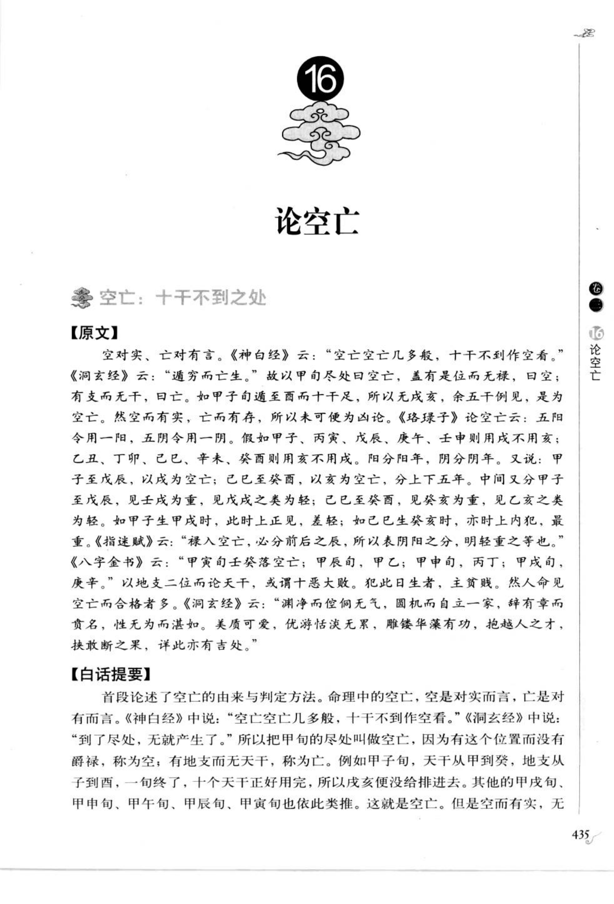
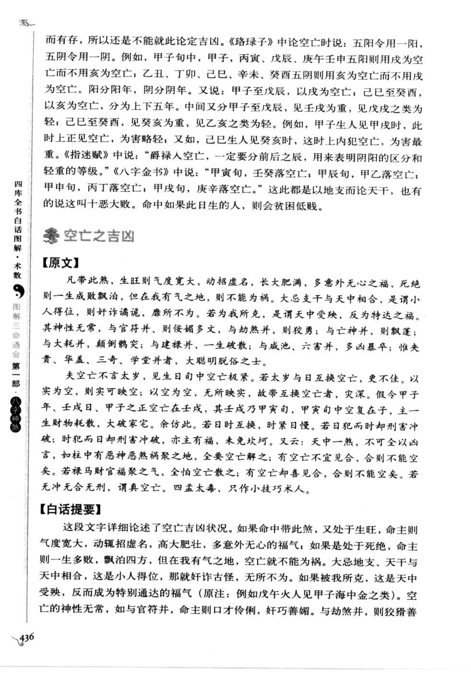
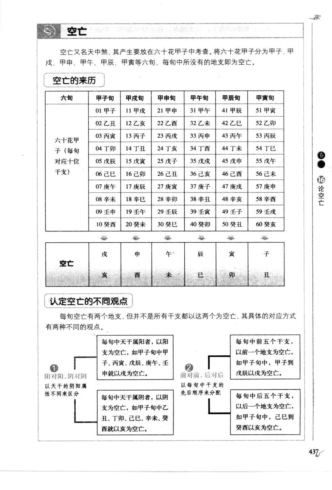
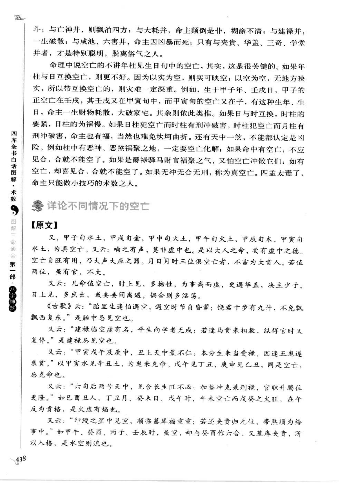
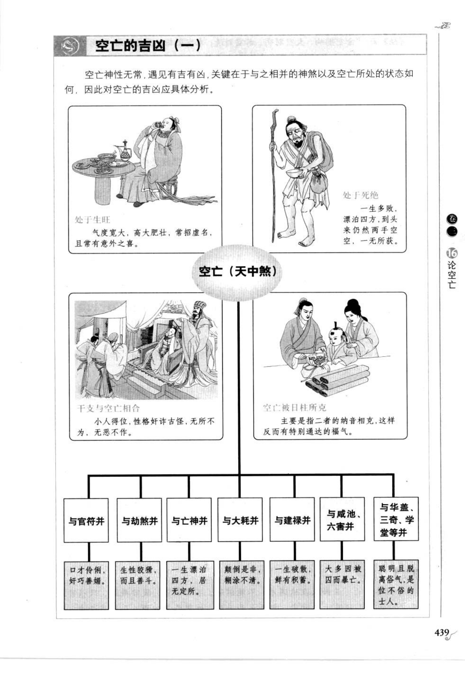
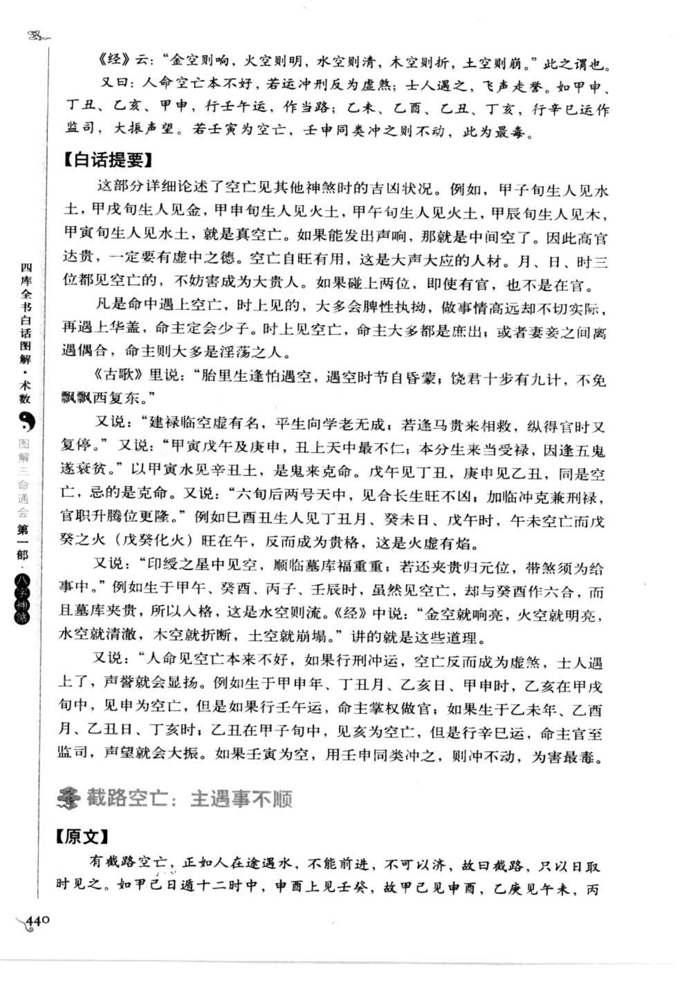
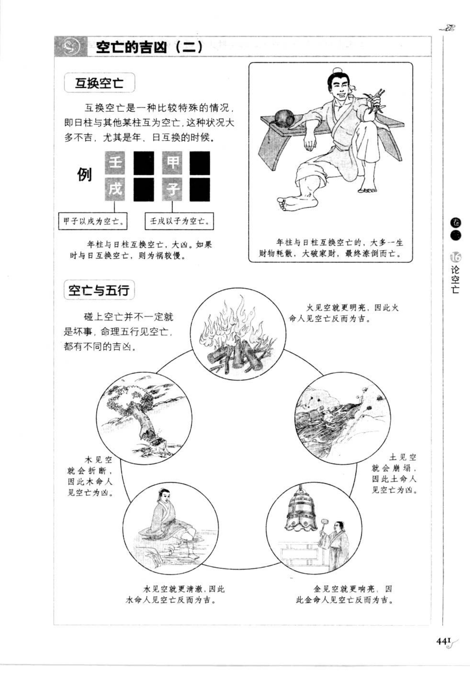
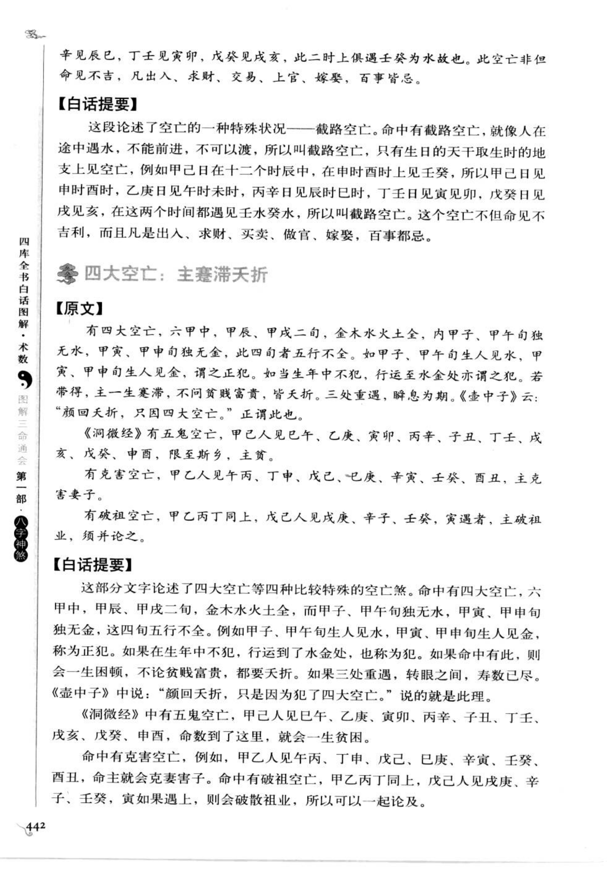
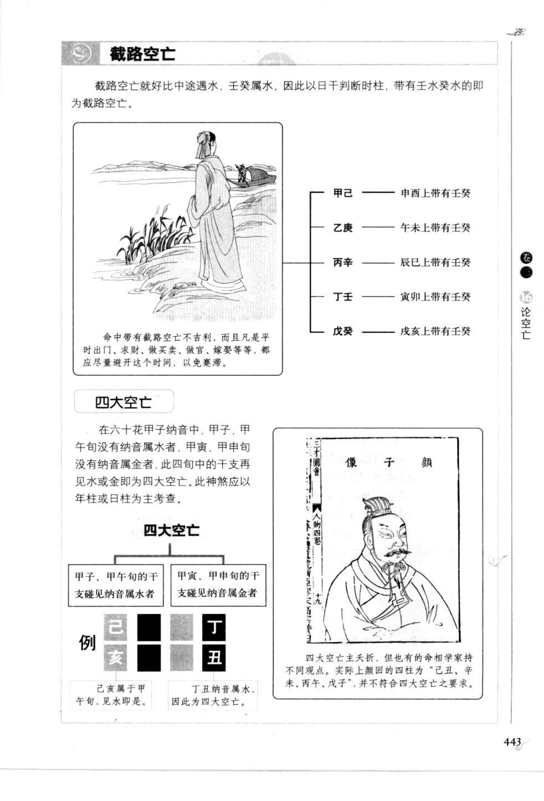

# 空亡（古籍摘录）

> 资料状态：OCR/人工转录初稿，来源为《图解三命通会（第1部）：八字神煞》书内页 435-443（PDF 页 439-447）。原页截图已保存到项目本地。

## 论空亡

### 【原文摘录】

空亡即十干不到之处。甲子旬空戌亥，甲戌旬空申酉，甲申旬空午未，甲午旬空辰巳，甲辰旬空寅卯，甲寅旬空子丑。古籍以空亡为“空而有实、亡而有存”之象，须结合四柱旺衰、干支生克、合冲刑害及岁运考察，不能只见空亡便断凶。

空亡有上五年、下五年之分，前后辰亦有轻重。年柱、日柱可以互换空亡；与官符、劫煞、亡神、大耗、建禄、咸池、六害、贵人、华盖、三奇、学堂等同见时，须分别论其组合。真空亡与普通空亡，取法亦有区别。

## 六旬空亡表

| 旬首 | 空亡地支 |
| --- | --- |
| 甲子旬 | 戌、亥 |
| 甲戌旬 | 申、酉 |
| 甲申旬 | 午、未 |
| 甲午旬 | 辰、巳 |
| 甲辰旬 | 寅、卯 |
| 甲寅旬 | 子、丑 |

书中并列两种认定观点：一是按每旬中天干阴阳区分空亡支；二是前五个干支以前一个地支为空，后五个干支以后一个地支为空。具体采用哪一说，应以所据底本和上下文为准。

## 空亡之吉凶

### 【原文摘录】

空亡处生旺，气度宽大而声名虚浮；处死绝，则漂泊困顿。干支与空亡相合，或空亡被日柱所克，情形又各不同，有时反成特殊通达之福。空亡因合而不能空，因冲刑而改变力量，均不可一概而论。

空亡与五行有如下取象：金空则鸣，火空则明，水空则清，木空则折，土空则崩。行刑冲时，空亡有时反为虚煞；但还须看日主、月令、纳音及所会诸神煞的生克制化。

互换空亡者，如甲子以戌为空，戊戌以子为空。年柱与日柱互换空亡，古法多取大凶；日时互换，则时紧日慢。五行图示又分别说明火空、木空、水空、金空、土空的不同取象。

## 截路空亡与四大空亡

### 【原文摘录】

截路空亡，如人在途中遇水，不能前进。以日干判断时柱，带壬癸水者为截路空亡：甲己日申酉时，乙庚日午未时，丙辛日辰巳时，丁壬日寅卯时，戊癸日戌亥时。

四大空亡：甲子、甲午旬无纳音属水，甲寅、甲申旬无纳音属金；四柱中再见水或金，即为四大空亡。古法主一生困顿，即使富贵也多有天折。原图特别说明，关于“四大空亡”的严格条件，历来有不同学者观点，部分四柱例证并不完全符合单一口径。

## 白话提要

空亡是每一旬中十天干轮完后，剩下的两个地支，表示气数未到或落空。六旬空亡分别为：甲子戌亥、甲戌申酉、甲申午未、甲午辰巳、甲辰寅卯、甲寅子丑。

判断空亡要同时看旺衰、合冲刑害、日柱和岁运。生旺之空可能只是虚名，死绝之空多主漂泊；空亡遇合可能不能空，遇冲刑也可能改变力量。五行还有“金空则鸣、火空则明、水空则清、木空则折、土空则崩”的分别取象。

截路空亡重在日干与时支的对应，象征行路受阻；四大空亡则按旬与纳音的金水缺失判断，但书中提示各家取法并不完全一致。

## 取用边界

- 本文先保存古籍原文、图表和白话信息，不将空亡直接固化为工程上的单一吉凶结论。
- “上五年、下五年”“真空亡”、阴阳分旬及四大空亡存在不同传本口径，正式计算前应回看原图并保留流派来源。
- 古籍吉凶断语仅作知识资料保存，不等同于现代医学、法律或现实决策建议。
