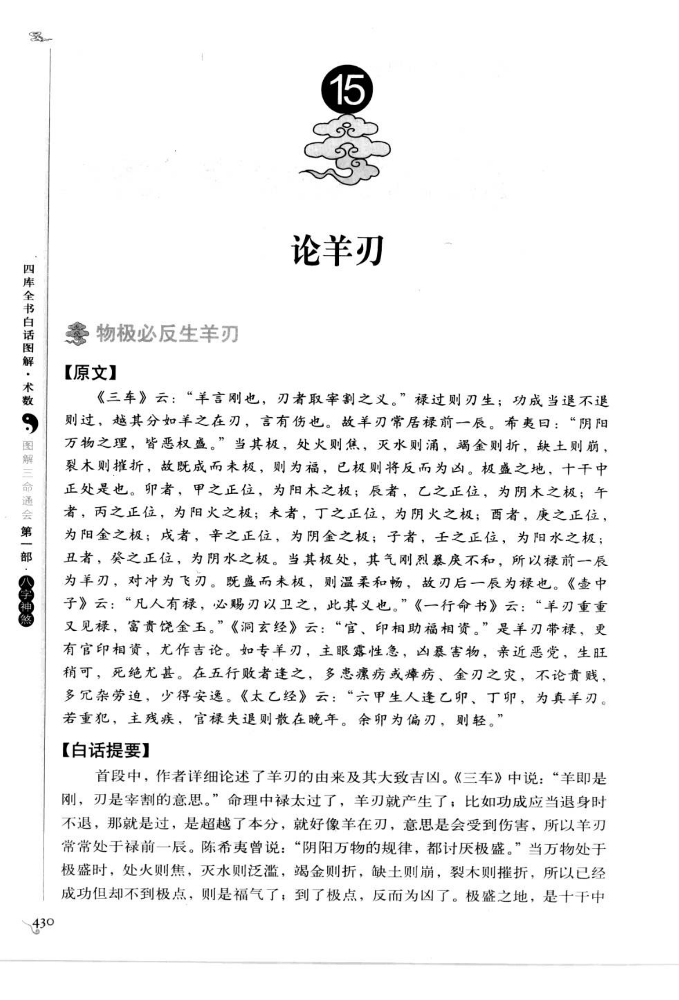
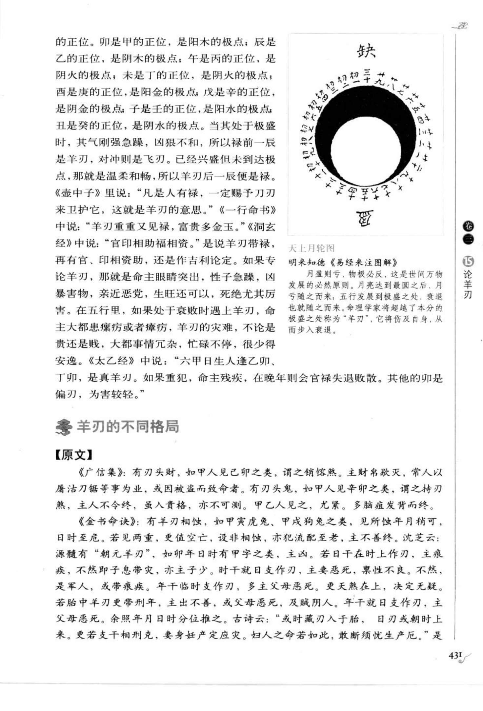
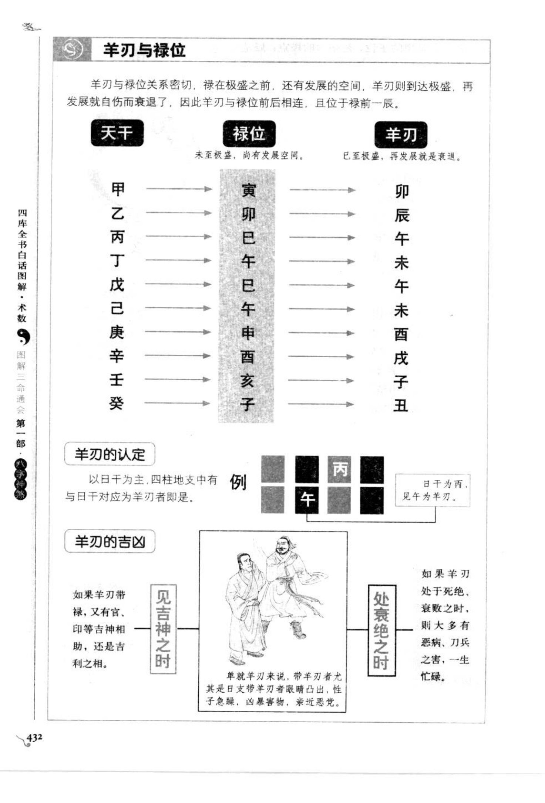
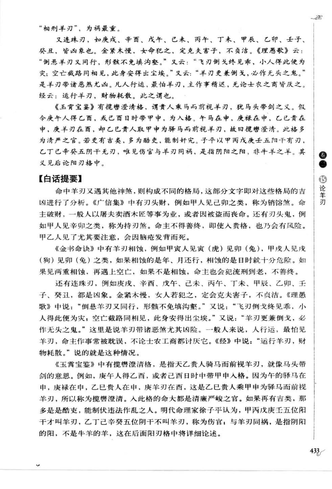
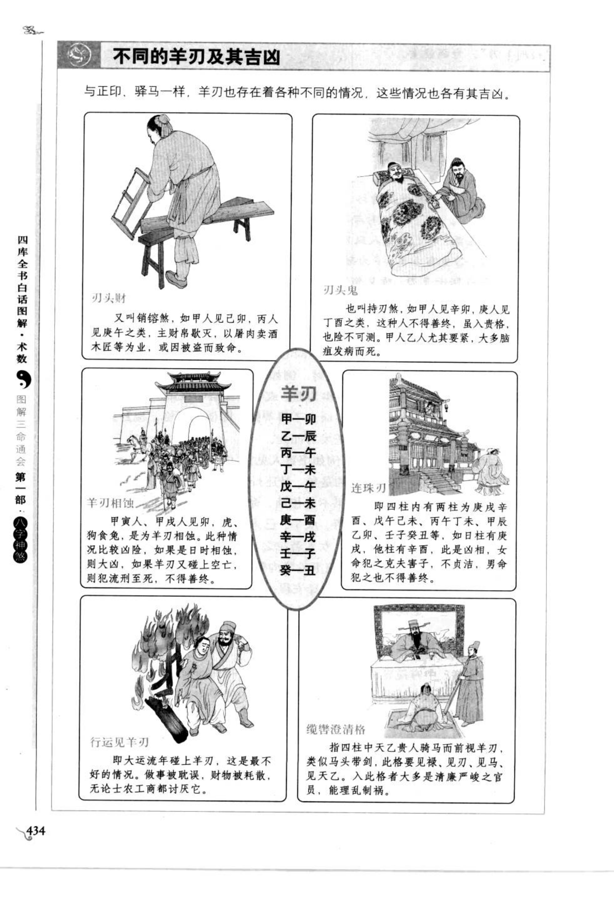

# 羊刃（古籍摘录）

> 资料状态：OCR 转录初稿，来源为《图解三命通会（第1部）：八字神煞》书内页 430-434（PDF 页 434-438）。原页截图保存在 `docs/bazi/img/san_ming_tong_hui/page-434.png` 至 `page-438.png`。

## 物极必反生羊刃

### 【原文】

《三车》云：“羊言刚也，刃者取宰割之义。禄过则刃生，功成当退不退则过，越其分如羊之在刃，言有伤也。故羊刃常居禄前一辰。”希夷曰：“阴阳万物之理，皆恶极盛。”当其极，处火则焦，灭水则涸，遇金则折，缺土则崩，裂木则摧折，故既成而未极则为福，已极则将反而为凶。极盛之地，十干中正处是也。卯者，甲之正位，为阳木之极；辰者，乙之正位，为阴木之极；午者，丙之正位，为阳火之极；未者，丁之正位，为阴火之极；酉者，庚之正位，为阳金之极；戌者，辛之正位，为阴金之极；子者，壬之正位，为阳水之极；丑者，癸之正位，为阴水之极。当其极处，其气刚烈暴戾不和，所以禄前一辰为羊刃，对冲为飞刃。既盛而未极，则温柔和畅，故刃后一辰为禄也。

《壶中子》云：“凡人有禄，必赐刃以卫之，此其义也。”《一行命书》云：“羊刃重重又见禄，富贵饶金玉。”《洞玄经》云：“官、印相助福相资。”是羊刃带禄，更有官印相资，尤作吉论。如专羊刃，主眼露性急，凶暴害物，亲近恶党，生旺稍可，死绝尤甚。在五行败者逢之，多患瘰疬或癞病，金刃之灾，不论贵贱，多犯杂劳迫，少得安逸。《太乙经》云：“六甲日生人逢乙卯、丁卯，为真羊刃。若重犯，主残疾；官禄失退则散在晚年。余卯为偏刃，则轻。”

### 【白话提要】

羊刃是禄过旺后的刚烈之气，常在禄前一辰。万物盛极必反，未到极点时为福，到了极点便可能转为凶。羊刃与官印、禄位相扶时可主富贵；单独出现或处死绝、再逢凶煞，则主性急、暴烈、刑伤疾病和劳苦。

## 羊刃的定位

| 日干 | 羊刃 |
| --- | --- |
| 甲 | 卯 |
| 乙 | 辰 |
| 丙 | 午 |
| 丁 | 未 |
| 戊 | 午 |
| 己 | 未 |
| 庚 | 酉 |
| 辛 | 戌 |
| 壬 | 子 |
| 癸 | 丑 |

原图判定：“以日干为主，四柱地支中有与日干对应为羊刃者即是。”并注明羊刃带禄、官印等吉神相助时为吉，处衰绝又遇凶煞时为凶。

## 羊刃与禄位

羊刃与禄位关系密切：禄在极盛之前，羊刃到达极盛，继续发展便由盛转衰。因此羊刃位于禄前一辰，禄位在羊刃后一辰。原图以天干、禄位、羊刃三列示例：甲禄寅、羊刃卯；乙禄卯、羊刃辰；丙禄巳、羊刃午；丁禄午、羊刃未；戊己禄巳午、羊刃午未；庚禄申、羊刃酉；辛禄酉、羊刃戌；壬禄亥、羊刃子；癸禄子、羊刃丑。

## 羊刃的不同格局

### 【原文】

《广信集》：有刃头财，如甲人见己卯之类，谓之销锋煞。主财帛散灭，常人以屠沽刀锯等事为业，或因被盗而致命者。有刃头鬼，如甲人见辛卯之类，谓之持刀煞，主人不令终，虽入贵格，亦不可测。甲乙人见之尤紧，多脑疽发背而终。

《金书命诀》：有羊刃相蚀，如甲寅虎兔、甲戌狗兔之类，见所临年月稍可，日时至危。若见两重，更值空亡，设非相蚀，亦犯流配至老，主不善终。沈芝云：源髓有“朝元羊刃”，如卯年日时有甲字之类，主凶。若日干在时上作刃，主瘵疾，不然即子息带灾，亦主子少。时干就日支作刃，主妻恶死，禀性不良；不然，是军人，或带痕疾。年干临时支作刃，多主父母恶死。更天煞在上，决定无疑。若胎中羊刃更带刑年，主出不善，或父母恶死，及贼阴人。年干就日支作刃，主父母恶死。余照年月日时分位推之。

又连珠刃，如庚戌、辛酉、戊午、己未、丙午、丁未、甲辰、乙卯、壬子、癸丑，皆凶象。金紧木慢，女人若犯之，定克夫害子，不贞洁。《理愚歌》云：“倒悬羊刃又同刑，形骸不免填沟壑。”又云：“飞刃倒戈终见乖，小人得此便为灾；空亡截路同相见，此身安得出尘埃。”又云：“羊刃更兼倒戈，必作无头之鬼。”是羊刃带诸恶煞尤凶。凡人行运，最怕羊刃，主作事稽迟，无论士农工商皆厌之。《经》云：“运行羊刃，财物耗散。”

《玉霄宝鉴》有揽辔澄清格，谓贵人乘马而前视羊刃，犹马头带剑之义。假令庚午人得乙酉，或己酉日時带甲申，为人格。午马在申，庚禄在申，乙己贵人在申，庚羊刃在酉，却乙己贵人取甲申为驿马而前视羊刃，故曰揽辔澄清。此格多为清严之官。若更有吉类，多为酷吏，能制奸宄违法作乱之人。

### 【白话提要】

羊刃与财、鬼、刑、空亡、倒戈等组合会形成不同格局。刃头财主破财或以刀锯为业，刃头鬼主凶险；羊刃相蚀、连珠刃和行运遇羊刃多主刑伤、灾病、破财。贵人乘马前视羊刃的“揽辔澄清格”，则可主清严之官。

## 取用边界

- 羊刃主法以日干取对应地支，禄位、飞刃、官印及刑冲合化属于附加条件。
- 原图中“真羊刃”“偏刃”及纳音、贵人组合有版本异文，正式实现前应继续逐字校勘。
- 古籍吉凶断语仅作知识资料保存，不等同于现代命理结论。

