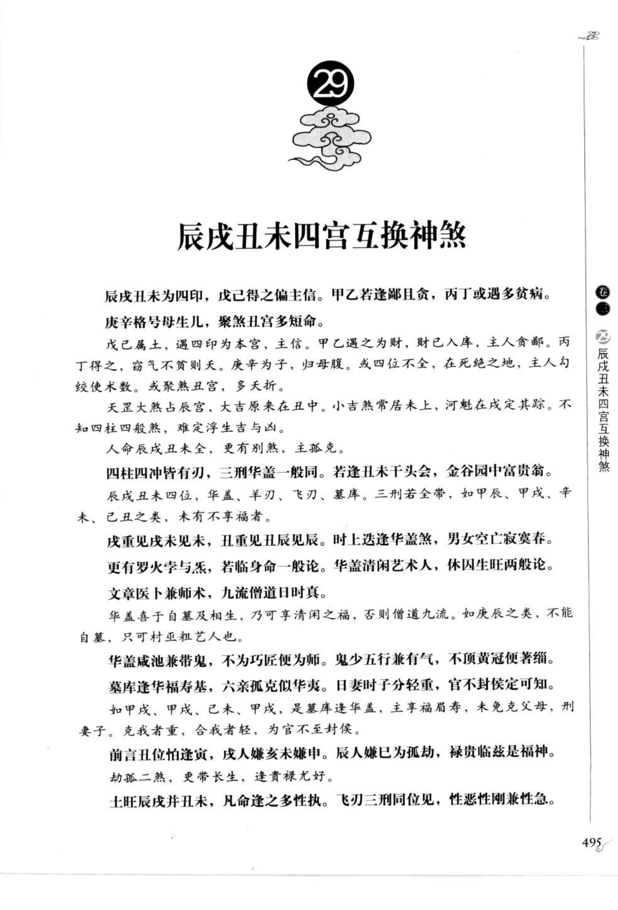
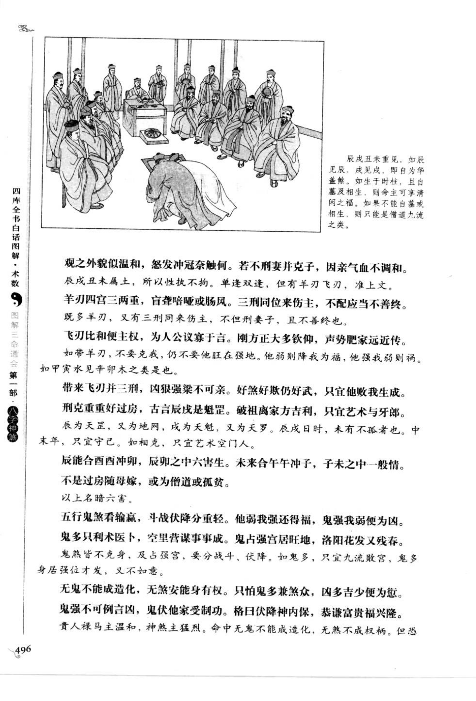
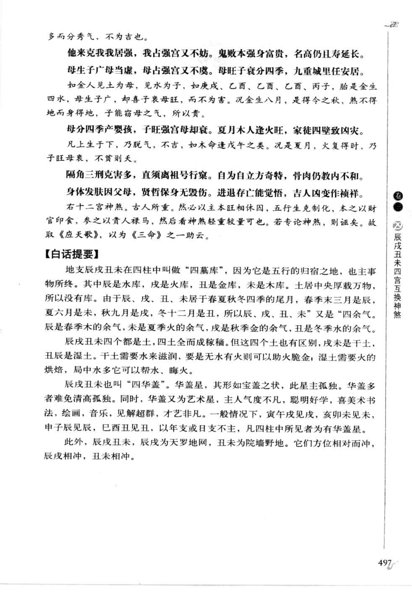

# 辰戌丑未四宫互换神煞（第 29 章）

> 资料状态：OCR/人工转录初稿，来源为《图解三命通会（第1部）：八字神煞》书内页 495-497（PDF 页 499-501）。原页截图已保存到项目本地；古诗、日时例证和个别字形以 `[待校]` 标记。

## 四库、四墓与互换

辰戌丑未为四库，辰为水库，戌为火库，丑为金库，未为木库；又为天罗地网、华盖、刑冲破害等关系密集之处。四柱四冲、四库、华盖、羊刃、飞刃、墓库和三刑互见时，须分辨是聚福还是聚祸。

### 【原文摘录】

辰戌丑未为四印，戊己得之偏主信。甲乙若逢胆且贪，丙丁或遇多贫病。庚辛格号母生儿，聚煞丑宫多短命。

戊己属土，遇四库为本宫，主信；甲乙得之为财，丙丁得之为窘气，庚辛得之为印，壬癸得之为官。四位不全，在死绝之地，主人约绊；木数多，或聚煞丑宫，多夭折。

天罡太煞总辰宫，大吉原来在丑中；小吉煞常居未上，河魁在戌定其踪。不知四柱四煞，难定浮生吉与凶。

人命辰戌丑未全，更有别煞，主孤克。四柱四冲皆有刃，三刑华盖一般同；若逢丑未干头会，金谷园中富贵翁。成重见戌未见未，丑重见丑辰见辰。时上逢华盖煞，男女空亡寂寞春；更有罗炅字与气，若临身命一般论。

华盖咸池兼带鬼，不为巧匠便为师；鬼少五行兼有气，不顶黄冠便著绯。墓库逢华盖为主，六亲孤克似伥；日妻时子分轻重，官不封候定可知。

前言丑位怕逢寅，戌人嫌亥未嫌申；辰人嫌巳为孤劫，禄贵临兹是福神。劫孤二煞，更带长生，遂贵禄尤好。

土旺辰戌并丑未，凡命逢之多性拙；飞刃三刑同位见，性恶性刚兼性急。凡处公门休带煞，若逢亡劫便遭刑；计字火罗临四正，千里徒流枉费身。

## 章中主要断语

- 辰戌丑未若逢全，长生不遇命难延；谋高胆大终遭辱，结果应无莫怨天。
- 四柱四冲皆有刃，三刑华盖一般同；若逢丑未干头会，金谷园中富贵翁。
- 劫孤带贵长生兼，便主威权福寿全；若不长生逢贵气，也应白手置庄田。
- 咸池羊刃兼带鬼，华盖孤辰最为真；空亡生旺心偏巧，能武能文驾鬼神。
- 三刑隔角更空亡，华盖重并主过房；必是双生或庶出，否则重拜两爷娘。
- 双辰者，干支两位是也，多主孤克；亡劫双辰煞，多为长老；如乙亥、丁亥、己卯、丁卯为一妯娌，如己亥、乙亥、丁酉、己酉为一过房。
- 六合合刃合咸池，空主聪明刀狠愚；合刃罗纹身恶死，官刑苟免主颠痴。
- 合贵之中更带官，少年平步上云端；合禄干头兼得禄，三台钧起福人看。
- 贵人克人最为佳，禄马如斯皆可夸；微克更兼逢六合，簪缨富贵享荣华。
- 进神羊刃必遭官，日上屡数歌鼓盆；时上号为埋子煞，三刑同到人军门。
- 白虎胎神气象衰，木人癸酉便声高；更逢羊刃兼飞刃，马煞时人只似刀。
- 阴错阳差因孝娶，外祖两重或人赘；不然决要克其妻，或者败房来作婿。
- 亡劫不宜真六合，有合还宜有贵人；不遇贵人兼克主，他不煞人人煞身。
- 五行四柱皆在本旬，遇禄马官贵则吉，遇羊刃、破碎则凶，秀而不实。

## 【白话提要】

辰戌丑未是四库、四墓和四余气，分别收藏水、火、金、木。它们既能成为印、财、官、库，也容易形成华盖、天罗地网、刑冲破害和孤劫。判断四库不能只看是否齐全，还要看五行旺衰、纳音、生克、长生、禄马和贵人是否同到。

四柱中四库重复、三刑、华盖、羊刃、飞刃、亡神劫煞等同时出现，可能主孤克、疾病、刑伤、破财和婚姻不利；若有长生、禄马、贵人、六合等制化，也可转为权贵、富足和福寿。书中反复强调“互换”和轻重，需把年、月、日、时的组合放在全局中判断。

## 取用边界

- 本条为第 29 章章节资料，覆盖书内页 495-497（PDF 499-501）；PDF 502 起进入第 30 章“战斗伏降刑冲破合”。
- 四库、华盖、羊刃、亡劫和互换格局的诗诀存在低清识读与传本差异，正式实现前应逐字回看底图校勘。
- 古籍吉凶断语仅作知识资料保存，不等同于现代命理结论。
