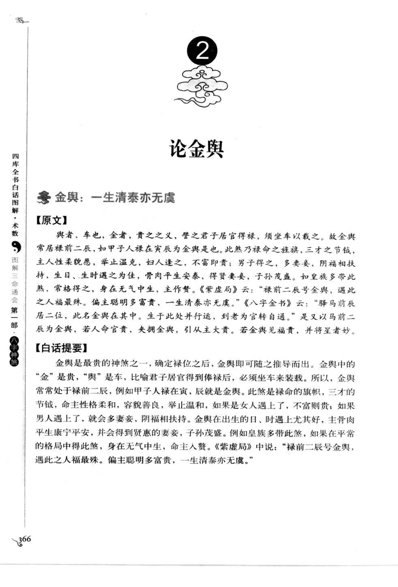
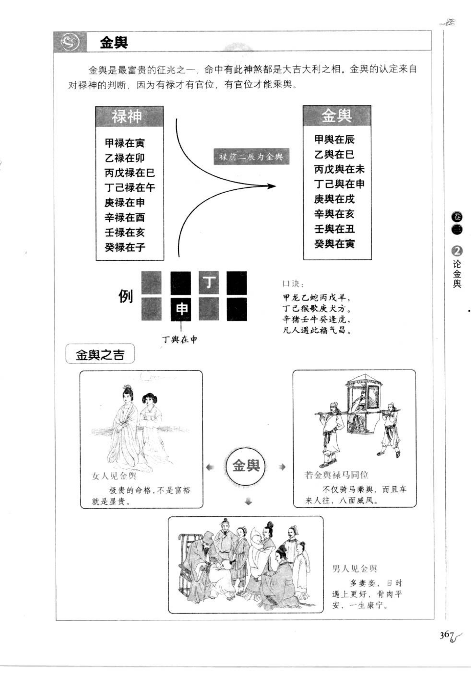

# 金舆（第 2 号，古籍摘录）

> 资料状态：OCR/人工转录初稿，来源为《图解三命通会（第1部）：八字神煞》书内页 366-367（PDF 页 370-371）。原页截图已保存到项目本地。

## 【原文】

舆者，车也；金者，贵之义。譬之君子居官得禄，须坐车以载之。故金舆常居禄前二辰，如甲子人禄在寅，辰就是金舆。此煞乃禄命之旌旗，三才之节钺，主人性柔貌愿，举止温克。如人逢之，不富即贵；男子得之，多妻妾，阴福相扶持；生日、生时遇之为佳，骨肉平生安泰，得贤妻妾，子孙茂盛。如皇族多带此煞，富格得之，身在无气中生，主作赘。命书云：“禄前二辰号金舆，遇此之人福最殊。偏主聪明多富贵，一生清泰亦无虞。”《八字全书》云：“驿马前辰居二位，此名金舆在其中。生于此处并行运，到老为官转自通。”是以马前二辰为金舆，若人命官贵，若拥金舆，引从主大贵。若金舆见福贵，并将星者妙。

## 金舆地支分配

金舆取日干禄神向前顺数二辰：

| 日干 | 禄位 | 金舆 |
| --- | --- | --- |
| 甲 | 寅 | 辰 |
| 乙 | 卯 | 巳 |
| 丙 | 巳 | 未 |
| 丁 | 午 | 申 |
| 戊 | 巳 | 未 |
| 己 | 午 | 申 |
| 庚 | 申 | 戌 |
| 辛 | 酉 | 亥 |
| 壬 | 亥 | 丑 |
| 癸 | 子 | 寅 |

命局以日干为准，四柱年、月、日、时地支见对应金舆，即可作为命中；生日、生时见之，古籍认为取象较佳。

## 图示与组合取象

原图以“禄前二辰为金舆”说明：例如甲禄在寅，顺数二位到辰；丁禄在午，顺数二位到申。金舆与禄马同位、福星、贵人或将星相并，多取富贵、车舆、妻妾和安泰之象；女子见金舆，图示提要称“极贵的命格，不是富裕就是显贵”；男子见金舆，多妻妾，日时遇之骨肉平安。

## 【白话提要】

“舆”是车，“金”代表尊贵。金舆是禄命的车舆和旗帜，取日干禄位前面顺数两位的地支。命局四柱任一地支出现对应金舆，便可论及此煞；若在日柱、时柱出现，古籍认为更有力。金舆常主聪明、富贵、清泰，也有男子多妻妾、女子不富即贵等附加取象，仍须结合全局旺衰和其他神煞。

## 取用边界

- 本条为第 2 号“金舆”，覆盖书内页 366-367（PDF 370-371）。
- 金舆判定只按日干禄位前二辰与四柱地支比较；福贵、将星、驿马同位等属于附加解释，不改变基本命中条件。
- 古籍吉凶断语仅作知识资料保存，不等同于现代命理结论。
